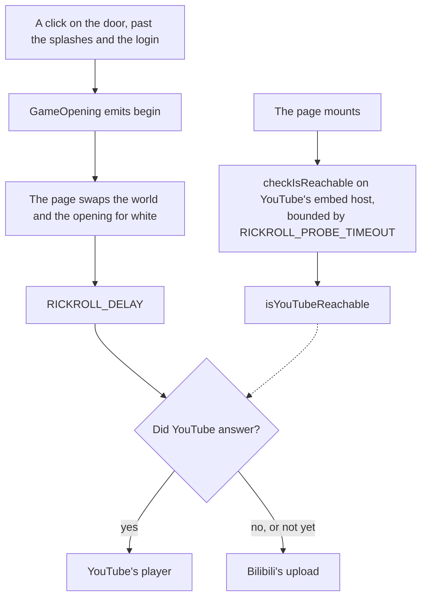

# Rickroll

Until the world past the login screen is ready to be walked into, the door is a joke: the reader clicks it, the screen whitens as the game's does, and after 3 seconds of white Rick Astley plays.

## How it plays

- **The world stops at the door.** On `begin` the page unmounts the world and the opening, so nothing renders behind the white.
- **Every reader's player starts as the white ends.** Whether the reader's network reaches YouTube is asked as the page mounts rather than guessed from their language or location, as [third-party reachability](/docs/architecture/third-party-reachability) sets out. The splashes alone outlast the probe's timeout, so the answer is in before anyone reaches the door, and the choice waits on nothing: a network that blocks YouTube, in mainland China or anywhere else, gets Bilibili's upload as quickly as an open one gets YouTube. A probe somehow still out when the white ends counts as a no.
- **The song plays with sound.** A browser lets a frame play with sound for only a few seconds after a click, which the frame's `allow="autoplay"` hands on to it. So YouTube's player mounts as the white begins, hidden under it, and once it has loaded and answered the page's listening handshake through YouTube's frame API (`enablejsapi`), the page tells it to play the moment the white ends: about three and a half seconds after the click, with nothing left to load. Mounted only as the white ended, its load ran past that window and it played muted. Bilibili's player takes no command, so it mounts as the white ends and plays itself. The page sends no cross-origin embedder policy, since a frame under one loads credentialless and loses that activation, and the page shares no memory that would need isolation.
- **Either player is sent the page's origin.** Both refuse to play without a `Referer`, which the site's `no-referrer` policy withholds, so the frame asks for `strict-origin-when-cross-origin`.

## Key files

| File                                            | Role                                                                   |
| :---------------------------------------------- | :--------------------------------------------------------------------- |
| `apps/web/app/components/Genshin/Index.vue`     | The page: the opening, the world behind it, and the probe              |
| `apps/web/app/components/Genshin/Rickroll.vue`  | The white, the player mounted under it, and the command that starts it |
| `apps/web/app/services/genshin/constants.ts`    | The delay, the probe's timeout and URL, and both players' URLs         |
| `apps/web/app/util/network/checkIsReachable.ts` | Whether the reader's network answers a URL in time                     |
| `apps/web/server/plugins/security.ts`           | The page's exemption from the cross-origin embedder policy             |
