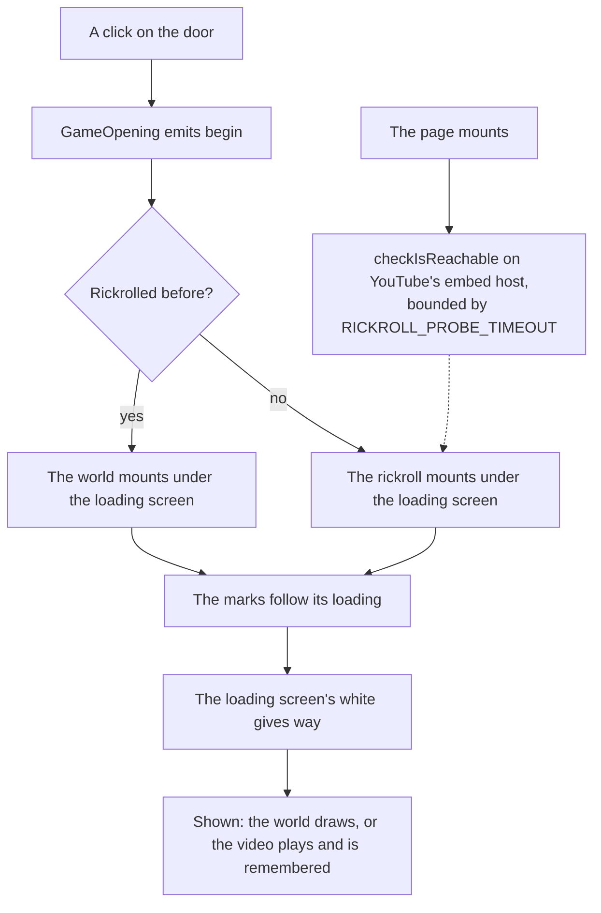

# Rickroll

The first time a browser opens the login screen's door, the door is a joke: the screen whitens as the game's does, the loading screen's seven marks fill as the video loads, and as their white gives way Rick Astley plays. The browser remembers it (`LocalStorageKey.GenshinRickrolled`), and every later visit the door opens onto the world.

## How it plays

- **The loading screen loads whatever the door opens onto.** Neither the world nor the rickroll exists before the door, and each loads under the seven-element screen, whose marks follow its two steps: its code arriving, and the world's renderer or the player being ready. There is no white of the page's own; the loading screen's is the game's.
- **YouTube or Bilibili, by the reader's network.** Whether the reader's network reaches YouTube is asked as the page mounts rather than guessed from their language or location, as [third-party reachability](/docs/architecture/third-party-reachability) sets out. The splashes alone outlast the probe's timeout, so the answer is in before anyone reaches the door; a network that blocks YouTube, in mainland China or anywhere else, gets Bilibili's upload, as does a probe somehow still out, and so does a player that reached YouTube's host yet never answers the page's handshake within `RICKROLL_YOUTUBE_READY_TIMEOUT`, so the loading screen never waits on it.
- **The song plays with sound.** A browser lets a frame play with sound for only a few seconds after a click, which the frame's `allow="autoplay"` hands on to it. So YouTube's player loads hidden under the loading screen and, once it has answered the page's listening handshake through YouTube's frame API (`enablejsapi`), is told to play the moment it is shown, with nothing left to load. Bilibili's player takes no command, so it has nothing to load ahead: it counts as ready at once and mounts as it is shown, playing itself. The page sends no cross-origin embedder policy, since a frame under one loads credentialless and loses that activation, and the page shares no memory that would need isolation.
- **Either player is sent the page's origin.** Both refuse to play without a `Referer`, which the site's `no-referrer` policy withholds, so the frame asks for `strict-origin-when-cross-origin`.
- **The choice is made at the door.** Whether this browser has been rickrolled is read as the door opens and written once the video is shown, so marking it does not swap the video for the world mid-song.

## Key files

| File                                            | Role                                                                          |
| :---------------------------------------------- | :---------------------------------------------------------------------------- |
| `apps/web/app/components/Genshin/Index.vue`     | The page: the opening, the world behind it, and the probe                     |
| `apps/web/app/components/Genshin/Rickroll.vue`  | The white, the player mounted under it, and the command that starts it        |
| `apps/web/app/services/genshin/constants.ts`    | The probe's and the player's timeouts, the probe's URL and both players' URLs |
| `apps/web/app/util/network/checkIsReachable.ts` | Whether the reader's network answers a URL in time                            |
| `apps/web/server/plugins/security.ts`           | The page's exemption from the cross-origin embedder policy                    |
