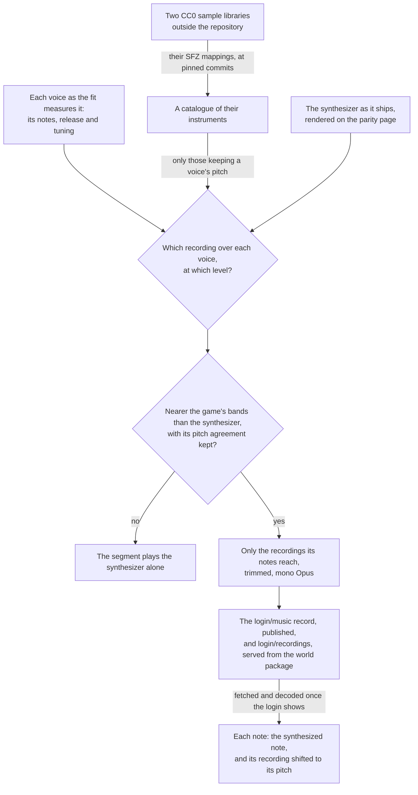

# Sampled instruments

The login's [music](/docs/genshin/music) plays the right notes, and the synthesizer playing them is why it does not sound like the game. Each register plays one fixed spectrum of harmonics under one envelope, an organ's sound, where the game's is an orchestra recorded in a hall. The shortest route to a real instrument's sound is a recording of one. So each voice of a piece can play a recording from an openly licensed library on top of its synthesized note, at a level solved against the game's sound. The playlist, the notes, the voices and each voice's fitted instrument are unchanged, and the recordings are layered over them; each segment's expression is refitted once they are, and the listening score read again.

## How it works

- **The libraries are CC0.** The Versilian Community Sample Library and the Versilian Chamber Orchestra 2 community edition it builds on are public-domain recordings of orchestral instruments: strings as sections and solo, harp, piano, woodwinds, brass and mallets, each sampled every tone or every few and in a few velocity layers, with their mappings in SFZ files. Beside them, from the SFZ instruments collection, are a solo cello bowed and plucked, a double bass bowed and plucked, and a grand piano, each dedicated to the public domain under CC0 as well; a library under any other licence, an attribution licence or Sampling Plus, is left out. Nothing of the game's sound is in them, so the rule that nothing of the game's audio ships is unchanged. They are the one exception to the Genshin area's rule that every asset is authored here, made because no oscillator of ours sounds like a plucked harp.
- **Layered, never replacing.** A voice's recording plays beside its synthesized note, both through the segment's expression. A level of zero leaves the synthesizer exactly as it was, so a solve that keeps the synthesizer's pitch agreement can only improve on it. Replacing the synthesizer outright lost pitch agreement on the first piece whatever the recordings and their balance ("What the passes found").
- **Chosen by a solve, never by ear.** `genshin:parity instruments` picks each voice's instrument and level and publishes them in the music's record where the mix beats the synthesizer; the listening score then confirms it and the user's ear approves it. A mix that loses any pitch agreement is a regression, whatever it gains in the bands.
- **The synthesizer stays.** The layering keeps every voice's oscillator, noise and envelope playing, so they and their solves remain the music's base rather than being retired.
- **No reverb until a reading asks for one.** A reverb lengthens what a note already holds, so it is the remedy only where ours dies sooner than the game's. The best mixes' largest gaps hold level from a note's start to half a second into it, so what is short is spectrum rather than ring.

## What is built

- **The catalogue.** Each library is read from its repository (`SampleLibraryOwnerMap`) at a pinned commit (`SampleLibraryCommitMap`), and only a mapping and the recordings a piece's notes reach are downloaded, into the scripts package's cache. A mapping's `#include` files are read into its place, each from the folder of the mapping first read as SFZ resolves them, so a library whose programs are assembled from included maps is catalogued as it ships (`readSfzMapping`). `parseSfz` reads a mapping into the regions a note plays. Opcodes are inherited from `<control>`, `<global>`, `<master>` and `<group>` down to `<region>`, and a key may be a number or a note name. Release triggers, every round robin past the first, and a region whose key range is empty (a pedal noise a controller triggers) are skipped. A layer crossfaded in and out by velocity answers from the middle of its fade in to the middle of its fade out, since some instruments mark their layers only by their crossfades. A region's `volume` is carried as its gain, because each recording is normalised on its own. The amplitude envelope's opcodes are not read: the release comes from the game's voice. Velocity scales a note linearly rather than through the mapping's velocity curve.
- **One choice of recording, one rate and one gain.** `selectMusicSample` picks the recording a note plays: the region whose keys hold the note's pitch or lie nearest it, then of those the one whose velocities hold or lie nearest its velocity on MIDI's scale. `getMusicRecordingRate` shifts it from the pitch it was recorded at by the mapping's tune and the voice's fitted tuning, and `getMusicRecordingGain` scales it by the note's velocity over the recording's own gain. The solve's offline render (`renderSampledVoice`) and the engine's sampler call the same three, so what is solved is what plays.
- **The pitch check.** `computeVoicePitchReference` reads the pitch classes a voice's notes name with no instrument in them, frame by frame in the listening score's own frames (`computeNoteChroma`), and the same notes rendered as pure tones at their fundamentals beside them. A render of the voice is scored by its pitch agreement with the notes, as it stands and at the lag within a fifth of a second that agrees best (`computeLaggedAgreement`). An instrument that matches or passes the pure tones keeps the voice's pitch. `genshin:parity solos` scores every catalogued instrument this way (`scoreSampledSolos`), with the median onset of the recordings it plays and how far each note is shifted from its recording.
- **The solve.** `solveSampledVoices` renders every catalogued instrument through each voice's notes at level 1, the way the sampler plays them, with the voice's fitted release and tuning, and under the segment's shipped expression. Only an instrument that keeps the voice's pitch is a candidate for it, or the one nearest that where none does, since the octave bands cannot hear pitch. The base is the synthesizer as it ships, rendered alone on the parity page whatever recordings already ship, so a second run solves what the first did. For every combination of one candidate a voice, the powers come in closed form from nonnegative least squares on each band's share of the game's energy, the target being what the base leaves short of each frame's share (`solveNonNegativeSystem`): a recording only adds energy, and unclipped, the base's average overfill solved every combination to silence. The best combinations are refined against the score's band distance over the base (`refineVoicePowers`), each level the square root of its power, and each mix is scored whole once its expression is refitted to the game's swells (`scoreShapedMusic`), as `genshin:parity expression` refits the shipped music's. A mix that loses the base's pitch agreement is tried again at a half, a quarter and an eighth of its levels, and dropped if none keeps it.
- **What ships.** A segment whose best mix lies nearer the game's bands than the synthesizer gets each voice's instrument set in the `login/music` record as its `recordings` and `recordingLevel` (`writeLayeredRecordings`), which the command then publishes; every other voice gets none and level 0. Only the regions the shipped notes select are written (`selectShippedRecordings`), in the instrument's own order so the sampler picks from them as it would from all of them. Each is cut where the furthest-reaching note that plays it stops reading it: the note's end and its release until it falls under a thousandth, at the rate the note shifts it by. The cut is encoded as one channel of Opus in Ogg (`encodeMusicRecording`) into `login/recordings`, which is rewritten whole so no unplayed recording stays. The second piece's layering is about twenty recordings and about a megabyte.
- **The sampler.** `scheduleMusicRecording` plays a note's recording as a buffer source at its rate, through a gain at the voice's recording level times the note's gain, held to the note's end and then faded with the voice's release, beside the oscillator `scheduleMusicNote` plays. `createMusicPlayer` and `renderMusicSegment` call both for every note, through the segment's expression gain, and take the decoded recordings by file; a voice with none, or a recording not decoded, plays its synthesized note alone. The login's music (`Login/Music`) fetches and decodes its recordings once it mounts (`loadMusicRecordings`), from the URL its host passes down through the opening (`musicRecordingBaseUrl`), and starts the playlist once they are decoded, or without them if they cannot be fetched. The app's server serves them from the world package's folder at `GENSHIN_LOGIN_MUSIC_RECORDING_BASE_URL`, and the parity page decodes them before it renders a segment for `listen`.

## What the passes found

Every score is the listening score against the game's own sound, read against the synthesizer's on the same segments.

| Render                                                | First piece: pitch agreement, distance | Second piece: pitch agreement, distance |
| :---------------------------------------------------- | -------------------------------------: | --------------------------------------: |
| The synthesizer                                       |                          0.884, 8.0 dB |                           0.815, 7.0 dB |
| Pass 1, instruments ranked by fitted profile          |                          0.673, 9.4 dB |                           0.853, 7.2 dB |
| Pass 1 at the game's tuning                           |                          0.730, 9.2 dB |                           0.849, 7.2 dB |
| Pass 2, the band solve                                |                          0.709, 7.9 dB |                           0.668, 7.5 dB |
| Pass 3, pitch-keeping candidates                      |                          0.803, 8.8 dB |                           0.818, 7.2 dB |
| The synthesizer under its expression                  |                          0.884, 5.4 dB |                           0.815, 6.6 dB |
| Pass 4, each mix under its own expression             |                          0.861, 6.9 dB |                           0.819, 6.8 dB |
| The synthesizer, its decay fitted to the median curve |                          0.888, 5.4 dB |                           0.798, 6.5 dB |
| Pass 5, recordings layered over the synthesizer       |                          0.888, 5.3 dB |                           0.864, 5.6 dB |
| Pass 6, a fixed equaliser held out across time        |                          0.888, 5.4 dB |                           0.864, 5.4 dB |

- **Ranked by fitted profile, the instruments lost both scores.** The first pass fitted each candidate through the voice's notes with `fitInstrument`, as the game's voice is, and ranked it by its distance from the game's voice over the harmonics and the envelope. A profile distance weighs a harmonic forty decibels down the same as the second, so it does not predict the score: a cello section chosen for the first piece's bass overfilled 125 Hz by about twelve decibels. The fit also read the cello half a semitone sharp, while every recording sits within about ten cents of its mapping, so a voice plays at the game's fitted tuning rather than a recording's own.
- **The bands predict the score but cannot hear pitch.** Solved in the score's own bands, the second pass's distance came within about two tenths of a decibel of what `listen` then measured, so the band measure is a faithful proxy. Its choices, timpani shifted far past their range on the second piece's top voice and a plucked zither at four times its recording's level on the first piece's bass, cost both pieces about a sixth of their pitch agreement.
- **The pitch loss was the instruments, never the render.** Held alone through each voice of either piece, pianos, harps and plucked strings keep as much pitch agreement as pure tones or more (`genshin:parity solos`), so the render, the mappings' tuning and the recordings' onsets cost nothing common. Bowed and blown sustains take a tenth to a fifth of a second to speak, so they agree best read a frame or more late. Only pitch-keeping instruments are candidates since the third pass.
- **Replacing the synthesizer could not hold the first piece's pitch.** Under an expression fitted to each, the fourth pass's best mixes read 6.9 dB at 0.861 on the first piece and 6.8 dB at 0.819 on the second, against the synthesizer's 5.4 dB at 0.888 and 6.5 dB at 0.798 once its decay was refitted. Solved for pitch alone, no balance of one recording a voice reached past 0.881 on the first piece, two layered on a voice reached 0.880, and an octave-band equaliser on each voice, held out across time, fell back to 0.873. Each recording's harmonics fold into the pitch classes differently from the game's, where the synthesizer's are fitted to them.
- **Layered over the synthesizer, the second piece comes a decibel nearer.** The fifth pass layers each mix over the synthesizer as it ships. On the second piece a folk harp on the middle voice and hand chimes on the top, with a faint chime under the bass, take the distance from 6.5 dB to 5.6 dB and pitch agreement from 0.798 to 0.864, every band but 250 Hz nearer and the top octave's shortfall halved. On the first piece the solve leaves the lower voices all but silent, and its best mix only ties the synthesizer, so it ships nothing there.

- **Neither a second library nor an equaliser moves the first piece.** The sixth pass added a solo cello and a double bass, each bowed and plucked, and a grand piano, all CC0. Held alone through the first piece, they keep only its bass voice's pitch: the piano reads 0.786, the plucked double bass 0.779 and the plucked cello 0.744 against pure tones' 0.735, while on the middle and top voices none reaches pure tones, the piano nearest at 0.843 against 0.860 and 0.894 against 0.913. Layered, no mix from any library keeps the first piece's pitch agreement, even at an eighth of its levels. On the second piece the piano's best mix ranks third, at 5.59 dB. A fixed equaliser of one gain an octave band, fitted on one half of a segment's frames and scored on the other, takes the second piece's best layered mixes from 5.56 dB to between 5.39 dB and 5.47 dB, and leaves the synthesizer alone where it was, 6.42 dB from 6.44 on the second piece and 5.39 dB from 5.34 on the first. That is a tenth or two of a decibel, under how far the solve has stood from `listen`, so no equaliser ships.

## Not yet

- **The first piece's sound.** Nothing layered brings it nearer, and an equaliser over it does not hold out across time. Its largest gaps are the synthesizer's own, the lowest band about six decibels over and 250 Hz about three under, held from a note's start through its first half second: a recording only adds energy, so it cannot take back the lowest band's overfill, and the gap waits on the synthesizer's fit of that piece's voices rather than on another recording ([roadmap](/docs/genshin/roadmap)).

## Key files

| File                                                                     | Role                                                                  |
| :----------------------------------------------------------------------- | :-------------------------------------------------------------------- |
| `packages/genshin-engine/src/models/audio/MusicRecording.ts`             | A recording as the sampler plays it: its file, key centre, tune, gain |
| `packages/genshin-engine/src/audio/scheduleMusicRecording.ts`            | One note's recording played over its synthesized note                 |
| `packages/genshin-engine/src/audio/selectMusicSample.ts`                 | The recording a note plays, in the sampler and the solve alike        |
| `packages/genshin-engine/src/audio/getMusicRecordingRate.ts`             | How fast a recording is read to sound a pitch                         |
| `packages/genshin-world/src/services/login/music/loadMusicRecordings.ts` | A piece's recordings fetched and decoded once, by file                |
| `packages/genshin-world/src/components/Login/Music/Index.vue`            | The login's music, started once its recordings are decoded            |
| `scripts/src/services/genshinAssets/music/solveSampledVoices.ts`         | Each voice's recording and level over the synthesizer, pitch heard    |
| `scripts/src/services/genshinAssets/music/writeLayeredRecordings.ts`     | The winning layering written into the data, its recordings encoded    |
| `scripts/src/services/genshinAssets/music/selectShippedRecordings.ts`    | Only the regions the shipped notes play, each cut where it stops      |
| `scripts/src/services/genshinParity/music/scoreShapedMusic.ts`           | A mix scored under an expression fitted to it                         |
| `scripts/src/services/genshinAssets/music/parseSfz.ts`                   | A mapping's regions                                                   |
| `scripts/src/services/genshinAssets/music/computeVoicePitchReference.ts` | What a voice's render is scored against for pitch                     |
| `scripts/src/services/genshinParity/commands/instrumentsCommand.ts`      | The solve's report, and what it ships                                 |
| `scripts/src/services/genshinParity/commands/solosCommand.ts`            | Every instrument alone through each voice, scored for pitch           |
| `packages/genshin-world/src/data/login/music.json`                       | The login's notes, each voice's instrument and its recordings         |

## Sources

- [VCSL](https://github.com/sgossner/VCSL), Versilian Studios: the community sample library, CC0, its instruments sampled every tone where possible in two or three velocity layers, with SFZ mappings on its `sfz` branch.
- [VSCO 2 Community Edition](https://github.com/sgossner/VSCO-2-CE), Versilian Studios: the chamber orchestra library, CC0, with SFZ mappings on its `SFZ` branch.
- [SFZ format: headers](https://sfzformat.com/headers/): the global, master, group and region hierarchy whose opcodes define which samples play and when, a header's opcodes applying to every region under it, which is the order `parseSfz` inherits them in.
- [A Diffusion-Based Generative Equalizer for Music Restoration](https://arxiv.org/html/2403.18636), Moliner, Turunen, Elvander and Välimäki, section 3.4: the equaliser taken as the ratio of two long-term average spectra, with its limits, that a time average assumes the signal's balance holds throughout and louder sections weigh more, so it is a starting point rather than a remedy on its own.
- [DDSP: Differentiable Digital Signal Processing](https://arxiv.org/html/arXiv:2001.04643): the harmonic-plus-noise model our synthesizer is a static form of, whose harmonics and noise change through each note; the alternative the recordings take the shorter route past.
- [Opus recommended settings](https://wiki.xiph.org/Opus_Recommended_Settings), Xiph.Org: 128 kbit/s variable bit rate as about transparent for stereo music, of which a mono recording takes a channel's half (`MUSIC_RECORDING_BITRATE`).
- [Opus Audio Codec: browser support](https://www.testmuai.com/learning-hub/opus-audio-codec-browser-support/): Opus in Ogg decoded by every current engine, Safari since 18.4.
