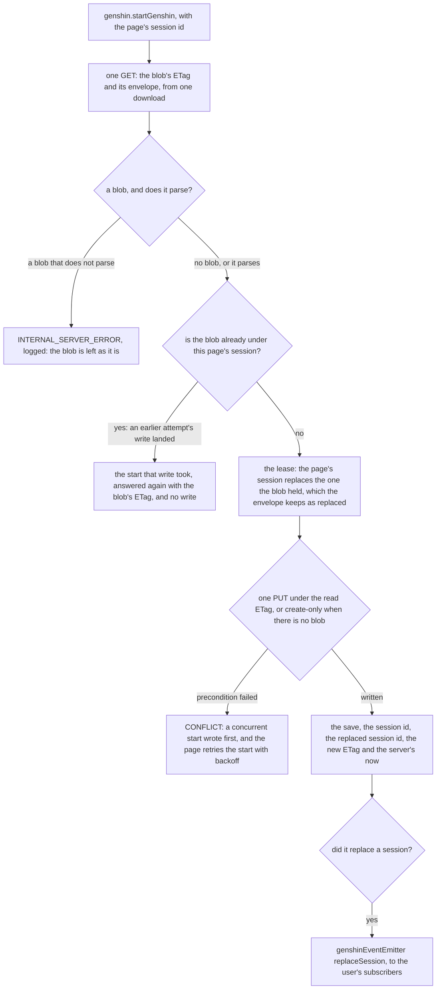
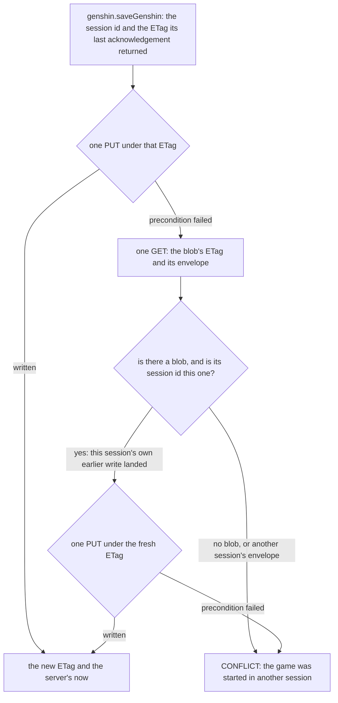
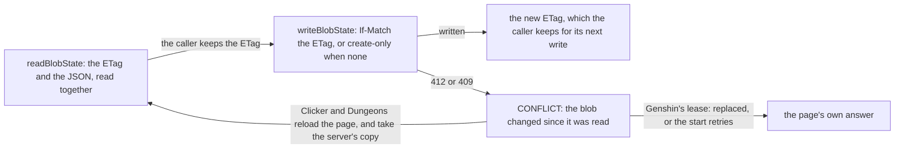
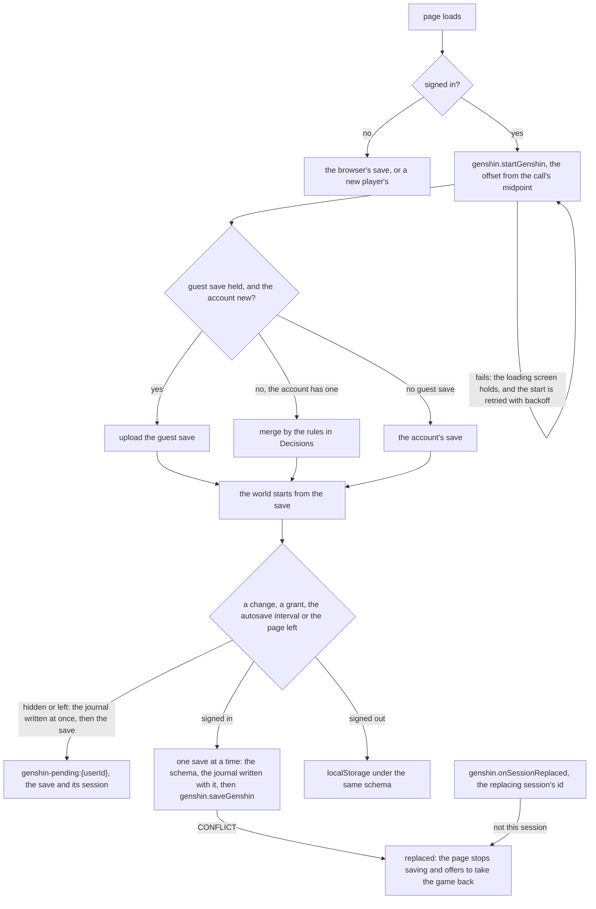

# Save data

A signed-in player's Genshin save is one blob, `{userId}/save.json` in the `genshin-assets` container, and it holds the session that owns it beside the save itself. Starting the game takes the lease: the start names the page's new session id, which replaces the one the blob held, and returns the save the player resumes. A write from a session that is no longer current is refused, and the server never merges it. Signed out, the same save is kept in the browser under the same schema.

## What is saved and what is not

A system the world holds is saved only when its slice is in the save's schema (`packages/genshin-world/src/models/save/GenshinSave.ts`). Anything else is held in memory for the session, and a reload starts it fresh. The save holds:

- the wallet: the currencies, the instant Original Resin last changed, and the Primogem refill count and day;
- the bag: each entry by its item id, with its bag id, its count and a weapon's or an artifact's level, and the id the next entry takes;
- the carried quests' progress, by quest id, and the unlocked landmarks, by id;
- each achievement's count and the moment it finished, by achievement id;
- the bench's recipes learned from instructions, and each recipe's crafted count, by recipe id ([crafting](/docs/genshin/crafting));
- each kind of wish's counters;
- Adventure EXP, Mondstadt's Reputation (its level and EXP) and each character's Companionship EXP, by character id.

It does not hold:

- the characters a player holds, with their levels, weapons, artifacts and copy counts, so a reload loses the characters a wish granted until the roster is saved ([save data proposal](/docs/proposals/genshin/save-data));
- the day's commissions, their counts and their claims ([commissions](/docs/genshin/commissions));
- the expeditions, each character sent and the moment it left ([expeditions](/docs/genshin/expeditions));
- the forge's queues and each game day's forge points ([forging](/docs/genshin/forging));
- each defeated enemy's respawn instant, so a reload brings every enemy back ([enemies](/docs/genshin/enemies));
- the exploration's chests, camps, Oculi and puzzles, which are not recorded as done yet ([exploration progress](/docs/genshin/exploration-progress)).

Some values are derived on load and never saved: a character's Friendship Level is read from its Companionship EXP, and a namecard is held by its character's level, so no save keeps it. The save holds what the player did and nothing derived.

## How a save is leased and written

A start is one read and one write. The blob's ETag and its envelope come from one download, and the start writes the page's session under that ETag, or creates the blob when none exists. The replaced session is announced to the user's subscribers, as the start's own answer says which session it replaced. The page generates its session id once and sends it with every attempt of its start, so an attempt whose write landed and whose response was lost is answered again rather than replaced.

The envelope keeps the session a start replaced until the page's first save rewrites it, and a player is new when no session was replaced. A page's save is only sent once its start has answered, so no save can rewrite the envelope before a retry of that start.

A save is one write under the ETag its session's last start or save returned. That ETag was minted by a write of this session, so a blob still carrying it is unchanged since, and its lease is still this session's, which needs no read and no parse. Only a refused write is read, once.

The server reads the lease from the blob and never from the page's copy. A session's own earlier write that landed before a lost response, or before an SDK retry, is written over under the fresh ETag, so a retry does not look like a replacement. Any other session's envelope is a replacement, and a write refused again is a CONFLICT too, since a blob that changed under the lease means the lease was lost. Both are the one replacement error (`getGenshinSessionReplacedError`), and the page reads any CONFLICT on a save as its session replaced.

A blob that no longer parses is never overwritten. The start and the save answer a logged error and leave the blob as it is, because the save is the player's only copy and a fresh game written over it would be the loss. Only a blob that is absent begins a new player's save. A save written before a slice was added is not read with a default for that slice: the schema describes the latest shape only, and the stored blob is brought to it by a backfill (the backfills skill).

The reads and writes go through the shared blob-state services, which the Clicker and Dungeons saves use as well:

## The page's save

The page plays the save its start returned, and the world emits the whole save on every change. The save is sent by value: each save is the world's whole state rather than a delta, so a later save carries every earlier change, and a save lost in flight is covered by the next one.

Saves go one at a time. A save requested while one is in flight runs once after it settles, carrying the newest save and the ETag the last acknowledgement returned, so no save is sent over one the page has not heard back about. Before a save is sent, the same schema the server parses is run on it: a save the schema refuses is logged and shown, is not sent and is never marked saved. A save equal to the last one stored is not sent at all.

The page saves on three occasions. On the autosave interval (`AUTOSAVE_INTERVAL_MS`, the same clock the Clicker saves on), when a change is pending. At once after a grant, which is one tick's changes to the bag, the wallet, the wish counters or an achievement's progress: a pickup, a wish with its spend and pity, and an achievement's progress with the Primogems it paid each save once. And when the page is left, which writes the journal before it sends.

Signed out, the page plays the browser's copy under the `genshin-save` key, in the same schema. It is read as plain JSON, so its instants reach the schema as the ISO strings they are stored as. A sign-in uploads that copy when the account has no save, and merges it into the account's when it has one, then clears it once the merged save is acknowledged.

A signed-in start that fails does not fall back to the browser's copy. The page holds its loading screen and retries the start with backoff, doubling from a base to a cap, both named in `services/genshin/constants.ts`, and the page's Retry cuts a wait short. Every attempt sends the page's one session id, so a retry of an attempt whose write landed is answered that attempt's start. The save is loaded in the background, so setup is not held while the start is retried.

The save a page has not had acknowledged is kept in a journal under the account, `genshin-pending:{userId}`, holding the save and the session that held it. Each save is written to the journal before it is sent, and the journal is written at once when the page is hidden or left, and cleared once the account acknowledges the save. So the journal is never older than the save the account may hold under that session. The next start reads the journal from the browser as it answers, rather than from a copy the page kept, since another window of the browser may have written it since, and adopts it only when it replaced that same session. Any other journal is discarded.

The server's clock answers every start and save, and the page keeps its offset from the call's midpoint, re-taken on each acknowledgement. A replaced session is told by the real-time layer when it is subscribed, and otherwise by its next refused save.

## Write budget

Each cause of a write, per player-hour of play:

- **The autosave interval:** one save per interval, and only when the save differs from the last one stored. Idle play sends nothing, and a player who changes something every interval sends about one a minute, so about sixty an hour at the current interval.
- **A grant:** one save at once, through the same single-flight. A grant made while a save is in flight is sent once after it settles, so a burst of pickups costs one save per round trip rather than one each.
- **Leaving:** one save when the page is hidden or left, written after the journal.
- **A start:** one read and one write per page load. A failed attempt whose write had not landed is one more read and one more write, and one whose write had landed is one more read, answered as that start.
- **A refused save:** one more read and one more write, and only when another write landed under the same blob.

The cost basis is the operations: each write is one billed write operation on the `genshin-assets` container, and each read is one read. A write carries the save's own JSON, which at its ceiling is about 1.4 MB before the blob-state's zstd compression. The page restates no price, since the Azure pricing page gives it. The per-save CPU cost on the client and the server is measured by `saveGenshin.bench.ts`, whose committed report is the number to quote.

## Decisions

- **The lease lives in the save blob.** The session id is written in the same blob as the save, so one ETag covers both, and no table, service or migration is added. A separate lease blob would leave a window between the lease check and the save write that the ETag cannot close.
- **A stale write is refused, never merged.** With one live session per account, two copies of a save cannot diverge, so the only merge is a guest's, below.
- **The ETag is the lease.** A save under the ETag its session last got is one write, and a refused one is read once. Only the session's own earlier write is written over, and any other session's envelope is a replacement. A changed blob is never merged, and a refused write of the session's own is a replacement too. A start that loses a race with another start is replaced the same way, since the other start holds the lease.
- **Every blob-state save goes through the shared path, and the Genshin lease is one caller of it.** The Clicker and Dungeons save the same way, as the [conditional writes](/docs/architecture/conditional-writes) page describes. The Genshin start and save write through the same service, with the lease's own rules in front of it.
- **Saves are by value, one at a time.** Each save is the world's whole state, so the newest save supersedes the ones before it and a lost save costs nothing the next one does not carry. Sending one at a time keeps every save built on the ETag the last acknowledgement returned.
- **The save fits one request.** The request size limiter admits 2 MB for a body that is not multipart (`MAX_REQUEST_SIZE`), and a save at its ceiling is about 1.4 MB, so a save is never refused for its size on the way in.
- **A start is idempotent across its page's retries.** The page generates one session id and sends it with every attempt. A blob already under that id answers the start its first write took, from the session that write replaced, which the envelope keeps, so a lost response is never read as a replacement of the page's own lease, and a guest's save is never uploaded over an account that the first attempt already created.
- **A replaced session is told by the in-process real-time layer, and by the refused write as the fallback.** A start that replaces a session emits the replacing session's id on the per-user `replaceSession` event, which the `onSessionReplaced` subscription yields to the user's subscribers. The emitter is in-process, so a session on another server instance hears nothing and is replaced by its next refused save.
- **A signed-in start that fails blocks the page.** The browser's copy is a guest's save or a new player's, so a signed-in player whose start fails must not play it. The page waits on its loading screen with a Retry, and the retries back off so an outage is not hammered.
- **The unacknowledged save is journaled per account.** A page can be closed the moment it is hidden, before its save lands, so the save it holds is written to the browser under `genshin-pending:{userId}` at once, not sent, and each save is written there before it is sent. A start adopts that journal only when it replaced the session that wrote it, reading it from the browser as the start answers. The journal is never older than a save the account may hold under that session, so adopting it cannot roll the account's save back past one it acknowledged. A journal that does not parse or that the schema refuses is discarded.
- **A save is validated before it is sent.** The schema the server parses is run on the client first. A save it refuses is logged and shown, is not sent and is not marked saved.
- **A guest's save merges by a pure rule, slice by slice.** The landmarks and the achievements are grow-only: landmarks union, and an achievement keeps the larger count and the earlier moment it was finished. A quest keeps the further of its two steps, and on the same step each objective's count keeps the larger. The Adventure EXP and each character's Companionship EXP keep the larger. Each kind of wish keeps the counters of the copy that has made more wishes of it, whole, so its pity is one copy's. Mondstadt's Reputation keeps the further, by level and then by EXP. The bag and the wallet are the account's copy, except that a same-day Primogem refill count takes the larger. A new account takes the guest's save as it is.
- **The bag keeps no names.** An entry stores the item's id in the game's tables, the bag's own id and count, and a weapon's or an artifact's level. Its definition, and so its name in the reader's language, is read from the game's tables as the save loads: a weapon's from the weapon table, whose id the entry names, and any other item's from the materials table, each name read by its text id from the name-text chunks. A bag reads in whichever language the reader plays.
- **The save's slices are the game's ids and counters.** A wallet's currencies, the instants as ISO strings, the unlocked landmark ids, each carried quest's progress by id, each achievement's count and finish moment by id, each character's Companionship EXP by id and each kind of wish's counters. The world's rules derive everything else on load.
- **The save's slices have no defaults.** A slice a save predates is a save the backfill has not reached, not a shape to read, so the schema refuses it, and the blobs in storage are backfilled to the shape in the change that added the slice (the backfills skill). A new player's save is written whole, never with a slice left out.
- **Reputation and Companionship are carried, not changed.** No source adds Reputation or Companionship EXP to the world yet, so the world holds the saved values and writes them back unchanged. Companionship has no character to apply to until the roster is saved.
- **Enemy respawn timers are not saved, so they stay on the local clock.** Each defeated enemy's instant is held in memory, and a reload resets them. The [save data proposal](/docs/proposals/genshin/save-data) says how they are read once they are saved.
- **The save's bounds are the game's counts, and its ceiling is derived from them.** The bag holds its kinds of item, each tab counted on its own at its room, and a stack at most the highest maximum an item is held at, all from `services/inventory/bagLimits.ts` and `ItemCategoryRoomMap.ts`, which cite the wiki's Inventory page. The achievements are at most the count of the game's achievement table, which `genshin:assets achievements` writes beside the table. The other collections keep typed bounds in `services/save/constants.ts`, and every id is at most `MAX_SAVE_ID_LENGTH` characters. An achievement's, a character's and a recipe's id keys its record as the number's own decimal, with no sign or leading zero (`models/save/numericSaveIdSchema.ts`), since the save is read back by the number, so no two keys of one record read back as the same id. The serialized document's ceiling, `MAX_GENSHIN_SAVE_LENGTH`, is computed there as a skeleton of the fixed slices at their largest plus each collection's cap times its longest entry, so no literal sets it. A save at every cap passes it (`models/save/GenshinSave.test.ts`). The world refuses a pickup past a full category, as the game does, through [inventory](/docs/genshin/inventory).
- **The new player's save is the empty one.** It holds the wallet a new player holds, Original Resin at its cap from the epoch, an empty bag, Mondstadt's Reputation at its first level, and nothing else.
- **A blob that does not parse is an error, never a reset.** The start and the save answer a logged error and leave the blob, since the save is the only copy the player has. The reset the latest-shape-only standard describes stays with the Clicker and Dungeons reads.
- **Genshin saves do not count against the storage quota.** The quota counts what a user keeps as resources, and the save is the game's state: one blob rewritten in place, at a size its own ceiling bounds. Its writes go through the blob-state path, which does not charge the ledger, so the quota never refuses a save. The save's own size is still bounded: the schema refuses one past `MAX_GENSHIN_SAVE_LENGTH`, as the bounds above derive it. The [storage quotas](/docs/resource/storage-quotas) page's what-is-not-counted list records it.

## Key files

Paths relative to the repository root.

| File                                                                                   | Role                                                                                              |
| -------------------------------------------------------------------------------------- | ------------------------------------------------------------------------------------------------- |
| `apps/web/server/trpc/routers/genshin.ts`                                              | `startGenshin` and `saveGenshin`, and `onSessionReplaced`                                         |
| `apps/web/server/services/genshin/startGenshin.ts`                                     | take the lease in one GET and one PUT, returning the replaced session and the new ETag            |
| `apps/web/server/services/genshin/saveGenshin.ts`                                      | one write under the session's ETag, one read when a refused write was the session's own           |
| `apps/web/server/services/genshin/writeGenshinSaveEnvelope.ts`                         | the write through `writeBlobState`, its CONFLICT refused as a replacement                         |
| `apps/web/server/services/genshin/saveGenshin.bench.ts`                                | the save's cost: the client's stringify, validate and request body, the server's PUT and 412 path |
| `apps/web/server/services/genshin/readGenshinSaveState.ts`                             | the blob's ETag and its parsed envelope; a blob that does not parse is an error, never a reset    |
| `apps/web/server/models/genshin/StartGenshinInput.ts`                                  | the start's input: the session id the page generated, sent with every attempt of its start        |
| `apps/web/server/models/genshin/SaveGenshinInput.ts`                                   | the save's input: the save, the session id and the session's ETag                                 |
| `apps/web/server/services/genshin/startGenshinSession.ts`                              | the lease rule: a new session replaces the old, keeps its save and keeps the session it replaced  |
| `apps/web/server/services/genshin/checkIsGenshinSessionCurrent.ts`                     | the write rule: only the current session's id matches                                             |
| `apps/web/server/models/genshin/GenshinSaveEnvelope.ts`                                | the blob's shape: the save, the session id and the session a start replaced                       |
| `apps/web/server/services/blobState/readBlobState.ts`                                  | the blob's ETag and JSON from one download, decoded through `decompressJsonBlob`                  |
| `apps/web/server/services/blobState/writeBlobState.ts`                                 | the write under the ETag, create-only when none, a refusal as CONFLICT                            |
| `apps/web/server/trpc/procedure/blobState/createReadBlobStateProcedure.ts`             | the shared read: `{ data, etag }` for Clicker and Dungeons                                        |
| `apps/web/server/trpc/procedure/blobState/createSaveBlobStateProcedure.ts`             | the shared save: `{ data, etag }` in, the new ETag out                                            |
| `apps/web/app/services/trpc/checkIsTRPCConflict.ts`                                    | the page's test for a CONFLICT answer                                                             |
| `packages/genshin-world/src/save.ts`                                                   | the save's entry for the server, `genshin-world/save`                                             |
| `packages/genshin-interface/src/save.ts`                                               | the kinds of wish the save keys its counters by, and the bag's tabs, `genshin-interface/save`     |
| `packages/genshin-world/src/models/save/GenshinSave.ts`                                | the composed save schema, every slice required, and its size bound                                |
| `packages/genshin-world/src/models/save/GenshinSaveState.ts`                           | the systems as the world reads them                                                               |
| `packages/genshin-world/src/models/inventory/InventorySave.ts`                         | the bag's slice, its entries by item id                                                           |
| `packages/genshin-world/src/models/inventory/WalletSave.ts`                            | the wallet's slice, with the Original Resin instants as ISO strings                               |
| `packages/genshin-world/src/models/map/UnlockedLandmarkSave.ts`                        | the unlocked landmarks' slice                                                                     |
| `packages/genshin-world/src/models/quest/QuestProgressSave.ts`                         | the carried quests' progress slice                                                                |
| `packages/genshin-world/src/models/save/numericSaveIdSchema.ts`                        | a record's numeric id key, the id's own decimal                                                   |
| `packages/genshin-world/src/models/achievement/AchievementProgressSave.ts`             | the achievements' progress slice, each finish moment an ISO string                                |
| `packages/genshin-world/src/models/adventureRank/AdventureExpSave.ts`                  | the Adventure EXP slice                                                                           |
| `packages/genshin-world/src/models/friendship/CompanionshipExpSave.ts`                 | the Companionship EXP slice, by character id                                                      |
| `packages/genshin-world/src/models/reputation/ReputationProgressSave.ts`               | Mondstadt's Reputation slice                                                                      |
| `packages/genshin-world/src/models/wish/WishPityMapSave.ts`                            | the wish counters' slice, keyed by the kind of wish                                               |
| `packages/genshin-world/src/services/save/constants.ts`                                | the bounds, the ceiling derived from them, the slices' empty values and the new player's save     |
| `packages/genshin-world/src/services/inventory/bagLimits.ts`                           | the kind and per-item bounds the save's bag is checked against                                    |
| `packages/genshin-world/src/data/achievements/achievementCount.json`                   | the count of the achievements the table keeps, which the achievement slice is bounded by          |
| `packages/genshin-world/src/services/save/toInventory.ts`                              | the bag read from its save, each definition read by item id, a weapon from the weapon table       |
| `packages/genshin-world/src/services/save/toInventorySave.ts`                          | the bag written as its save, each entry by item id                                                |
| `packages/genshin-world/src/services/save/toAchievementProgressMap.ts`                 | the achievements' progress read from its save                                                     |
| `packages/genshin-world/src/services/save/toAchievementProgressSave.ts`                | the achievements' progress written as its save                                                    |
| `packages/db/src/services/azure/container/decompressJsonBlob.ts`                       | the zstd decode every server reader of a JSON blob shares                                         |
| `packages/db/src/services/azure/container/writeJsonBlob.ts`                            | a write under conditions, returning its ETag and stored length                                    |
| `apps/web/server/services/genshin/events/genshinEventEmitter.ts`                       | the per-user `replaceSession` event a start emits                                                 |
| `apps/web/app/composables/genshin/useGenshinSave.ts`                                   | the page's save: start with retry, offset, autosave, grant, leaving, journal, guest merge         |
| `apps/web/app/services/shared/createSingleFlight.ts`                                   | one save in flight, and one trailing run for every call made meanwhile                            |
| `apps/web/app/models/genshin/GenshinJournal.ts`                                        | the journal's shape: the unacknowledged save and the session that held it                         |
| `apps/web/app/services/genshin/parseGenshinJournal.ts`                                 | the journal read back from the browser, or none when it does not parse or is refused              |
| `apps/web/app/services/shared/parseJsonWithSchema.ts`                                  | the one parse of a stored save or journal: plain JSON, then the schema, or none                   |
| `apps/web/app/services/genshin/getGenshinStartRetryDelayMs.ts`                         | the wait before a start's next attempt, doubling to a cap                                         |
| `apps/web/app/services/shared/LocalStorageKey.ts`                                      | the `genshin-pending:{userId}` key of the journal and the `genshin-save` key of the guest's copy  |
| `apps/web/app/services/genshin/readGuestSave.ts`                                       | the signed-out save, read through `parseJsonWithSchema` so its instants read                      |
| `apps/web/app/components/Genshin/Index.vue`                                            | the page wiring the save into the world, the loading progress, the retry and the replaced dialog  |
| `packages/genshin-world/src/components/World/Session/Index.vue`                        | the world reading each system from the save and emitting the whole of it                          |
| `packages/genshin-world/src/services/save/readGenshinSave.ts`                          | the save read into the world's systems                                                            |
| `packages/genshin-world/src/services/save/toGenshinSave.ts`                            | the world's systems written as the save                                                           |
| `packages/genshin-world/src/services/save/mergeGenshinSave.ts`                         | the guest's save merged into the account's, slice by slice                                        |
| `apps/web/shared/services/achievement/definitions/ClickerAchievementDefinitionMap.ts`  | the clicker achievements' conditions, read from the save's `data` key                             |
| `apps/web/shared/services/achievement/definitions/DungeonsAchievementDefinitionMap.ts` | the dungeons achievements' conditions, read from the save's `data` key                            |

## Notes

- The read is a start: there is no separate read procedure, so opening the game is always a lease, and a second tab that opens the game takes it from the first.
- The start's own write can fail its precondition when two starts race, as when the game opens in two tabs at once. The one that lost gets the same CONFLICT a replaced save does, and the start is retried like any failed start: the page's loading screen waits for it, and the browser's copy never stands in for the account's.
- A save under its session's ETag costs one write. A refused one costs one read and the envelope's parse, after the request body is validated by the procedure's input schema.
- At a full bag, most of the client's time goes to the transformer's walk of the save, not to the JSON it produces, so the request body task in `saveGenshin.bench.md`, not its stringify, is the number a client speedup has to move.
