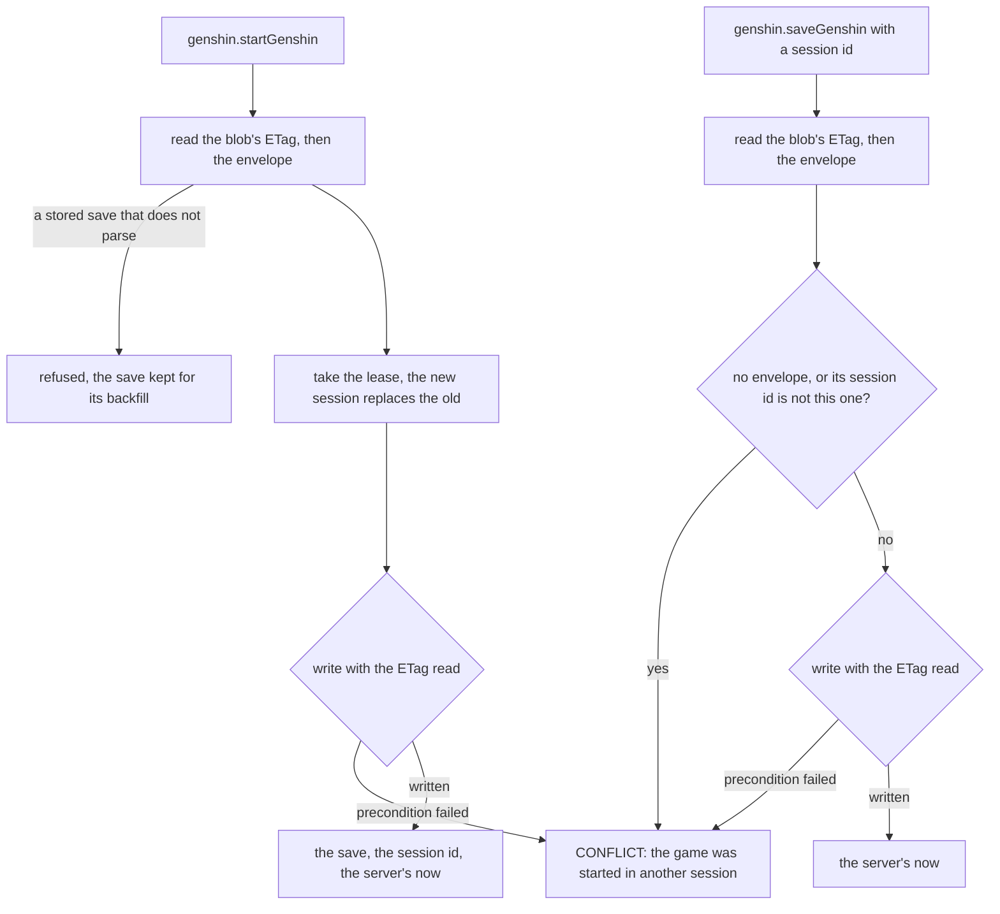
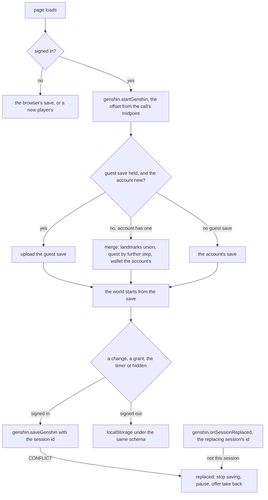

# Save data

A player's Genshin save is one blob in the game's own container, `{userId}/save.json`, and it holds the session that owns it beside the save itself. Starting the game takes the lease: the start issues a new session id, which replaces the one the blob held, and the save it returns is the one the player resumes. A save from a session that is no longer current is refused, and the server does not merge it. Its slices are Zod schemas beside their models in `genshin-world`, and the composed schema bounds every list and the document's serialized size.

## How it works

A start and a save each read the ETag before the envelope, so a write that lands between the two reads makes the save's own write fail its precondition. That failure is answered as a replacement too, because with one live session a changed blob means the lease was lost. The router throws the same CONFLICT for both, so the client can tell a replaced game from a failed save.

The client plays the save it starts with. The world takes its wallet, carried quests and unlocked landmarks from the save and emits the whole save on every change, so the page saves what it holds on the clicker's autosave cadence, saves at once after a grant, and flushes when the page is hidden. Signed out, the same schema is kept in localStorage. A start answers whether the account had a save: when it did not, a guest's save uploads, and when it did, the two merge.

A stored save that no longer parses is refused, never read as no save: a start over it would write a new player's save over the player's progress. The save is the server's to hold, so the latest-shape-only standard backfills it to the current shape rather than resetting it (the `backfills` skill), and both the start and the save are refused until it is.

## Decisions

- **The lease lives in the save blob.** The session id is written in the same blob as the save, so one ETag covers both, and no table, service or migration is added. The alternative, a separate lease blob, would leave a window between the lease check and the save write that the ETag cannot close.
- **A stale write is refused, never merged.** One live session per account means two copies of a save cannot diverge, so the merge the proposal first described is not needed for the live session. It stays only for a guest's local save uploaded into an account that already has one, which is not built.
- **The ETag is a safety net.** A conflicting write means the lease was lost, so it is answered as a replacement rather than retried. A start that loses a race with another start is replaced the same way, since the other start holds the lease.
- **The server's clock answers every start and save, and the client reads its timers through the offset.** The offset is the server's now minus the midpoint of the call's send and answer, re-taken on each save. Original Resin's regeneration, the gathering points' respawns and the pickups' instants are read through it.
- **A replaced session is told by the in-process real-time layer, and by the refused write as the fallback.** A start that replaces a session emits the replacing session's id on the per-user `replaceSession` event, which the `onSessionReplaced` subscription yields to the user's subscribers. A session that does not hear it is refused with CONFLICT on its next save, and that refusal alone also replaces it.
- **A guest's save merges by a pure rule.** Landmarks union, a quest keeps the further of its two steps, and the wallet is the account's copy, except that a same-day Primogem refill count takes the larger. A new account takes the guest's save as it is.
- **The save's slices are the game's ids and counters.** A wallet's currencies, the instants as ISO strings, the unlocked landmark ids, and each carried quest's progress by id. The world's rules derive everything else on load.
- **The save's bound is named.** At most 512 unlocked landmarks, 512 quests, 16 objectives a quest and 64 characters an id, and a document at most 256 KiB serialized.
- **The new player's save is the empty one.** It holds the wallet a new player holds, Original Resin at its cap from the epoch, and nothing else.

## Key files

Paths relative to the repository root.

| File                                                               | Role                                                                        |
| ------------------------------------------------------------------ | --------------------------------------------------------------------------- |
| `apps/web/server/trpc/routers/genshin.ts`                          | `startGenshin` and `saveGenshin`                                            |
| `apps/web/server/services/genshin/startGenshin.ts`                 | take the lease and write the envelope under the ETag read                   |
| `apps/web/server/services/genshin/saveGenshin.ts`                  | refuse a stale session and write under the ETag                             |
| `apps/web/server/services/genshin/writeGenshinSaveEnvelope.ts`     | the conditional write, a failed precondition refused as a replacement       |
| `apps/web/server/services/genshin/readGenshinSaveState.ts`         | the blob's ETag and its parsed envelope, a save that does not parse refused |
| `apps/web/server/services/genshin/startGenshinSession.ts`          | the lease rule: a new session replaces the old and keeps its save           |
| `apps/web/server/services/genshin/checkIsGenshinSessionCurrent.ts` | the write rule: only the current session's id matches                       |
| `apps/web/server/models/genshin/GenshinSaveEnvelope.ts`            | the blob's shape: the save and the session id                               |
| `packages/genshin-world/src/save.ts`                               | the save's entry for the server, `genshin-world/save`                       |
| `packages/genshin-world/src/models/save/GenshinSave.ts`            | the composed save schema and its size bound                                 |
| `packages/genshin-world/src/models/inventory/WalletSave.ts`        | the wallet's slice, with the Original Resin instants as ISO strings         |
| `packages/genshin-world/src/models/map/UnlockedLandmarkSave.ts`    | the unlocked landmarks' slice                                               |
| `packages/genshin-world/src/models/quest/QuestProgressSave.ts`     | the carried quests' progress slice                                          |
| `packages/genshin-world/src/services/save/constants.ts`            | the bounds and the new player's save                                        |
| `packages/db/src/services/azure/container/writeJsonBlob.ts`        | a write under conditions, returning its ETag and stored length              |
| `apps/web/server/services/genshin/events/genshinEventEmitter.ts`   | the per-user `replaceSession` event a start emits                           |
| `apps/web/server/trpc/routers/genshin.ts`                          | `onSessionReplaced`, the per-user subscription the page holds               |
| `apps/web/app/composables/genshin/useGenshinSave.ts`               | the page's save: start, offset, autosave, grant, hidden flush, guest merge  |
| `apps/web/app/components/Genshin/Index.vue`                        | the page wiring the save into the world and the replaced dialog             |
| `packages/genshin-world/src/services/save/readGenshinSave.ts`      | the save read into the world's systems                                      |
| `packages/genshin-world/src/services/save/toGenshinSave.ts`        | the world's systems written as the save                                     |
| `packages/genshin-world/src/services/save/mergeGenshinSave.ts`     | the guest's save merged into the account's                                  |

## Notes

- The read is a start: there is no separate read procedure, so opening the game is always a lease, and a second tab that opens the game takes it from the first.
- The start's own write can fail its precondition when two starts race, as when the game opens in two tabs at once. The one that lost gets the same CONFLICT a replaced save does.
- A refused session costs one blob read and the envelope's parse. The request body is validated by the procedure's input schema before any of that runs.
