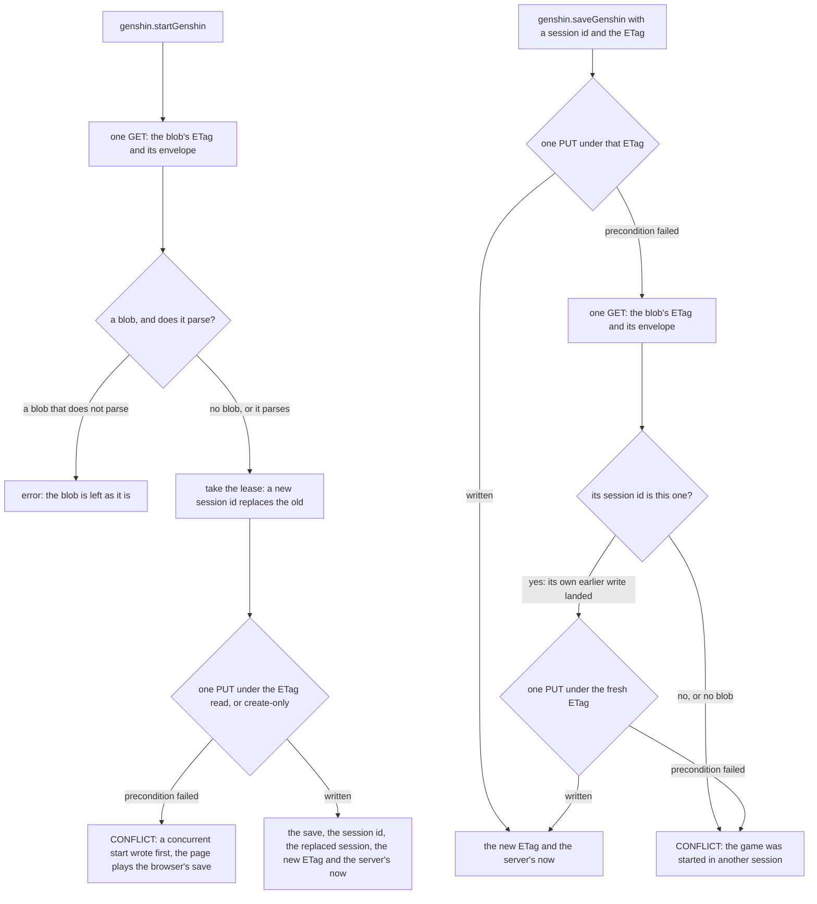
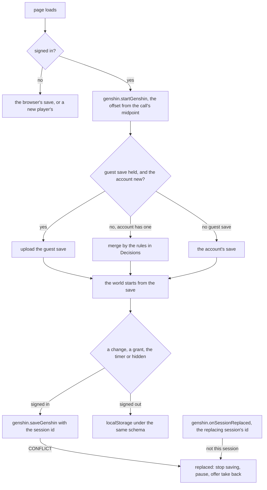
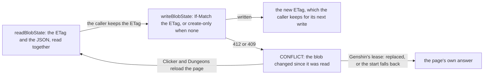

# Save data

A player's Genshin save is one blob in the game's own container, `{userId}/save.json`, and it holds the session that owns it beside the save itself. Starting the game takes the lease: the start issues a new session id, which replaces the one the blob held, and the save it returns is the one the player resumes. A save from a session that is no longer current is refused, and the server does not merge it. The save holds one slice per system the world keeps: the wallet, the carried quests, the unlocked landmarks, the bag, the achievements, the wish counters, the Adventure EXP, Mondstadt's Reputation and the Companionship EXP. Each slice is a Zod schema beside its model in `genshin-world`, and the composed schema bounds every list and the document's serialized size.

## How it works

A start is one GET and one PUT. A save is one PUT under the ETag its session's last start or save returned: that ETag was minted by a write of this session, so a blob still carrying it is unchanged since, and its lease is still this session's, which needs no read and no parse. Only a refused write is read once. A write of this session that landed before (a lost response, an SDK retry) is written over under the fresh ETag; any other session's envelope is a replacement, and a write refused again is a CONFLICT too, since a blob that changed under the lease means the lease was lost. The write throws the same CONFLICT for each, so the client can tell a replaced game from a failed save.

The client plays the save it starts with. The world takes its wallet, bag, carried quests, unlocked landmarks, achievements and wish counters from the save and emits the whole save on every change, so the page saves what it holds on the clicker's autosave cadence, saves at once after a grant, and flushes when the page is hidden. Signed out, the same schema is kept in localStorage as plain JSON, and a reload reads it back the same way, its instants still the ISO strings the schema reads. A start answers whether the account had a save: when it did not, a guest's save uploads, and when it did, the two merge.

A save that no longer parses is never overwritten. The start and the save answer a logged error and leave the blob as it is, because the save is the player's only copy and a fresh game written over it would be the loss. Only a blob that is not there begins a new player's save. A save written before a slice was added is not read with a default for that slice: the schema describes the latest shape only, and the stored blob is brought to it by a backfill (the backfills skill).

The reads and writes of the blob go through the shared blob-state services, which the Clicker and Dungeons saves use as well. A read returns the blob's JSON with the ETag it was read under, and a write is conditioned on an ETag: the write lands only while the blob still carries it, and an absent ETag means the blob must not exist yet. A refused write is a CONFLICT.

## Decisions

- **The lease lives in the save blob.** The session id is written in the same blob as the save, so one ETag covers both, and no table, service or migration is added. The alternative, a separate lease blob, would leave a window between the lease check and the save write that the ETag cannot close.
- **A stale write is refused, never merged.** One live session per account means two copies of a save cannot diverge, so the merge the proposal first described is not needed for the live session. The guest's merge below is the only merge.
- **The ETag is the lease.** A save under the ETag its session last got is one write, and a refused one is read once: only the session's own earlier write is written over, and any other session's envelope is a replacement. A conflicting write is answered as a replacement rather than retried, so a changed blob is never merged. A start that loses a race with another start is replaced the same way, since the other start holds the lease.
- **Every blob-state save goes through the shared path, and the Genshin lease is one caller of it.** The Clicker and Dungeons save the same way, as the [conditional writes](/docs/architecture/conditional-writes) page describes. The Genshin start and save write through the same service, with the lease's own rules in front of it.
- **The server's clock answers every start and save, and the client reads its timers through the offset.** The offset is the server's now minus the midpoint of the call's send and answer, re-taken on each save. Original Resin's regeneration, the gathering points' respawns and the pickups' instants are read through it.
- **A replaced session is told by the in-process real-time layer, and by the refused write as the fallback.** A start that replaces a session emits the replacing session's id on the per-user `replaceSession` event, which the `onSessionReplaced` subscription yields to the user's subscribers. A session that does not hear it is refused with CONFLICT on its next save, and that refusal alone also replaces it.
- **A guest's save merges by a pure rule, slice by slice.** The landmarks and the achievements are grow-only: landmarks union, and an achievement keeps the larger count and the earlier moment it was finished. A quest keeps the further of its two steps, and on the same step each objective's count keeps the larger. The Adventure EXP and each character's Companionship EXP keep the larger. Each kind of wish keeps the counters of the copy that has made more wishes of it, whole, so its pity is one copy's. Mondstadt's Reputation keeps the further, by level and then by EXP. The bag and the wallet are the account's copy, except that a same-day Primogem refill count takes the larger. A new account takes the guest's save as it is.
- **The bag keeps no names.** An entry stores the item's id in the game's tables, the bag's own id and count, and a weapon's or an artifact's level. Its definition, and so its name in the reader's language, is read from the game's tables as the save loads: a weapon's from the weapon table, whose id the entry names, and any other item's from the materials table, each name read by its text id from the name-text chunks. A bag reads in whichever language the reader plays.
- **The save's slices are the game's ids and counters.** A wallet's currencies, the instants as ISO strings, the unlocked landmark ids, each carried quest's progress by id, each achievement's count and finish moment by id, each character's Companionship EXP by id and each kind of wish's counters. The world's rules derive everything else on load.
- **The save's slices have no defaults.** A slice a save predates is a save the backfill has not reached, not a shape to read, so the schema refuses it, and the blobs in storage are backfilled to the shape in the change that added the slice (the backfills skill). A new player's save is written whole, never with a slice left out.
- **Reputation and Companionship are carried, not changed.** No source adds Reputation or Companionship EXP to the world yet, and the characters a player holds are not saved, so the world holds the saved values and writes them back unchanged. Companionship has no character to apply to until the roster is saved.
- **Enemy respawn timers are not saved, so they stay on the local clock.** Each defeated enemy's instant is held in memory, and a reload resets them. The [save data proposal](/docs/proposals/genshin/save-data) says how they are read once they are saved.
- **The save's bound is named.** At most 512 unlocked landmarks, 512 quests, 16 objectives a quest, 2048 achievements, 512 characters, a bag of a few thousand entries, and 64 characters an id, and a document at most 256 KiB serialized. The bounds are named in `services/save/constants.ts`.
- **The new player's save is the empty one.** It holds the wallet a new player holds, Original Resin at its cap from the epoch, an empty bag, Mondstadt's Reputation at its first level, and nothing else.
- **A blob that does not parse is an error, never a reset.** The start and the save answer a logged error and leave the blob, since the save is the only copy the player has. The reset the latest-shape-only standard describes stays with the Clicker and Dungeons reads.
- **Genshin saves do not count against the storage quota.** The ledger is charged only by writes to resource assets: its subscription filters to that container, and every charge call names a resource write. The blob-state write discards the stored size `writeJsonBlob` returns and keeps only the ETag, so nothing charges `genshin-assets`, and a save is never rejected for its size. The [storage quotas](/docs/resource/storage-quotas) page's what is not counted list names the game-save blobs.

## Key files

Paths relative to the repository root.

| File                                                                                   | Role                                                                                           |
| -------------------------------------------------------------------------------------- | ---------------------------------------------------------------------------------------------- |
| `apps/web/server/trpc/routers/genshin.ts`                                              | `startGenshin` and `saveGenshin`, and `onSessionReplaced`                                      |
| `apps/web/server/services/genshin/startGenshin.ts`                                     | take the lease in one GET and one PUT, returning the replaced session and the new ETag         |
| `apps/web/server/services/genshin/saveGenshin.ts`                                      | one write under the session's ETag, one read when a refused write was the session's own        |
| `apps/web/server/services/genshin/writeGenshinSaveEnvelope.ts`                         | the write through `writeBlobState`, its CONFLICT refused as a replacement                      |
| `apps/web/server/services/genshin/readGenshinSaveState.ts`                             | the blob's ETag and its parsed envelope; a blob that does not parse is an error, never a reset |
| `apps/web/server/models/genshin/SaveGenshinInput.ts`                                   | the save's input: the envelope and the session's ETag                                          |
| `apps/web/server/services/genshin/startGenshinSession.ts`                              | the lease rule: a new session replaces the old and keeps its save                              |
| `apps/web/server/services/genshin/checkIsGenshinSessionCurrent.ts`                     | the write rule: only the current session's id matches                                          |
| `apps/web/server/models/genshin/GenshinSaveEnvelope.ts`                                | the blob's shape: the save and the session id                                                  |
| `apps/web/server/services/blobState/readBlobState.ts`                                  | the blob's ETag and JSON from one download, decoded through `decompressJsonBlob`               |
| `apps/web/server/services/blobState/writeBlobState.ts`                                 | the write under the ETag, create-only when none, a refusal as CONFLICT                         |
| `apps/web/server/trpc/procedure/blobState/createReadBlobStateProcedure.ts`             | the shared read: `{ data, etag }` for Clicker and Dungeons                                     |
| `apps/web/server/trpc/procedure/blobState/createSaveBlobStateProcedure.ts`             | the shared save: `{ data, etag }` in, the new ETag out                                         |
| `apps/web/app/services/trpc/checkIsTRPCConflict.ts`                                    | the page's test for a CONFLICT answer                                                          |
| `packages/genshin-world/src/save.ts`                                                   | the save's entry for the server, `genshin-world/save`                                          |
| `packages/genshin-interface/src/save.ts`                                               | the kinds of wish the save keys its counters by, `genshin-interface/save`                      |
| `packages/genshin-world/src/models/save/GenshinSave.ts`                                | the composed save schema, every slice required, and its size bound                             |
| `packages/genshin-world/src/models/save/GenshinSaveState.ts`                           | the systems as the world reads them                                                            |
| `packages/genshin-world/src/models/inventory/InventorySave.ts`                         | the bag's slice, its entries by item id                                                        |
| `packages/genshin-world/src/models/inventory/WalletSave.ts`                            | the wallet's slice, with the Original Resin instants as ISO strings                            |
| `packages/genshin-world/src/models/map/UnlockedLandmarkSave.ts`                        | the unlocked landmarks' slice                                                                  |
| `packages/genshin-world/src/models/quest/QuestProgressSave.ts`                         | the carried quests' progress slice                                                             |
| `packages/genshin-world/src/models/achievement/AchievementProgressSave.ts`             | the achievements' progress slice, each finish moment an ISO string                             |
| `packages/genshin-world/src/models/adventureRank/AdventureExpSave.ts`                  | the Adventure EXP slice                                                                        |
| `packages/genshin-world/src/models/friendship/CompanionshipExpSave.ts`                 | the Companionship EXP slice, by character id                                                   |
| `packages/genshin-world/src/models/reputation/ReputationProgressSave.ts`               | Mondstadt's Reputation slice                                                                   |
| `packages/genshin-world/src/models/wish/WishPityMapSave.ts`                            | the wish counters' slice, keyed by the kind of wish                                            |
| `packages/genshin-world/src/services/save/constants.ts`                                | the bounds, the slices' empty values and the new player's save                                 |
| `packages/genshin-world/src/services/save/toInventory.ts`                              | the bag read from its save, each definition read by item id, a weapon from the weapon table    |
| `packages/genshin-world/src/services/save/toInventorySave.ts`                          | the bag written as its save, each entry by item id                                             |
| `packages/genshin-world/src/services/save/toAchievementProgressMap.ts`                 | the achievements' progress read from its save                                                  |
| `packages/genshin-world/src/services/save/toAchievementProgressSave.ts`                | the achievements' progress written as its save                                                 |
| `packages/db/src/services/azure/container/decompressJsonBlob.ts`                       | the zstd decode every server reader of a JSON blob shares                                      |
| `packages/db/src/services/azure/container/writeJsonBlob.ts`                            | a write under conditions, returning its ETag and stored length                                 |
| `apps/web/server/services/genshin/events/genshinEventEmitter.ts`                       | the per-user `replaceSession` event a start emits                                              |
| `apps/web/app/composables/genshin/useGenshinSave.ts`                                   | the page's save: start, offset, autosave, grant, hidden flush, guest merge                     |
| `apps/web/app/services/genshin/readGuestSave.ts`                                       | the signed-out save, parsed as plain JSON so its instants read                                 |
| `apps/web/app/components/Genshin/Index.vue`                                            | the page wiring the save into the world and the replaced dialog                                |
| `packages/genshin-world/src/components/World/Session/Index.vue`                        | the world reading each system from the save and emitting the whole of it                       |
| `packages/genshin-world/src/services/save/readGenshinSave.ts`                          | the save read into the world's systems                                                         |
| `packages/genshin-world/src/services/save/toGenshinSave.ts`                            | the world's systems written as the save                                                        |
| `packages/genshin-world/src/services/save/mergeGenshinSave.ts`                         | the guest's save merged into the account's, slice by slice                                     |
| `apps/web/shared/services/achievement/definitions/ClickerAchievementDefinitionMap.ts`  | the clicker achievements' conditions, read from the save's `data` key                          |
| `apps/web/shared/services/achievement/definitions/DungeonsAchievementDefinitionMap.ts` | the dungeons achievements' conditions, read from the save's `data` key                         |

## Notes

- The read is a start: there is no separate read procedure, so opening the game is always a lease, and a second tab that opens the game takes it from the first.
- The start's own write can fail its precondition when two starts race, as when the game opens in two tabs at once. The one that lost gets the same CONFLICT a replaced save does, and the page plays the browser's save for that load rather than the account's.
- A save under its session's ETag costs one write. A refused one costs one read and the envelope's parse, after the request body is validated by the procedure's input schema.
- The achievement conditions read the save they are checked against through its `data` key, because the shared save procedure's input is `{ data, etag }`.
