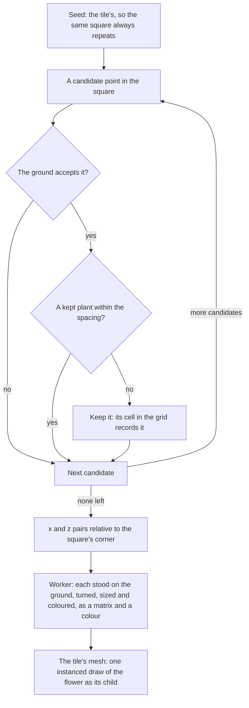

# Scatter

Genshin's ground carries more than its trees and grass. Between the placed trees there are small flowers and pebbles that no placement record holds, so no record places them. They are scattered: each finest terrain tile is given its key as a seed, a set of candidate points is thrown over its square in the terrain's worker, and the flowers kept are drawn on the tile.

## How it works

- **Dart throwing with a fixed count.** `computeScatterPoints` draws `candidateCount` points from a seeded stream (`createSeededRandom`) over the square. A candidate is kept only when the ground accepts it and no kept plant stands closer than `spacing`, so plants are spread evenly without a visible lattice. The stream is consumed whether a candidate is kept or not, so the same options always give the same plants.
- **The ground decides.** The caller's `checkIsAccepted` is the ground's verdict on a point. The generator does not know what grows where; Windrise's worker accepts a point above the water whose ground is almost all grass by the [ground paint](/docs/genshin/ground-paint)'s weights there, at the slope read across it (`computeWindrisePlants`). The ground it asks is the one the worker was loaded with as it started: its height, its layers' weights and the water's level (`WindrisePlantsGround`), built once from the records the world read before it opened ([terrain](/docs/genshin/terrain)).
- **Only the finest tiles grow plants.** A tile past the finest level is drawn too far for a flower to show, so the worker scatters nothing on it. Each flower kept stands on the ground, turned and sized at random from a seeded stream of its own, in one of the region's colours, written as an instance matrix relative to the tile's corner and a colour, and handed back with the tile's arrays.
- **A tile's flowers are one draw, its mesh's child.** The terrain draws them as an instanced mesh of the one flower under the tile's mesh, so they show, hide and are freed with the tile (`createFlowerGeometry`). A flower is two cards crossed, cut to a round head, white in itself so each instance takes its own colour; like a grass blade it takes the ground's upward normal and bends with the wind by the square of its height (`createFlowerMaterial`).
- **A grid makes the spacing check cheap.** The grid's cells are a spacing over the square root of two a side, so a cell holds at most one kept plant. A candidate checks only the cells within two of its own, not every plant kept so far.

## What it costs to run

- **Per square, linear in the candidates.** Each candidate costs one accept call and a check of at most twenty-five cells, so the cost follows the candidates thrown, not the plants kept.
- **Nothing is stored between squares.** Each square's grid is built and dropped with the call.
- **A draw for each finest tile drawn.** Tens of them round the eye, each a few dozen flowers.

## Key files

| File                                                                    | Role                                                                             |
| :---------------------------------------------------------------------- | :------------------------------------------------------------------------------- |
| `packages/genshin-engine/src/vegetation/computeScatterPoints.ts`        | Seeded dart throwing with the spacing check, returning the plants' x, z          |
| `packages/genshin-engine/src/models/vegetation/ScatterOptions.ts`       | The square's side, spacing, seed, candidate count and the ground's verdict       |
| `packages/genshin-world/src/services/windrise/computeWindrisePlants.ts` | Windrise's flowers on a finest tile: where they grow, their matrices and colours |
| `packages/genshin-world/src/workers/terrainTile.worker.ts`              | The worker that scatters a finest tile's flowers beside its ground               |
| `packages/genshin-engine/src/vegetation/createFlowerMaterial.ts`        | A flower's head, its colour, its shading and its sway                            |
| `packages/genshin-engine/src/random/createSeededRandom.ts`              | The seeded stream every candidate is drawn from                                  |

## Notes

- **The flowers' spacing, sizes and colours are provisional.** Being random, they are matched to the references by their statistics, their density, sizes and colours' spread ([trees and scatter](/docs/proposals/genshin/trees-and-scatter)).
- **A flower stands on its tile's finest heights.** As its tile morphs toward the next level at the far end of its range, the ground under a flower can move a few centimetres from where it stands, where no one sees it.
