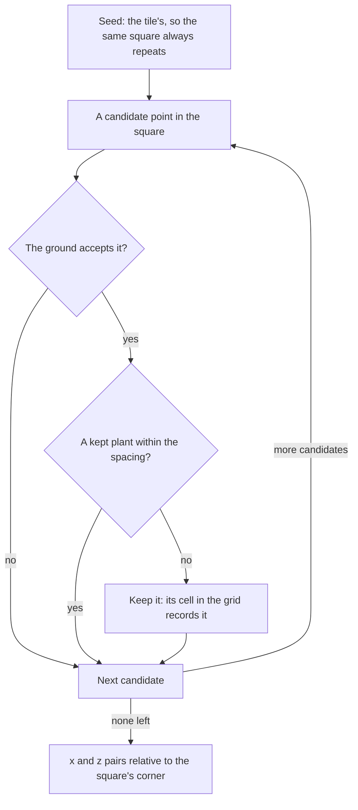

# Scatter

Genshin's ground carries more than its trees and grass. Between the placed trees there are small flowers and pebbles that no placement record holds, so no record places them. They are scattered: each terrain tile is given a seed, and a set of candidate points is thrown over its square. The generator here is the part that decides where the plants go.

## How it works

- **Dart throwing with a fixed count.** `computeScatterPoints` draws `candidateCount` points from a seeded stream (`createSeededRandom`) over the square. A candidate is kept only when the ground accepts it and no kept plant stands closer than `spacing`, so plants are spread evenly without a visible lattice. The stream is consumed whether a candidate is kept or not, so the same options always give the same plants.
- **The ground decides.** The caller's `accepts` is the ground's verdict on a point, the fitted layers, slope and height that the terrain worker will supply. The generator does not know what grows where.
- **A grid makes the spacing check cheap.** The grid's cells are a spacing over the square root of two a side, so a cell holds at most one kept plant. A candidate checks only the cells within two of its own, not every plant kept so far.

## What it costs to run

- **Per square, linear in the candidates.** Each candidate costs one accept call and a check of at most twenty-five cells, so the cost follows the candidates thrown, not the plants kept.
- **Nothing is stored between squares.** Each square's grid is built and dropped with the call.

## Key files

| File                                                              | Role                                                                       |
| :---------------------------------------------------------------- | :------------------------------------------------------------------------- |
| `packages/genshin-engine/src/vegetation/computeScatterPoints.ts`  | Seeded dart throwing with the spacing check, returning the plants' x, z    |
| `packages/genshin-engine/src/models/vegetation/ScatterOptions.ts` | The square's side, spacing, seed, candidate count and the ground's verdict |
| `packages/genshin-engine/src/random/createSeededRandom.ts`        | The seeded stream every candidate is drawn from                            |

## Notes

- **Not yet in a tile.** The generator is not called from the terrain worker and its plants are not drawn; sizes and colours come with that consumer. Species, impostors, culling and the trail are still in [trees and scatter](/docs/proposals/genshin/trees-and-scatter).
