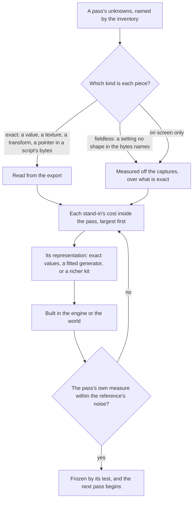
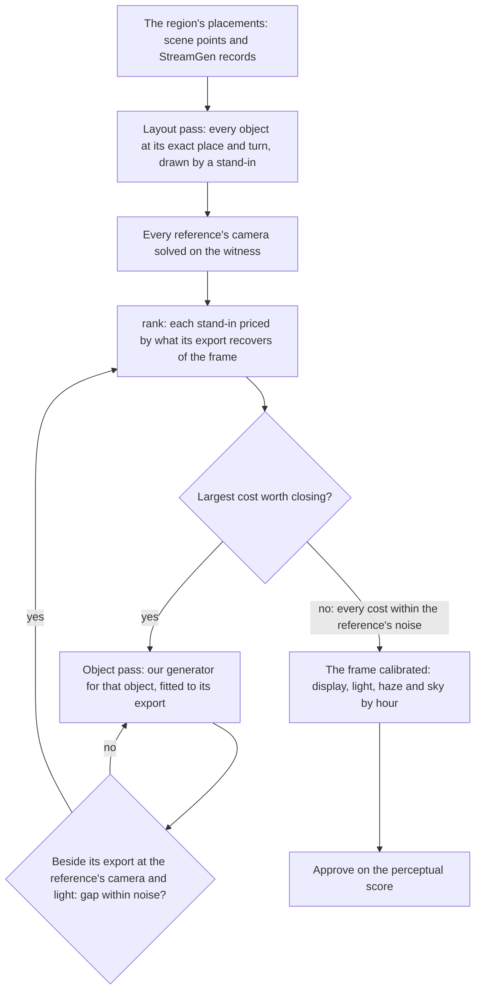

# Scene derivation

This page is the method every 3D scene of the [Genshin](/docs/proposals/genshin) program follows, built on the [derived assets](/docs/genshin/derived-assets) pipeline and the [parity](/docs/genshin/parity) loop; the tools each step uses are those pages' commands, and the order its unknowns are answered in, each judged by its own measure and frozen, is set by the [recreation passes](/docs/proposals/genshin/recreation-passes). The interface converges on the game within a few tenths of a percent because its reference holds it exactly and every difference points at the piece that caused it. A 3D scene converges only when the same is made true of it, and four things stand in the way unless the method rules them out:

- **A search over the frame.** The arrangement, the camera, the materials, the light, the fog and the grade all land in one frame's score, and a search over it settles at the minimum that masks every other mistake: a grid of camera poses absorbs a wrong arrangement into a plausible pose, and a light searched on the frame's mean stands in for a missing texture.
- **A fit that throws the game's information away.** A tower's exports are a mesh of thousands of vertices, a diffuse, a normal and a mask texture, and a material of several dozen values. A kit that keeps a lathe section per band and one colour for all the stone has a ceiling below the game however its few numbers move.
- **An assumed shading model.** The login stone's own programs only write its normal map, gloss, specular colour and rim into the G-buffer, and the game's deferred pass lights them: the sun through a ramp of its own, the sky's spherical harmonics, a cube and a GGX highlight. No tuning of a toon ramp or of a physically based material reaches that pass; reading its program does.
- **A score that cannot say where the gap is.** A whole frame's shape and tone, the tone blurred past any texture, cannot tell the geometry, a material, the light, the sky or the grade apart when a change moves them.

## Decisions

- **Lossless, re-derived.** The goal is that the browser shows what the game shows, pixel for pixel where the game's own frame allows. What ships is our own re-derivation: shaders written in TSL, geometry generated by our code, and data in our own formats written by our fits. No file, format or data of the game's passes through into the repository or a build, and that is the one line. Short of it, a re-derivation has no fidelity ceiling: a kit rich enough to rebuild a tower within a pixel of its mesh on screen, or a procedural stone that reproduces its texture's look, is the goal, not an overreach.
- **Solved in the passes' order, never searched.** Each unknown is answered in its [recreation pass](/docs/proposals/genshin/recreation-passes), after the passes it depends on, by the most exact query there is: the exact value, then a closed-form solve, then a local refinement from it.
- **Nothing is built before it is inventoried.** A scene starts by listing everything the game draws it with: every renderer, its materials, each material's shader, values and texture slots, what each texture channel holds, and the lightmaps, reflection probes, grading tables and sky the scene reads. It also lists what the scene's scripts spawn and set. Each piece of information is sorted into one of three kinds, and the kind decides how it is derived (below).
- **Every loss in a pass is priced before it is closed.** The witness render draws the exports themselves, and each stand-in of ours is drawn beside its export at the same camera, moment and light. Inside a pass, the frame's error each term could recover is its cost, and the work goes to the largest cost first; across passes, the earlier pass goes first however large a later cost.
- **The witness render is a diagnostic and never ships.** It runs only on the parity page in development, reads the exports from the references folder, and is never bundled, built or committed. It is not a second render path of the product: it is how the product's one render path is measured.
- **Each layer is scored on its own.** A reference is split into layers, sky, clouds, stone and walkway among them, by the witness render's part identifiers from the same camera, so each subsystem has its own shape, tone and detail score and a change is judged where it lands.
- **The game's shaders and its scripts' raw bytes are read; its code metadata is not decrypted.** A shader asset the exporter dumps is read as a reference, its maths rewritten in TSL as our own. A script's JSON export carries no fields, but its raw export keeps the serialized bytes, which are scanned for what their shapes name: a pointer to a path ID the scene holds, a colour, a curve. Nothing of the game's code metadata is decrypted and nothing touches the running game ([the Genshin proposal](/docs/proposals/genshin)). What neither holds is measured off the captures, as [derived assets](/docs/genshin/derived-assets) measures what a dump cannot hold.
- **A family of scattered cards is gated on its envelope, against the exports' own halves, closed at the cards' own spacing.** Leaf against leaf, the outline, depth and normal of each card are scatter: the Oak's leaves sit 163,000 pixels apart against 73,000 with the cards whole, so no canopy meets a pixel or a hundredth but the export's own cards, which may not ship. The per-card figures stay as diagnostics. The gate is the canopy's envelope: each side's leaf cards closed and their depth and normal averaged over the same window, read against the exports' two halves (each card whole in one half, `WitnessView.leafHalf`), with the gate the distance those two halves stand apart on their own envelopes (`measureEnvelope`). The window is the cards' spacing as the exports draw it, never a size picked by hand: the least closing radius at which every hole either half leaves is a hole the whole leaves too (`computeEnvelopeRadius`), so a gap one half's cards leave where the other's fill is closed, and a window every sample shows stays open. One card's 5.9 m read the radius rather than the shape: swept from 1 to 100 pixels, the floor's outline ran anywhere from 4.8 to 14.0 pixels and ours rose from 5 to 54. Drawn from both sides (the next decision) the floor's outline stays within 4.3 to 7.5 pixels over the same sweep, its depth and normal falling as any windowed mean's scatter does, and ours misses all three at every radius past the cards' spacing, so the miss is the canopy's and not the window's. Windrise's Oak spaces its cards at 11 pixels, 1.1 m at the crown's median depth, where its floor reads 5.43 pixels outline, 0.101 depth and 17.3 degrees normal, the normal read on the geometry as every family's is. Ours read 13.7, 0.141 and 26.5 before its crown was fitted to the export's leaf ([trees](/docs/genshin/trees)) and 12.1, 0.099 and 24.2 after, its depth held; our cards set at the export's own triangles read 10.8 pixels and 23.2 degrees, so no layout of them meets the outline or the normal. With the bark's surface roots drawn, swept along the centrelines traced off the export's own, the outline reads 10.0 pixels, the depth 0.097 and the normal 24.1 degrees, from 12.5, 0.099 and 24.2 on the same machine. What the outline still misses under the crown is the trunk, which the kit stands straight on the oak's axis where the export's leans off it and parts into limbs, and the roots the hills bury before it.
- **The witness draws a face from behind where its source does, and that face reads its geometry's own normal.** The game's leaf mesh holds no back face for any card, and its normals are a field over the crown at right angles to the cards, so its foliage is drawn from both sides, as ours is. The witness's targets drew every part from the front alone, so each side kept only the cards that happened to face the camera. Every target now takes its source's sides, the exports' leaf material drawn from both, and a face drawn from behind writes its geometry's normal: `normalWorld` flips a back face's, which read the exports' own halves 75 to 80 degrees apart. Windrise's per-card Oak reads 2.25 pixels, 0.169 and 32.1 degrees drawn so, from 2.21, 0.195 and 39.9; the statue and the paving read as before, the ground's normal 9.56 degrees from 9.66, and the login's families draw nothing from behind.
- **A family's normal is read on its geometry; its maps' bend is gated on its own.** The exports' normal target is their normals as their normal maps bend them, and the maps are textures nothing of ours ships, so a stand-in drawn without them reads at least their bend however exact its geometry. So the shape pass reads each family's normal on the geometry: the exports' `geometryNormal` target against ours, both drawn without maps, at the same 10 degrees. The bend is gated separately, as a surface detail: each family's mean bend of ours less the exports' over the pixels both draw, gated at the floor the exports' own two halves of 32-pixel blocks stand apart by, never below the normal target's resolution, about 0.02 degrees (`getSurfaceBendReading`, `SHAPE_NORMAL_RESOLUTION_DEGREES`). Windrise's statue reads 14.8 degrees on its geometry, its maps bend the exports' normals 10.5 degrees (10.4 and 10.6 over its halves) and ours bend none, so its detail fails until a procedural normal detail fitted to that bend ships on its material; the oak's 1.7 degrees, the paving's 5.9 and the ground's 0.0006 holds, its halves' 0.0002 being float noise under the 0.02-degree floor. The map-included normal stays a printed diagnostic, 16.8 degrees for the statue.
- **A ground's layers are a fitted field of their shares, placed where the game places them, never by slope.** Over Windrise's radius the base maps' flat ground is about half grass and half earth and their steep ground mostly grass, so the hand slope bands misclassed about two fifths of the ground and the best slope-only bands paint it all grass; each TerrainData names the layer of every four-metre cell itself, a byte map one of the base map's tones on 91 to 95% of each tile ([game data formats](/docs/genshin/game-data-formats)). So the representation is a grid of each layer's shares over the ground radius, fitted from the base-map texels each classed to its nearest palette tone ([ground paint](/docs/genshin/ground-paint)): our own parameters at the measure's resolution, never the game's texture, and fitted from the base maps rather than the byte map because the witness draws the base maps. The cell was chosen by its bytes against the colour the reference's camera sees, read off the base maps: 64 metres misses the gate at about 3.2 ΔE for 11 KB, 32 metres holds at about 1.7 for 39 KB with 13.5% of the ground misclassed, and 16 metres gains a third of a ΔE for 138 KB. Inside a cell the slope moves no class, so no slope band is laid over the field, and neither is the shore's height band: its texels are three quarters earth, which the field paints already, and laid over it the band reads 6.41 ΔE. At 32 metres the surface pass reads Windrise's Ground colour at 1.55 ΔE against 2.30, from 9.10 under the slope bands, and moves no other family's reading.
- **A stand-in's colour is read off its export's texture where each of its vertices stands, never one colour a mesh.** A mesh's mean over every face counts its undersides and the faces no view shows, so the surface it shows reads warmer or cooler than the mean: Windrise's statue read 5.19 ΔE against 2.30 with each of its meshes in its own mean colour, while each mesh covered its share of the exports' pixels to within a point, and drawn over the exports' own coverage it still reads 5.18. So each vertex of the statue's stacks carries its own colour, the mean of the six of its piece's fitted points nearest it, each point the export texture's texel under its material's tint, as the game's G-buffer holds it (`createNearestColourReader`). The colour per vertex was chosen by what each coarser one reads offline against the surface pass: one a stack 3.68 ΔE, one a ring 3.28, one a vertex 1.33; on the page the statue reads 1.32 ΔE, held, and its structure 0.099 share from 0.596, at the cost of a record twice the size, 614 KB, 170 KB compressed.

## How it works

### The three kinds of information

- **Exact.** The exports hold it as numbers or pixels: a material's values and colours, a mesh, a texture's channels, a transform, a grading table, a lightmap, a pointer or a colour in a script's raw bytes. It is re-derived to within the reference's own noise, and the fit that re-derives it prints the error it leaves.
- **Fieldless.** The game holds it, but nothing in the export's bytes names it: a setting whose shape the scanner cannot tell from its neighbours, a particle system's spread and rate. It is measured off the captures and written over an exact value, as the camera's height is written over the walkway's width.
- **On screen only.** Nothing exported holds it: a transition's timing, the running game's light. It is measured off the captures alone, by a solve over what is exact (a camera's path by the matchmove, a light by regression).

### What the passes read here

The [recreation passes](/docs/proposals/genshin/recreation-passes) own the order. What this method adds to them is how a scene's passes read the game: the inventory reads the scene tree, which prints every root, every node and what each lost, and the closure, which exports everything the roots reach, an empty anchor under a script's object being where that script spawns a prefab its raw bytes name; the layout holds every proportion a reference shows between parts that meet, the cross-ratio of the four ends their widths mark on the line where they meet, in a unit test before any render; the camera is solved from landmark correspondences in closed form and refined on the stone's silhouette edges; and the light is solved by least squares over the witness's G-buffer, every pass before it frozen.

### The witness render

The witness page loads a scene's exports from the references folder, draws them through the engine's own renderer at a reference's camera pose, and writes a part identifier, depth, normal and albedo beside the colour. Its layers come from the inventory: which object belongs to the sky, the clouds, the stone. Because the pose is the reference's, the identifier target is also a segmentation of the reference, which is where each layer's score gets its mask. While a tool drives it, the witness holds its clock and its anti-aliasing's jitter, so one render settles a view.

Attribution is `rank`, and it swaps nothing. It shoots the witness twice at the reference's pose, once with every family drawn from the exports and once with none, ours in their place, and ranks every term of the reference's error by its ceiling, the most of the frame's FLIP that term drawn exactly could recover: each family's stand-in with the exports' own lighting and grading set aside, and the sky by its rows. A second table renders every stand-in next to its export under one shared pose and lighting and compares the pair, by FLIP and by structural similarity; the [parity page](/docs/genshin/parity) holds both tables in full. A first table of every swap scored layer by layer against the recording read its rows within noise of each other, since a recording is too soft to tell a stand-in from its export, and was retired for it.

### Choosing a representation

A loss is closed by the least representation that closes it, from this order:

1. **The exact value.** A material's specular colour, a rim's colour, an occlusion strength, a sky colour a script's bytes hold: a number the inventory already has, written into the scene's data.
2. **A fitted generator.** Our code generates the piece and a fit sets its parameters so its output matches the export: a stone material in TSL whose block layout, colour variation, wear and normal detail are fitted to the part's own textures, or a tower kit whose mouldings, windows and bands are fitted to its mesh. The fit prints its error on screen, in pixels at the reference's pose, not in texels or metres.
3. **A richer kit.** When no generator of ours can reach the export's look within the reference's noise, the kit grows the parameters that close it, and the fit is extended to set them.

A representation is judged by its pass's measure at the references' cameras, never by how close it looks in isolation: a stone texture that is visibly different up close can cost nothing at the distance the scene shows it, and a tower silhouette that looks right can cost the most.

### The open world: a layout pass, then a pass per object

An open-world region holds hundreds of objects, so it is built in two kinds of pass. The **layout pass** stands every object the game streams there at its exact place and turn, read from its scene points and its StreamGen records, each drawn by a stand-in: a kit we already have, or the export's bounding box where we have none. Nothing in this pass is judged by eye, since what it gets right is exact data, and it is what every later pass stands on: the cameras are solved against it. Each **object pass** then replaces one stand-in with our own re-derivation of that object, chosen by the loss table and fitted against its own export. It is drawn beside the export at a reference's camera, moment and light, so the only difference left between the two is the object, and it is done when that gap is within the reference's noise. The frame is ranked again before the next object is chosen. Only once every object's gap is within noise are the display transform, the light, the haze and the sky calibrated over the rebuilt region, in the [recreation passes](/docs/proposals/genshin/recreation-passes)' order, since a light calibrated over stand-ins stands in for their wrong shapes and surfaces.

An object the game places many times (a ruin slab, a rock) is one object pass however often it stands, since the fit is of its mesh and the layout already places every copy.

### Scores

- **Each layer is scored on its own**, over its mask, with the existing `shape` and `tone`.
- **A detail score reads what tone blurs away**: the difference in each band of spatial frequency between the reference and the shot over the layer, so a textureless stone scores a loss that its right mean colour hides.
- **A perceptual score over the whole frame**, FLIP's, as the one number a scene is approved by once every layer's loss is within the reference's noise.

## The login scene

The login scene is the first scene run through this method, and what it found applies to every scene after it:

- **The arrangement is spawned, not laid out.** The login's own root holds `SceneObj` at a tenth of its scale, and `SceneObj`'s children are `Atmosphere`, `ModelCamera` and three empty anchors, `SceneBeginNode`, `BridgeBeginNode` and `DoorNode`, all in the login's block. No block is missing: `MonoLoginScene` spawns the scene's prefabs into those anchors at run time. Which prefab the login spawns is in the script's raw bytes, the walkway's parent is `BridgeBeginNode`, and the three spawns are the component's, composed through their anchors.
- **A pose is read by perspective, never searched.** The flight's first pose, shared by the dawn, dusk and night skies, and its last, at the door, are read from the walkway's crossbars and the door's pixel widths and rows and checked by one render each, where a search over a grid of thousands of poses absorbs a wrong arrangement into a plausible pose. The day sky has a pose of its own. The flight between them is a script's, with no clip, so its path is tracked across the recording.
- **The stone is a physically based material.** Its values are a specular colour, a metallic, a shininess, a rim glow and an occlusion strength, and its mask texture is smoothness in red and metal in green. Its diffuse is a near-neutral grey, so the reference's warm stone is its light. Its shader, `miHoYo/Scene/Login Base`, is one AnimeStudio cannot parse, but its unparsed raw export holds its programs like any other's; its programs only write the G-buffer, so the witness and our stone alike are lit as the deferred pass lights it (`StoneLightingModel`), its ramp and its sky harmonics solved per hour by `calibrate`.
- **The tone curve is the bloom's own.** On a standard display the uber pass adds the bloom, applies the white balance and, behind `_MHYBloomTonemapping`, maps each channel by an exposure and a contrast the bloom's settings hold, then encodes it; the 3D table another pass bakes is sampled only in PQ space for an HDR display. A post profile names its table by a pointer in its raw bytes; the login's chains the game's bloom with no colour grading, so its transform to the screen is that curve and that bloom (the login's `Display.reference.ts`).
- **The clouds' shader reads cleanly.** A cloud samples its atlas through a curl-noise offset, dissolves its alpha with its age, is coloured between a dark and a light colour by the atlas's red with a rim, and fades toward the sky. It reads the Enviro sky's own terms: top and bottom colours front and back of the sun, a horizon halo and a sun halo, which `EnviroSky`'s raw bytes hold by hour.

## Windrise

Windrise is the first open-world region run through the method, and its layout pass has begun. Its ground is our own hills fitted to the game's terrain, its water stands at the game's level, and its statue and oak stand and turn where the game's placements set them. Each stands at a height over our ground, its `heightOffset`, its export root's height over our ground. The oak's shape is the tree kit fitted to its meshes ([trees](/docs/genshin/trees)), while the statue's shape is stacks fitted piece by piece to its meshes, an upright stack for each ring of stone and the figure's robe and blades along their own lengths for its leaves, wings and arms, so its size is the game's, and each stack's vertices carry the colour its export's texture paints where they stand (the decisions above). Its shape pass holds its outline and its depth; its normal, read on its geometry, misses at 14.8 degrees against the gate of 10, the hood, the wings, the dish and the leaves most, and its maps' bend fails apart as a surface detail, both as the decisions above set out. The witness lays the region's exports out round the same origin our scene stands round, the oak's foot ([derived assets](/docs/genshin/derived-assets)), and the world screen takes a held camera and a held hour for each reference. Its first camera, the fixed one of a recording of the statue through a whole day, is solved from points on the statue's axis, the dish's brim, the plinth's rim and the trunk's axis. Those landmarks still disagree by about seven pixels, the statue's top and plinth against the dish's brim, so the held camera is the earlier solve's until a set that holds is found; a refinement on the statue's outline is kept only where the landmarks still hold.

The paving round the statue is drawn now, as the export's eighteen slab placements of the two ruin meshes, each a prism over its mesh's outline as its convex hull's radii at twenty-four angles, with flat faces and the export's heights. Its shape pass reads a paving outline of 3.6 pixels against a gate of one, down from 8.5 where the family was not drawn, its depth at 0.0008 against 0.01 and its normal at 6.8 degrees against 10, both of which now overlap. The rest of the outline is one stone at the dais's foot, whose top lies 5 centimetres under our terrain: the terrain's height there is the Ground pass's to fit, so the stone is not raised to the frame. The paving's record is `World/Screen`'s `Paving.reference.ts`.

Every solve is cross-checked on more than one recording. Windrise's ground and placements are the same on the older builds' recordings, so a 2021 or 2022 recording solves a camera and calibrates a light as well as the current build's, and a field of view or an hour read off one recording is trusted only once another agrees. What is worked on next is chosen by what the solves and `rank` price, never by how far a stand-in looks from the game: the fitted ground stays as it is until a ranking prices a finer one.

## Each region's ground

A region's base ground is fitted by `fitRegionGround`, the same fit Windrise's ground goes through. It fits Gaussian hills to the game's terrain tiles of the region's component, round the region's capital: the place its `RegionCapitalMap` landmark stands at, or for Snezhnaya the place set by hand. The hills are fitted only on the catalogue's outlines of the region's areas, so no region's ground runs into another's. A region the catalogue gives no outline, Windrise, is fitted over its disc instead.

Every region is in the world's axes round the oak's foot, so its heights are read against Windrise's origin rather than its own component's. The fit publishes the region's base ground as `<region>/base-ground`, beside its plateau, which `<region>/ground.json` holds and `genshin:data authored` publishes as `ground/<region>`, and prints the error its hills leave and the composed ground's, its hills, features and faded residual together ([terrain shapes](/docs/proposals/genshin/terrain-shapes)). The composed ground is the bar every region's ground is held to: its RMS within 60 metres of the centre at or under the 0.62 metres Windrise's hills leave there, and every landmark's ground moving under 5 centimetres, the layout pass's gate on a root. Each region's fit is an entry in `DerivedAssetFitMap` that runs the fit with its centre; none is written yet, so `fit <region>` has nothing to run.

## The other regions

Each other region's open world is derived by `extract` from its capital's catalogued place, the way Windrise's is laid out, and is never rooted at its capital's index. A capital's layout is checked by `tree`: no architecture lost father within the architecture radius of its place, and architecture placed in that view by the witness. A top collapsed at the origin is an unplaced spawn (a prefab a script spawns at run time), dropped from the witness and counted apart. A lost father at the origin whose subtree is placed off it is placed by the witness, so it is not counted lost. The index is the chunk index of the capital's own StreamGen blob, a MonoBehaviour holding that blob's chunk offsets and hashes and no game object. A closure starts from the layout of game objects, so a root that holds none walks to nothing, and `extract` reports 0 objects for it. The capital's props and buildings are not in that index at all: they are the placements of its own city blob, `Area_<code>_City`, which the index describes ([game data formats](/docs/genshin/game-data-formats)). So the derivation reads that blob and the tiles its view and its architecture radius cover by path hash, keeps the placements in the capital's view and, past it, each architecture placement within 600 metres of its landmark (a building family's name, not a prop, plant, effect or decal), names each prefab by its path hash (the community's index, and each hash past 2.6 that index leaves unnamed by the path its folder gives, hashed from the asset index's own names in the same run by `readDerivedPathNames`, so the extraction owes no later step before its prefabs are named), roots each prefab at the game object its name finds, counts the prefabs no path names, and takes the ground from the 2x2 of terrain tiles its own tile starts (its east, north and north-east neighbours), as Windrise's is. A prefab whose records carry no path hash is named by no stream, so it is not rooted: most of Mondstadt's city blob is such a prefab (170 of its 180 unnamed ids carry no hash in any record). The capital's city area is found by its place, not by name: `genshin:assets city-areas` reads every `Area_<code>_City` candidate the asset index names (every one whose index is a MonoBehaviour, whichever region it serves), keeping each blob's placements' bounding box and centroid in the same game axes as a capital's place, cached as `~/Esposter/genshin-parity/city-areas.json` per game version and read by `readCityAreas`. `selectCapitalCityArea` then picks the area whose extent contains the capital, the nearest centroid where several do, failing that the nearest centroid within the 600-metre architecture radius, and no area beyond it, and `readCapitalCityCode` reads that choice for `extract`. Every capital's city area is found so, with no name kept by hand: the place lookup picks Mondstadt's `Area_Mengde_City` and Liyue's `Area_LYG_City`, the areas their names were once looked up by. The derived block is written beside the exports as `world.json`, and every reader takes it through `readWorldOptions`.

## Key files

| File                                                                    | Role                                                                           |
| :---------------------------------------------------------------------- | :----------------------------------------------------------------------------- |
| `scripts/src/services/genshinAssets/shared/DerivedAssetComponentMap.ts` | Each component's roots, spawns and landmarks, grown to its shader and grade    |
| `scripts/src/services/genshinAssets/fit/fitRegionGround.ts`             | Each region's base ground: hills fitted round its capital, inside its outlines |
| `scripts/src/services/genshinAssets/fit/fitLoginScene.ts`               | The login screen's fits, each printing the error it leaves on screen           |
| `scripts/src/services/genshinAssets/fit/fitAlbedo.ts`                   | A part's one albedo, the median of its export's diffuse textures               |
| `scripts/src/services/genshinParity/reference/compareScreen.ts`         | Scores each layer, and the detail and perceptual scores                        |
| `scripts/src/services/genshinParity/witness/rankReferenceGains.ts`      | The loss table: every term's ceiling, ordering the work inside a pass          |
| `packages/genshin-world/parity/screens.ts`                              | The page the witness render is mounted beside                                  |
| `packages/genshin-world/src/components/Login/Scene/Index.vue`           | The first scene run through the method                                         |
| `packages/genshin-engine/src/nodes/createToonMaterial.ts`               | The environment material the witness render judges                             |
| `scripts/src/services/genshinAssets/fit/createNearestColourReader.ts`   | A stand-in's colour at each of its vertices, read off its export's texture     |
| `packages/genshin-engine/src/nodes/createObjectSurfaceNode.ts`          | A part's surface, times the colours its vertices carry                         |

## Notes

- **The witness render measures the renderer first.** It reaches the reference only as far as our engine renders the game's own data the way the game does, so what it still misses is the renderer's: the shader, the light and the grade. That remainder is the first work, since every stand-in is measured against it.
- **An exact value is not a finished part.** A material's values are written first, but a value names a term of the game's shader, and the term is only right once the shader that reads it is.

## Sources

- [AnimeStudio](https://github.com/Escartem/AnimeStudio): the exporter the inventory reads, and the shader, texture and raw script assets it can dump.
- [FLIP](https://github.com/NVlabs/flip), NVIDIA: the perceptual difference between a rendered image and its reference, as an error map and a mean, the score a scene is approved by.
- Zhenzhong Yi's [Console platform development in Genshin Impact](https://docswell.com/s/UnityJapan/KWRPQ5-210617-unity-dojo20211mihoyozhenzhongyi) (miHoYo, Unity Dojo 2021): the game's own account of its shadows, fog and god rays, read before the frame is calibrated.
