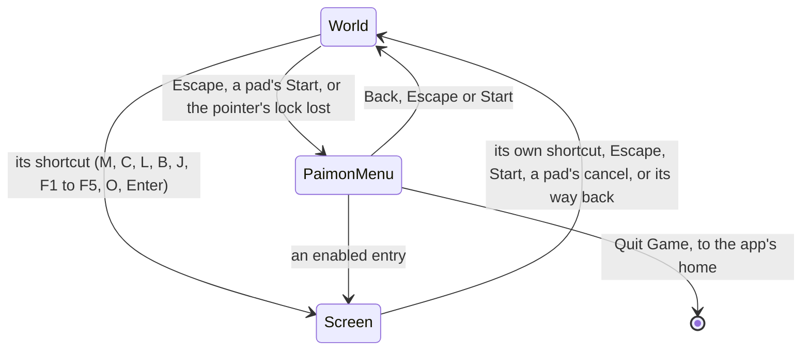

# Screens

In the game, a key or the Paimon menu opens a screen over the world: the map, the character screen, the inventory, the wish and the rest. The world screen does the same. What is open is a `ScreenKind`, either `World`, the world in play with nothing over it, or one of the screens the game opens from it. The world screen keeps it, reads the frame's pressed actions into it once a frame, and draws the open screen over the canvas.

## Moving between screens

`getNextScreenKind` is the rule, a pure function of what is open and the frame's pressed actions:

- **From the world, a shortcut opens its screen.** `InputActionScreenKindMap` names the screen each opening action opens; `Escape` and a pad's `Start` open the Paimon menu, as the game's controls bind them ([controls](/docs/genshin/controls)).
- **Over a screen, the way back is to the world.** `Escape`, `Start` and a pad's cancel close any screen, and a screen's own shortcut closes it again, as `M` closes the map it opened.
- **One screen at a time.** Over a screen, every other screen's shortcut waits; the Paimon menu's entries are the one way from a screen to another, and they replace the menu with the screen chosen.

The rule is read only while the world is shown, so nothing opens under the opening that covers it.

## What a screen does to the world

`ScreenBehaviourMap` answers for each kind:

| Field               | When true                                                                             |
| :------------------ | :------------------------------------------------------------------------------------ |
| `isHeld`            | the world's fixed-step loops and its clock stand still, while the world keeps drawing |
| `isHudHidden`       | the heads-up display is hidden                                                        |
| `isPointerReleased` | the pointer's lock is let go, for the screen's own cursor                             |

Every menu answers true to all three, as the game's single-player menus pause its simulation and its time while its music and particles carry on. Photo mode alone holds nothing: its clock runs, its camera flies and the pointer still turns it, with the HUD hidden. The world in play answers false to all three.

- **Held.** The free camera neither looks nor steps while the world is held, and Windrise's clock and its clouds stand still. Drawing goes on, so the world stays behind the screen. This is a different thing from the world screen's `isPaused`, which stops drawing altogether while the opening covers the world.
- **Pointer.** A screen that lets the pointer go releases the lock when it opens. Closing it does not take the lock back, since the browser grants one only to a click; a click on the world takes it, as it did the first time.
- **A lock lost in play opens the menu.** The browser keeps `Escape` for itself while the pointer is locked, so a lock lost with the world in play opens the Paimon menu as the key would have.

## Drawing the open screen

`MenuScreen` draws what is open over the canvas:

- the Paimon menu;
- a built screen, which is a slot of `MenuScreen` named by its kind, filled by the world screen with what that screen needs and closed by setting the world back;
- or, for a screen nobody has built yet, a placeholder: its title in the game's words (`ScreenKindGameTextKeyMap`) over a veil, and a way back. Every shortcut therefore opens something, and closes it again, before its screen exists.

Each one is a dialog that takes focus as it opens, so the keyboard reaches it without a pointer.

## The Paimon menu

The shell of the game's pause menu: its side bar down the left, from Back to Quit Game, and its contents beside it, each in the game's own order and every label the game's own text. Its links out to web pages (Special Event, Community, Version Highlights, Feedback, Survey) are left out.

- **Every entry the game has, an unbuilt one disabled.** An entry opens its screen once that screen is built, which is whether `MenuScreen` has a slot for it; until then it is drawn disabled. A disabled entry says the game has the screen and this world does not yet, while a missing one would say the game has no such screen.
- **Back closes it, Quit Game leaves.** Quit Game leaves the world for the app's home, which the app does, since leaving the page is the browser's closing of the game.
- **Its layout is provisional.** Sizes, places and colours are stand-ins until the menu is measured off the game's own interface tree, and its entries carry their labels without their icons; both wait on the [menu screens](/docs/proposals/genshin/menu-screens) proposal's references.

## Key files

| File                                                                     | Its role                                                                                  |
| :----------------------------------------------------------------------- | :---------------------------------------------------------------------------------------- |
| `packages/genshin-world/src/models/screen/ScreenKind.ts`                 | the world and every screen opened over it                                                 |
| `packages/genshin-world/src/services/screen/ScreenBehaviourMap.ts`       | what each screen does to the world under it                                               |
| `packages/genshin-world/src/services/screen/InputActionScreenKindMap.ts` | the screen each shortcut opens                                                            |
| `packages/genshin-world/src/services/screen/getNextScreenKind.ts`        | the rule moving between screens on a frame's pressed actions                              |
| `packages/genshin-world/src/services/screen/ScreenKindGameTextKeyMap.ts` | each screen's title in the game's words                                                   |
| `packages/genshin-world/src/services/menu/constants.ts`                  | the Paimon menu's contents and side bar, in the game's order                              |
| `packages/genshin-world/src/components/World/Screen/Index.vue`           | reads the input once a frame, keeps what is open, holds the world and lets the pointer go |
| `packages/genshin-world/src/components/Menu/Screen/Index.vue`            | draws the open screen: the Paimon menu, a built screen's slot or a placeholder            |
| `packages/genshin-world/src/components/Menu/Paimon/Index.vue`            | the Paimon menu's shell                                                                   |
| `packages/genshin-world/src/components/Menu/Placeholder/Index.vue`       | an unbuilt screen's title and way back                                                    |
| `apps/web/app/components/Genshin/World.vue`                              | hands the world its game text, and leaves for the app's home on Quit Game                 |

## Notes

- **The agent console's world gets the menu too.** The console mounts the same world, so once it is shown again its own `Escape` and the Paimon menu's both answer the key; its rebuild in the game's style settles which one keeps it.

## Sources

- [Paimon Menu](https://genshin-impact.fandom.com/wiki/Paimon_Menu), Genshin Impact Wiki: the menu's contents and side bar in order, opened by Escape and a pad's Start, and its pause of everything but particles and music in single-player.
- [Controls](https://genshin-impact.fandom.com/wiki/Controls), Genshin Impact Wiki: the shortcut of each screen.
- [Time](https://genshin-impact.fandom.com/wiki/Time), Genshin Impact Wiki: the clock paused in the menu and running in photo mode.
