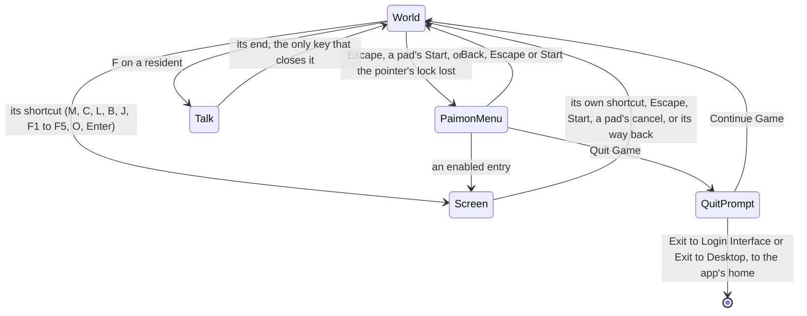

# Screens

In the game, a key or the Paimon menu opens a screen over the world: the map, the character screen, the inventory, the wish and the rest. The world screen does the same. What is open is a `ScreenKind`, either `World`, the world in play with nothing over it, or one of the screens the game opens from it. The world screen keeps it, reads the frame's pressed actions into it once a frame, and draws the open screen over the canvas.

## Moving between screens

`getNextScreenKind` is the rule, a pure function of what is open and the frame's pressed actions:

- **From the world, a shortcut opens its screen.** `InputActionScreenKindMap` names the screen each opening action opens; `Escape` and a pad's `Start` open the Paimon menu, as the game's controls bind them ([controls](/docs/genshin/controls)).
- **Over a screen, the way back is to the world.** `Escape`, `Start` and a pad's cancel close any screen, and a screen's own shortcut closes it again, as `M` closes the map it opened.
- **One screen at a time.** Over a screen, every other screen's shortcut waits; the Paimon menu's entries are the one way from a screen to another, and they replace the menu with the screen chosen.
- **A talk stays open.** Over a talk, every key waits, Escape and a pad's Start among them; only the talk's own end sets the world back. A talk is begun from the world by F on a resident, as the [dialogue](/docs/genshin/dialogue) page describes.

The rule is read only while the world is shown, so nothing opens under the opening that covers it.

## What a screen does to the world

`ScreenBehaviourMap` answers for each kind:

| Field               | When true                                                                             |
| :------------------ | :------------------------------------------------------------------------------------ |
| `isHeld`            | the world's fixed-step loops and its clock stand still, while the world keeps drawing |
| `isHudHidden`       | the heads-up display is hidden                                                        |
| `isPointerReleased` | the pointer's lock is let go, for the screen's own cursor                             |

Every menu answers true to all three, as the game's single-player menus pause its simulation and its time while its music and particles carry on. Photo mode and a talk hold nothing: their clock runs with the HUD hidden, photo mode's camera orbits the character and its pointer still turns it, while a talk lets the pointer go for its replies. The world in play answers false to all three.

- **Held.** Under any screen but the world, the character on the field and its body neither step, photo mode's and a talk's included. Only photo mode's follow camera still looks, orbiting the held body; a menu's and a talk's stand where they are. Only a menu holds the world's fixed-step loops, so Windrise's clock and its clouds stand still under a menu and run on under a talk and in photo mode. Drawing goes on, so the world stays behind the screen. This is a different thing from the world screen's `isPaused`, which stops drawing altogether while the opening covers the world.
- **Pointer.** A screen that lets the pointer go releases the lock when it opens. Closing it does not take the lock back, since the browser grants one only to a click; a click on the world takes it, as it did the first time.
- **A press that closes a screen is spent.** When the screen returns to the world, the world reads the input once more, so the key or click that closed it never reaches the world in play as an interact, a jump or an attack.
- **A lock lost in play opens the menu.** The browser keeps `Escape` for itself while the pointer is locked, so a lock lost with the world in play opens the Paimon menu as the key would have.

## Drawing the open screen

`MenuScreen` draws what is open over the canvas:

- the Paimon menu;
- a built screen, which is a slot of `MenuScreen` named by its kind, filled by the world screen with what that screen needs and closed by setting the world back;
- or, for a screen nobody has built yet, a placeholder: its title in the game's words (`ScreenKindGameTextKeyMap`) over a veil, and a way back. Every shortcut therefore opens something, and closes it again, before its screen exists.

Each one is a dialog that takes focus as it opens, so the keyboard reaches it without a pointer.

A talk is none of these: `MenuScreen` draws nothing for it, and the world screen mounts the talk's host over the world while the talk is open ([dialogue](/docs/genshin/dialogue)).

## The Paimon menu

The game's pause menu, laid out as the English PC client's 1.3 still draws it at 2560 wide: its side bar down the left, from Back to Quit Game, and its contents beside it, each in the game's own order and every label the game's own text. Every icon is traced from that still into a path of our own. Community and Feedback, the game's links out to web pages, are drawn disabled at the foot of the contents; Special Event, Version Highlights and Survey, which the still does not show, are left out. Training Guide is left out too, since no still of the menu the references hold draws it.

- **Every entry the game has, an unbuilt one disabled.** An entry opens its screen once that screen is built, which is whether `MenuScreen` has a slot for it; until then it is drawn disabled. A disabled entry says the game has the screen and this world does not yet, while a missing one would say the game has no such screen.
- **Back closes it, Quit Game asks first.** Quit Game opens the quit prompt over the world, the menu set aside while it shows. Continue Game sets the world back, and the two exits leave the world for the app's home, since leaving the page is the browser's closing of the game. Both exits leave alike, as the browser cannot tell one from the other.
- **Its layout is in the reference's own pixels.** Every place is read off the still by `--reference-pixel`, one pixel of the 2560 wide still at any window's size, and every glyph is placed the same way. Scored over the side bar and the panel above their translucent feet, the still's mean difference is about five percent, its FLIP about 0.22. What is left is the card's stars, the game's typeface where Signika stands in, the translucent foot of the panel where the world shows through, and the Traveler's avatar, which is the game's art and so drawn as a plain disc.
- **The quit prompt is the game's three buttons over the world.** Continue Game in a cream pill with a yellow play icon, then Exit to Login Interface and Exit to Desktop with their red icons, each on a dark disc at the pill's left and its label centred in the rest. Its scale is provisional: the only still the wiki holds is a 799 by 475 crop, with no whole frame to read the game's unit from, so the prompt is laid out at a 1080 high window until the recording on the Recordings owed list (`menu-quit-prompt.mkv`) fixes it. Its layout is therefore not scored yet.
- **The Graphics tab's header is scored; its rows are not.** The band over the header is 2.01% of its 82 pixels, FLIP 0.1037. The rows sit over the game's blurred world, which the page has no copy of, so no score covers them. The reference's quality row reads Custom, a state the renderer's tiers do not hold, so the row shows Medium until that choice is backed, and its FPS, global illumination and character resolution rows stay out as the renderer lacks those knobs.
- **Its profile card shows the rank and the World Level.** Each value stands right-aligned beside its row's end, where the current client draws it, and the info icon beside the World Level opens the World Level dialog over the dimmed menu ([Adventure Rank](/docs/genshin/adventure-rank)). Birthday stands over an empty value until the profile is backed; the [menu screens](/docs/proposals/genshin/menu-screens) proposal builds it.
- **The World Level dialog is measured off a public recording.** Its frame, 1078 by 716 and centred, its band, line and fill, the title, the cross, the dividers, the scroll track, the body's lines 32 units apart at a cap height of 20 and spaced out to the game's line widths, and the cream button with its red arrow are read from a tutorial recorded at 1080 high, at 5 seconds (`world-level-dialog`), its glyphs traced from the same tutorial's 4K recording. Scored over its frame, the mean difference is about six percent. What is left is the build's wording and the game's typeface: the recording's help text reads World Level 5 and "reduce" where the current text map reads 3 and "decrease", which wraps one line more and moves every line above it.

## Key files

| File                                                                     | Its role                                                                                              |
| :----------------------------------------------------------------------- | :---------------------------------------------------------------------------------------------------- |
| `packages/genshin-world/src/models/screen/ScreenKind.ts`                 | the world and every screen opened over it                                                             |
| `packages/genshin-world/src/services/screen/ScreenBehaviourMap.ts`       | what each screen does to the world under it                                                           |
| `packages/genshin-world/src/services/screen/InputActionScreenKindMap.ts` | the screen each shortcut opens                                                                        |
| `packages/genshin-world/src/services/screen/getNextScreenKind.ts`        | the rule moving between screens on a frame's pressed actions                                          |
| `packages/genshin-world/src/services/screen/ScreenKindGameTextKeyMap.ts` | each screen's title in the game's words                                                               |
| `packages/genshin-world/src/services/menu/constants.ts`                  | the Paimon menu's contents, links and side bar, in the game's order, each with its icon               |
| `packages/genshin-world/src/services/menu/MenuEntryGlyphMap.ts`          | each contents entry's icon, traced, placed in its tile                                                |
| `packages/genshin-world/src/services/menu/MenuFrameGlyphMap.ts`          | the side bar's, Back's, the card's and the settings header's icons, traced, placed in the reference   |
| `packages/genshin-world/src/components/Menu/Glyph/Index.vue`             | one traced icon, placed in the reference's pixels from its parent                                     |
| `packages/genshin-world/src/components/World/Session/Index.vue`          | reads the input once a frame, keeps what is open, holds the world, lets the pointer go, mounts a talk |
| `packages/genshin-world/src/components/Menu/Screen/Index.vue`            | draws the open screen: the Paimon menu, a built screen's slot or a placeholder                        |
| `packages/genshin-world/src/components/Menu/Paimon/Index.vue`            | the Paimon menu, laid out in the 1.3 still's pixels, its icons placed and its card drawn              |
| `packages/genshin-world/src/components/Menu/Settings/Index.vue`          | the Graphics tab's header, tab and quality row; not yet opened by the world                           |
| `packages/genshin-world/src/components/Menu/Placeholder/Index.vue`       | an unbuilt screen's title and way back                                                                |
| `packages/genshin-world/src/components/Menu/Exit/Index.vue`              | the quit prompt Quit Game opens: Continue Game and the two exits, over the world                      |
| `packages/genshin-world/src/components/Menu/WorldLevelDialog/Index.vue`  | the World Level dialog the card's info icon opens: its help text and lowering button                  |
| `packages/genshin-world/src/services/menu/MenuPromptGlyphMap.ts`         | the prompts' button icons, traced, placed on their discs in the button's pixels                       |
| `packages/genshin-world/src/models/menu/MenuPromptIcon.ts`               | the prompts' button icons, one per button                                                             |
| `packages/genshin-world/src/services/menu/MenuDialogGlyphMap.ts`         | a menu dialog's cross and corner ornament, traced, placed from its frame's top left                   |
| `packages/genshin-world/src/models/menu/MenuDialogIcon.ts`               | a menu dialog's icons                                                                                 |
| `apps/web/app/components/Genshin/World.vue`                              | hands the world its game text, and leaves for the app's home on Quit Game                             |

## Notes

- **The agent console's world gets the menu too.** The console mounts the same world, so once it is shown again its own `Escape` and the Paimon menu's both answer the key; its rebuild in the game's style settles which one keeps it.

## Sources

- [Paimon Menu](https://genshin-impact.fandom.com/wiki/Paimon_Menu), Genshin Impact Wiki: the menu's contents and side bar in order, opened by Escape and a pad's Start, and its pause of everything but particles and music in single-player.
- [Controls](https://genshin-impact.fandom.com/wiki/Controls), Genshin Impact Wiki: the shortcut of each screen.
- [Time](https://genshin-impact.fandom.com/wiki/Time), Genshin Impact Wiki: the clock paused in the menu and running in photo mode.
