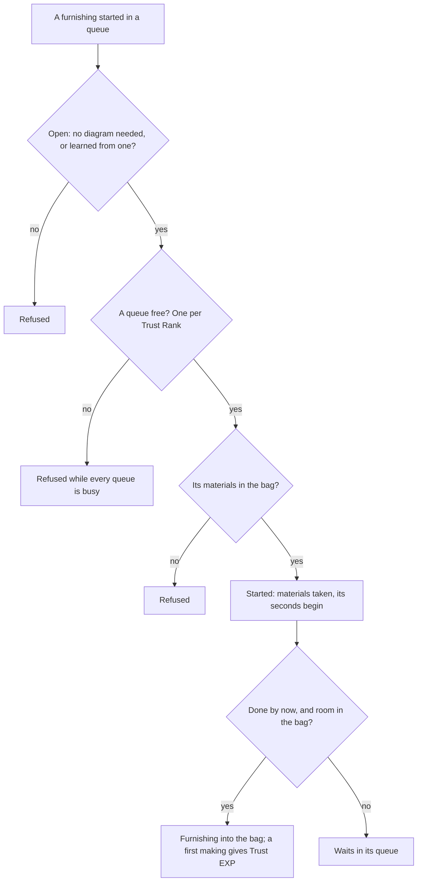
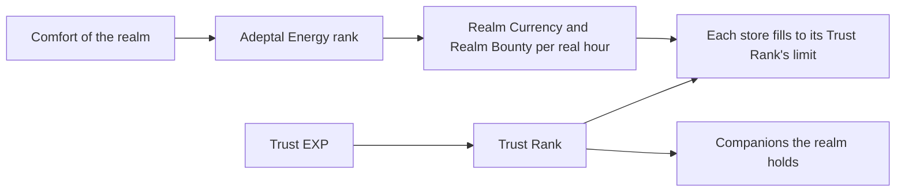

# Serenitea Pot

The Serenitea Pot's rules are over the game's own realm tables: which furnishings Tubby can make and what each costs in materials and time, how much Trust EXP a player has gained, how many queues Tubby runs, how much comfort a realm reads as, and how fast its stores fill. This page is the first build of the [Serenitea Pot](/docs/proposals/genshin/serenitea-pot) proposal, covering its furnishings made by Tubby, Trust Rank, Adeptal Energy and the realm's currency stores. The realm's scene, the placement editor and its load, the depot, gardens, ponds, the Adeptal Mirror and the companions' invitations stay in the proposal.

## How it works

## The tables

`pnpm -C scripts genshin:assets home` writes two slices into the world's generated folder, from the game's tables in the dump. Three of them are not in the community dump the scripts read, so they are fetched from the AnimeGameData repository into the dump and never committed, as the [forging](/docs/genshin/forging) tables are.

- **Blueprints.** `FurnitureMakeExcelConfigData`: each furnishing, its materials, its seconds and the Trust EXP its first making gives. The seconds are the table's `makeTime` read as seconds: between ten and twenty hours, the first blueprint fourteen. Each order makes one furnishing.
- **Diagrams.** The material table's `ITEM_USE_UNLOCK_FURNITURE_FORMULA` uses. Each diagram names the furnishing it opens by its item id, and over a thousand of the blueprints have one. The few dozen that no diagram names are open from the start.
- **Trust and Adeptal Energy.** `HomeworldLevelExcelConfigData` and `HomeWorldComfortLevelExcelConfigData`, written as one `levels.json`: each Trust Rank's EXP, companions and store limits, and each Adeptal Energy rank's comfort and the rates its stores fill at.

The furnishings' own table, `HomeWorldFurnitureExcelConfigData`, is not read yet: its comfort is for the placement editor, which is not built.

## The rules

- **Trust Rank.** A rank's EXP is what it takes to pass it, so a rank is reached once the EXP of every rank below it is held. The table has ten ranks; the last takes no EXP. Trust EXP comes from a furnishing's first making, given when it is collected into the bag, never again for the same blueprint.
- **Queues.** Tubby runs one queue for each Trust Rank, since every rank opens a build slot. A queue holds one furnishing at a time, each taking its blueprint's seconds from when it began, so it finishes while the page is closed.
- **Making.** A furnishing is started only when its blueprint is open and a queue is free, and its materials are taken from the bag at once. A furnishing done waits in its queue while the bag has no room for it.
- **Adeptal Energy.** The rank is the last whose comfort the realm's total reaches, and the lowest rank's comfort is zero, so every realm reads as at least rank one.
- **Stores.** Realm Currency fills at the Adeptal rank's `homeCoinProduceRate` and Realm Bounty at its `companionshipExpProduceRate`, each per real hour of the rank in force, in whole units, and never past the Trust Rank's store limit. A clock read below zero produces nothing.
- **Companions.** A Trust Rank holds as many companions as its `deployNpcCount`, from one at rank one to eight at rank ten. The companions themselves are not invited yet.

## Calls the table settled

- **The per-hour unit is provisional.** The wiki could not be read from this build (it answered HTTP 402), so the rates' unit is the table's own reading of one real hour, marked provisional in `packages/genshin-world/src/services/home/constants.ts` until a recording of a store across an hour settles it.
- **One queue per rank.** The build slot appears on every Trust Rank, so the count is the rank itself. A recording of the queues at two ranks would confirm it.

## Key files

| File                                                                 | Role                                                                   |
| :------------------------------------------------------------------- | :--------------------------------------------------------------------- |
| `scripts/src/services/genshinAssets/home/writeHomeRules.ts`          | The blueprints and the levels slices written from the dump             |
| `scripts/src/services/genshinAssets/home/toHomeBlueprint.ts`         | One making row as a blueprint, its empty material slots left out       |
| `packages/genshin-world/src/services/home/startHomeMake.ts`          | A furnishing started in a free queue, its materials taken from the bag |
| `packages/genshin-world/src/services/home/collectHomeOrder.ts`       | A finished furnishing taken into the bag, with the first making's EXP  |
| `packages/genshin-world/src/services/home/computeHomeTrustRank.ts`   | The Trust Rank a total of Trust EXP reaches                            |
| `packages/genshin-world/src/services/home/computeHomeAdeptalRank.ts` | The Adeptal Energy rank a realm's comfort reaches                      |
| `packages/genshin-world/src/services/home/computeHomeAccrued.ts`     | A store's Realm Currency or Realm Bounty after a span, capped          |
| `packages/genshin-world/src/services/home/learnHomeBlueprint.ts`     | A blueprint learned by using its diagram                               |
| `packages/genshin-world/src/services/shared/learnByDiagram.ts`       | The one diagram-learning rule the forge's recipes share                |
| `packages/genshin-world/src/generated/home/blueprints.json`          | The furnishings Tubby makes, a slice imported on demand                |
| `packages/genshin-world/src/generated/home/levels.json`              | The Trust and Adeptal Energy ranks, a slice imported on demand         |

## Notes

- **The bag does not hold the furnishings yet.** A finished furnishing is taken into the bag as an item the caller defines, since the Furnishings tab and its item definitions are not built.
- **Realm Currency is not in the wallet.** It is a store of the realm's progress, not a currency the wallet counts, until its game text name has a key in `genshin-text`.
- **The rates are read forward from a claim.** The caller settles a store at the rank in force before the rank changes, since a store accrues at the rank it was last claimed at.
- **Nothing is measured here.** The one provisional constant is the per-hour unit above, and its recording is owed on the roadmap.

## Sources

- [AnimeGameData](https://github.com/DimbreathBot/AnimeGameData), the community's per-patch dump: `FurnitureMakeExcelConfigData`, `HomeworldLevelExcelConfigData` and `HomeWorldComfortLevelExcelConfigData`, fetched into the dump, and the material table's `ITEM_USE_UNLOCK_FURNITURE_FORMULA` uses.
- [Serenitea Pot](https://genshin-impact.fandom.com/wiki/Serenitea_Pot), Genshin Impact Wiki: the per-hour rates and the store limits. The page could not be read from this build, so the per-hour unit waits on a recording.
