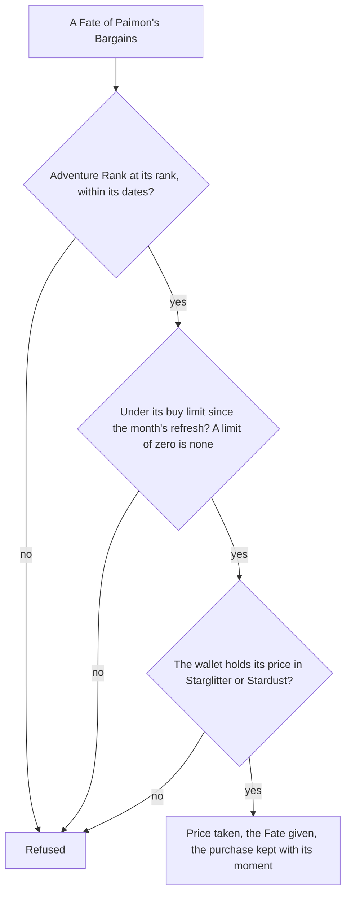

# Shops

Paimon's Bargains sells the two Fates for the Masterless currencies the world's wallet already holds. Its goods are the game's own rows in the shop table, read once into a slice that is imported on demand. The rule over them is built: a good is offered from its Adventure Rank within its dates, a buy limit is counted from the purchases made since the month's refresh, and a purchase takes the price from the wallet and gives the item's currency back. Nothing is on a screen yet, so the Fates are bought only by the rule's own callers.

## How it works

## Decisions

- **Paimon's Bargains' goods are those filed under 1001.** Its shop row, 102, is the Paimon shop and refreshes monthly, but holds no goods; the goods filed under 1001 are the only ones in the table that refresh monthly, Fates among them.
- **A buy limit of zero is no limit.** The table gives the Starglitter-priced Fates a limit of zero, and the Stardust-priced ones a limit of five a month.
- **The monthly refresh is the first of the month at the game's daily hour, four in the morning, in the game's time zone.** It is the game day's start that the Original Resin page reads, so a purchase made before the hour on the first belongs to the month before.
- **Starglitter is item 221 and Stardust item 222, the Fates 223 and 224.** The table's Fates are bought at five of 221 with no limit and at seventy-five of 222 with five a month, which matches the proposal's Starglitter for Fates and Stardust for Fates with monthly limits; the pairing of the names to the ids awaits a recording's check ([Recordings owed](/docs/genshin/roadmap#recordings-owed)).
- **The Primogem Fates are the inventory's.** A Fate bought for 160 Primogems is not in the slice, since selling for Primogems is the [inventory](/docs/proposals/genshin/inventory) proposal's.
- **The rotation, weapons and materials are the next step.** Their goods pay in the same currencies, but they give items the bag needs a definition for, and the world's item file holds three rows, so they wait for the bag's definitions.
- **Each good is written with its game-time dates at the game's offset.** The table's dates carry no zone, and the game's server is at UTC+8, so each is written with that offset and read as an instant.

## Key files

| File                                                                         | Role                                                                                  |
| :--------------------------------------------------------------------------- | :------------------------------------------------------------------------------------ |
| `scripts/src/services/genshinAssets/shops/checkIsPaimonsBargainsFateGood.ts` | The table's goods that are Paimon's Bargains' Fates bought with a Masterless currency |
| `scripts/src/services/genshinAssets/shops/writePaimonsBargainsGoods.ts`      | Writes the slice the world imports, one row a good                                    |
| `scripts/src/services/genshinAssets/shops/toShopGoodRow.ts`                  | A good as the world reads it, its dates at the game's offset                          |
| `packages/genshin-world/src/generated/shops/paimonsBargains.json`            | The generated slice                                                                   |
| `packages/genshin-world/src/services/shop/buyShopGood.ts`                    | The purchase rule: rank, dates, buy limit, price, and the wallet after                |
| `packages/genshin-world/src/services/shop/computeMonthlyRefreshTime.ts`      | The monthly refresh at or before a moment                                             |
| `packages/genshin-world/src/services/shop/checkIsShopGoodSoldOut.ts`         | Whether a good's limit is reached since the refresh                                   |
| `packages/genshin-world/src/services/shop/ShopItemCurrencyMap.ts`            | The item ids the shop trades in, as the wallet's currencies                           |

## Sources

- [AnimeGameData](https://github.com/DimbreathBot/AnimeGameData), the community's per-patch dump: `ShopGoodsExcelConfigData`, the goods, their prices, limits, refreshes, ranks and dates, and `ShopExcelConfigData`, the shops and their refreshes. The dump at its revision lacked the four shop tables; they were taken from the same repository's files into the game text dump, never committed.
- [Paimon's Bargains](https://genshin-impact.fandom.com/wiki/Paimon%27s_Bargains), Genshin Impact Wiki: the proposal's source for the monthly reset and the Fates' prices. Its page was not reachable for this build, so the table is the check.
