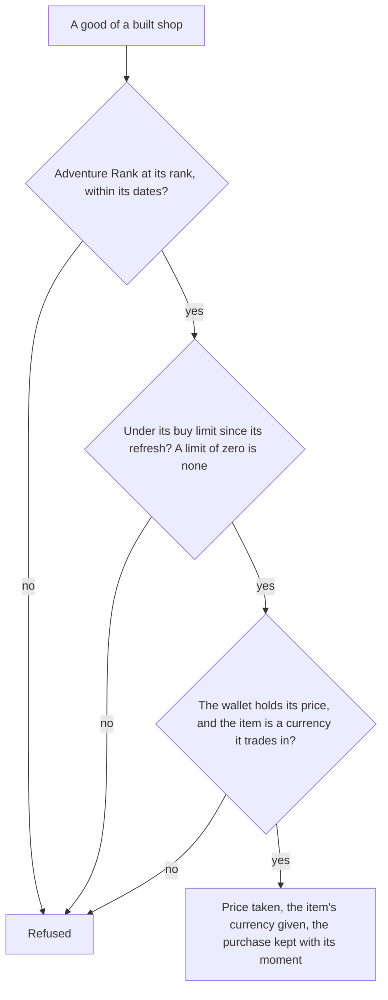

# Shops

The shops whose goods are built are Paimon's Bargains, which sells the two Fates for the Masterless currencies, and the Mondstadt grocery, which sells general goods for Mora. Their goods are the game's own rows in the shop table, read once into a slice per shop that is imported on demand. The rule over them is built: a good is offered from its Adventure Rank within its dates, a buy limit is counted from the purchases made since its refresh, and a purchase takes the price from the wallet and gives the item's currency back. Nothing is on a screen yet, so the goods are bought only by the rule's own callers.

## How it works

## Decisions

- **Paimon's Bargains' goods are those filed under 1001.** Its shop row, 102, is the Paimon shop and refreshes monthly, but holds no goods; the goods filed under 1001 are the only ones in the table that refresh monthly, Fates among them.
- **The Mondstadt grocery is shop 1004.** The table numbers its shops, and no dump file names those numbers. The number is read from the table's order: shop 1002 takes item 305 and 1009 takes 307, the Sigils of Mondstadt's and Liyue's Souvenir Shops, so the numbering runs city by city and 1004 is Mondstadt's grocery. Liyue's grocery, 1008, sells the same three items at the same Mora prices, which is the cross-check. The wiki's Blanche (Mondstadt) page confirms it, since the goods, Mora prices and daily limit it gives her are shop 1004's.
- **A good priced in Mora is priced at the table's Mora cost.** The grocery's goods carry their price in the table's Mora field rather than as an item, so the price is the Mora cost, taken as Mora's item id, 202, which the wallet holds as Mora.
- **A buy limit of zero is no limit.** The table gives the Starglitter-priced Fates a limit of zero, and the Stardust-priced ones a limit of five a month.
- **Each refresh is at the game's daily hour, four in the morning, in the game's time zone.** The daily refresh is the game day's start that the Original Resin page reads; the monthly refresh is the first of the month at that hour, so a purchase made before the hour on the first belongs to the month before. A good that never refreshes counts its purchases from the epoch.
- **Starglitter is item 221 and Stardust item 222, the Fates 223 and 224.** The table's Fates are bought at five of 221 with no limit and at seventy-five of 222 with five a month, which matches the proposal's Starglitter for Fates and Stardust for Fates with monthly limits; the pairing of the names to the ids awaits a recording's check ([Recordings owed](/docs/genshin/roadmap#recordings-owed)).
- **The Primogem Fates are the inventory's.** A Fate bought for 160 Primogems is not in the slice, since selling for Primogems is the [inventory](/docs/proposals/genshin/inventory) proposal's.
- **The grocery's goods wait on the bag.** They give ingredients the wallet does not hold, so the rule refuses them until the bag holds those items; the rule itself needs no change then.
- **The rotation, weapons and materials are the next step.** Their goods pay in the same currencies, but the rotation's item ids name no row in the dump, and the items they give need the bag's definitions, so they wait for both.
- **Each good is written with its game-time dates at the game's offset.** The table's dates carry no zone, and the game's server is at UTC+8, so each is written with that offset and read as an instant.

## Key files

| File                                                                         | Role                                                                                  |
| :--------------------------------------------------------------------------- | :------------------------------------------------------------------------------------ |
| `scripts/src/services/genshinAssets/shops/checkIsPaimonsBargainsFateGood.ts` | The table's goods that are Paimon's Bargains' Fates bought with a Masterless currency |
| `scripts/src/services/genshinAssets/shops/buildShopGoodSlice.ts`             | Builds one shop's goods as a record, one row a good                                   |
| `scripts/src/services/genshinAssets/shops/buildPaimonsBargainsGoods.ts`      | The Fates record, by the Fates filter                                                 |
| `scripts/src/services/genshinAssets/shops/buildMondstadtGeneralGoods.ts`     | The Mondstadt grocery's record, by shop 1004                                          |
| `scripts/src/services/genshinAssets/shops/toShopGoodRow.ts`                  | A good as the world reads it: its dates at the game's offset, its price and refresh   |
| `packages/genshin-world/src/generated/shops/paimonsBargains.json`            | The generated Fates slice                                                             |
| `packages/genshin-world/src/generated/shops/mondstadtGeneralGoods.json`      | The generated Mondstadt grocery slice                                                 |
| `packages/genshin-world/src/services/shop/buyShopGood.ts`                    | The purchase rule: rank, dates, buy limit, price, and the wallet after                |
| `packages/genshin-world/src/services/shop/computeShopRefreshTime.ts`         | The refresh at or before a moment, by its kind                                        |
| `packages/genshin-world/src/services/shop/checkIsShopGoodSoldOut.ts`         | Whether a good's limit is reached since its refresh                                   |
| `packages/genshin-world/src/services/shop/ShopItemCurrencyMap.ts`            | The item ids the shop trades in, as the wallet's currencies                           |

## Sources

- [AnimeGameData](https://github.com/DimbreathBot/AnimeGameData), the community's per-patch dump: `ShopGoodsExcelConfigData`, the goods, their prices, limits, refreshes, ranks and dates, and "ShopExcelConfigData", the shops and their refreshes. The table's refresh kinds are none, daily, weekly and monthly.
- [Paimon's Bargains](https://genshin-impact.fandom.com/wiki/Paimon%27s_Bargains), Genshin Impact Wiki: the monthly reset, the Fates' prices and the rotation's schedule, read through the repo's wiki reader.
- [General Goods](https://genshin-impact.fandom.com/wiki/General_Goods), Genshin Impact Wiki: the Mondstadt general goods vendor, Blanche.
