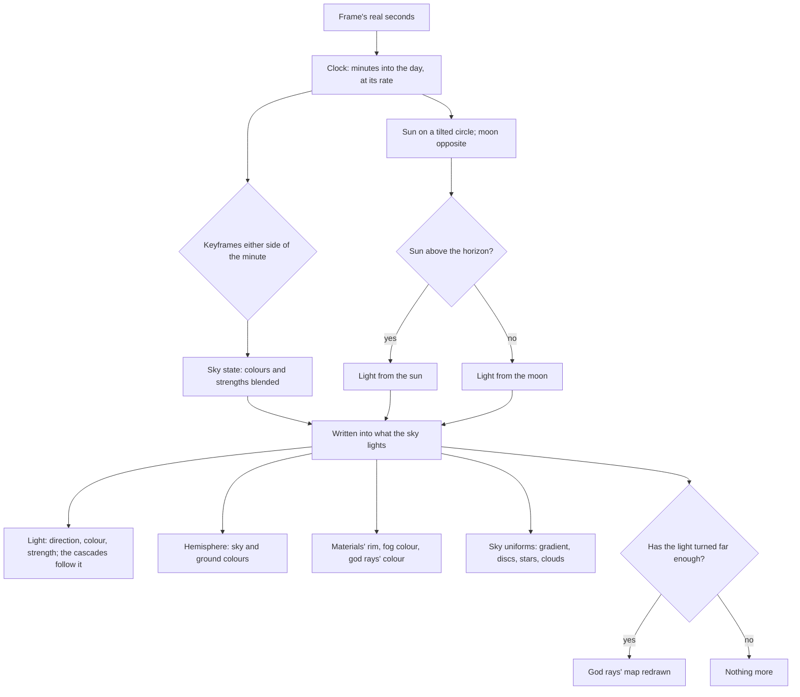

# Sky and time

Genshin's landscapes are as much sky as ground. The dawn is apricot, the afternoon a high clear blue, the dusk violet and gold, and the night deep blue under a large moon, and the whole world is lit to match. So the sky is the one source of every colour the [rendering style](/docs/genshin/rendering-style)'s materials, fog and post chain read: a region describes its day as a handful of keyframes, and the clock moves the world through them.

## How it works

- **The game's clock.** One in-game minute passes per real second, so a day lasts twenty-four minutes: dawn at six, noon at twelve, dusk at eighteen and midnight at twenty-four (`advanceGameClock`). A region starts at the hour its reference screenshots were taken, so Windrise loads at three in the afternoon. The clock carries its own rate, which the tuning panel sets to zero to hold an hour still against a screenshot, or raises to fast-forward the day.
- **The sun and the moon.** The sun rises due east at six, stands highest at noon on a path tilted toward the south by the region's tilt, and sets due west at eighteen (`computeSunDirection`). The moon stands opposite it. The world is lit by whichever of the two is above the horizon, and a region's keyframes bring the light near zero at six and eighteen, where one hands over to the other, so the swap never shows.
- **Keyframes, blended.** A region's day is a handful of `SkyKeyframe`s in order of their minute: the zenith and horizon colours, the light's colour and strength, the hemisphere's sky and ground colours and strength, the clouds' lit and shade colours, and how bright the stars are. `sampleSkyState` blends linearly between the two either side of the clock's minute, wrapping through midnight, into one `SkyState` that is reused every frame. The colours away from the sun and the two halos are a whole `SkyState`'s alone, as a scene solved for one hour sets them, so a keyframe cannot carry one that nothing would blend.
- **The sky drives the world's light.** `applySkyState` writes the state into everything it lights: the light's direction, colour and strength, which the cascades follow on their own; the hemisphere, whose colours are the shade; the materials' light direction, light colour and rim colour; the fog's colour, which is the horizon's; the god rays' colour; and the sky's own uniforms. Every write is to an existing value, each measured colour inverted straight into its uniform, so an hour passing rebuilds and allocates nothing.
- **The god rays' map follows the light in steps.** Their one shadow map is redrawn once the light has turned a little over half a degree, about every two real seconds, rather than every frame.

### The painted sky

The sky is the scene's background node (`createSkyNode`), drawn behind everything at no depth, so the fog and the god rays pass over it. It is painted rather than physical, since the game's skies are art-directed, and drawn as the game's own sky shader draws it, ported from its decompiled programs:

- **Top and bottom colours, toward the sun and away from it.** A ray's height is the share of a right angle it looks up; the sky's gradient texture carries the bottom colour up to its reach and gives way to the top's, and each of the two blends from its colour away from the sun to its colour toward it, by how far toward the sun the ray looks, cubed. A sky that tells no back colour from its front, as a region's keyframes do, draws one gradient all round, and one with no gradient of its own falls in a smoothstep (`DEFAULT_SKY_GRADIENT`).
- **A horizon halo** rides the gradient's other channel up to its own reach, toward the sun and, once the sun is up, all round.
- **The sun's halo** as three lobes of one falloff, each ten times wider and fainter, tighter toward the zenith, and **the moon's glow**, the sixth power of its closeness.
- **The sun's disc**, brighter than white so bloom lifts it: the game draws the sun and moon as bodies of their own.
- **The moon's disc** opposite the sun, and **stars** scattered by cell noise, as bright as the keyframes' star strength.
- **Stepped clouds.** Noise projected onto a plane overhead, so clouds shrink toward the horizon, is cut into cumulus with a hard edge and a stepped shade band, as the ground's ramp steps its light. Their lit and shade colours come from the keyframes, the sun's glow warms their edges, and they fade out near the horizon. The layer drifts downwind with the [wind](/docs/genshin/vegetation), and its coverage is the region's.

## What it costs to run

- **A frame's sky is arithmetic.** Sampling walks a handful of keyframes with no callback and writes into the one reused state, so a frame allocates nothing. The bench beside `sampleSkyState` holds its cost flat from a region's handful of keyframes to four times as many.
- **The sky is one full-screen background**, with no dome mesh and no texture.
- **The god rays' map is redrawn about every two seconds**, not every frame, while the sun moves.

## Key files

| File                                                            | Role                                                                      |
| :-------------------------------------------------------------- | :------------------------------------------------------------------------ |
| `packages/genshin-engine/src/clock/advanceGameClock.ts`         | The clock moved on by a frame at its rate, wrapping at midnight           |
| `packages/genshin-engine/src/atmosphere/computeSunDirection.ts` | The sun's direction at a minute of the day                                |
| `packages/genshin-engine/src/atmosphere/sampleSkyState.ts`      | The keyframes blended at a minute, and whether the sun or the moon lights |
| `packages/genshin-engine/src/atmosphere/applySkyState.ts`       | The sky state written into the light, the hemisphere and every uniform    |
| `packages/genshin-engine/src/nodes/createSkyNode.ts`            | The painted sky: gradient, sun, moon, stars and stepped clouds            |
| `packages/genshin-world/src/composables/useSky.ts`              | The sky as the background, and the clock run every frame                  |
| `packages/genshin-world/src/services/windrise/constants.ts`     | Windrise's day as keyframes, its start hour, tilt and clouds              |

## Notes

- **A set hour is a cut, not a sweep.** Setting the clock jumps the keyframes; only the running clock blends, so reduced motion needs nothing extra.
- **Weather is its own page.** It belongs to an area, and no area exists until the world map does, so rain, storms, snow, fog and sandstorms are the [weather](/docs/proposals/genshin/weather) proposal.
- **The clock control is exploring's.** A reader sets the hour from the control the [exploring](/docs/proposals/genshin/exploring) page adds; until then, the tuning panel sets it in development.

## Sources

- [Time](https://genshin-impact.fandom.com/wiki/Time), Genshin Impact Wiki: one in-game minute per real second, dawn, midday, dusk and midnight at six-hour marks, and the twenty-four-minute cycle.
- [Console platform development in Genshin Impact](https://docswell.com/s/UnityJapan/KWRPQ5-210617-unity-dojo20211mihoyozhenzhongyi), Zhenzhong Yi, Unity Dojo 2021: ambient light from spherical harmonics probes, which the hemisphere colours simplify.
- [SkyMesh](https://threejs.org/docs/pages/SkyMesh.html), three.js: the physical sky this page chooses not to use, since the game's skies are painted.
