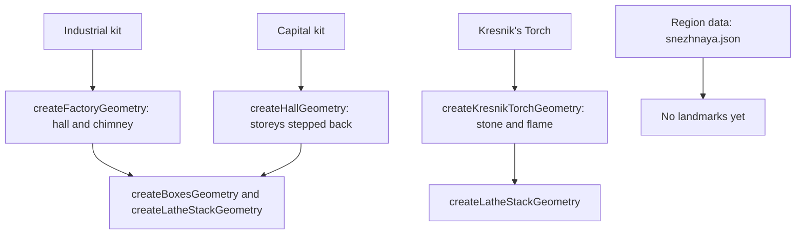

# Snezhnaya

Snezhnaya's region is specified in [its proposal](/docs/proposals/genshin/snezhnaya), and the parts below are the ones built so far. They are generators with no scene placing them yet: the nation's ground is not fitted, so no landmark has a height to stand on.

## How it works

- **Factories are one hall and one chimney.** `createFactoryGeometry` merges a box for the hall, centred on the origin, with a plain lathe stack for the chimney, which stands at a fixed share of the hall's width. Its width, depth, height and chimney are its options, so each factory is fitted by its caller.
- **Capital halls step back as they rise.** `createHallGeometry` stacks its storeys as boxes, each inset by the setback from the one below, so a palace's tiers are its options and nothing more.
- **Kresnik's Torch is two geometries for two materials.** The stone is a faceted lathe stack of a stepped plinth, a tapering shaft and a cup brazier, and the flame is a lathe of its silhouette standing in the cup at the brazier's rim, 2.15 metres up.
- **Region data is a shape.** `src/data/regions/snezhnaya.json` holds the region's id and no landmarks, so a camera that comes within reach fetches it and draws nothing until its landmarks are placed.

## Key files

| File                                                                          | Role                                                    |
| :---------------------------------------------------------------------------- | :------------------------------------------------------ |
| `packages/genshin-world/src/services/snezhnaya/createFactoryGeometry.ts`      | The industrial kit: a factory hall with its chimney     |
| `packages/genshin-world/src/services/snezhnaya/createHallGeometry.ts`         | The capital kit: a hall of storeys set back as it rises |
| `packages/genshin-world/src/services/snezhnaya/createKresnikTorchGeometry.ts` | A Kresnik's Torch as its stone and its flame            |
| `packages/genshin-world/src/models/snezhnaya/FactoryOptions.ts`               | A factory's options                                     |
| `packages/genshin-world/src/models/snezhnaya/HallOptions.ts`                  | A hall's options                                        |
| `packages/genshin-world/src/data/regions/snezhnaya.json`                      | Snezhnaya's region data, with no landmarks yet          |

## Notes

- **No landmark kind yet.** A Kresnik's Torch becomes a landmark kind with its component when its ground height exists, since the torch stands on the ground the terrain system fits for the nation. Until then the kit is built and nothing draws it.
- **Palette and light are not set.** The stone, flame and the nation's shade colours are not chosen, and the torch's light does not reach the scene, since a point light is not one of the lighting model's shared uniforms.

## Sources

- [Snezhnaya](https://genshin-impact.fandom.com/wiki/Snezhnaya), Genshin Impact Wiki: Kresnik's Torch in every settlement, and the nation's factories and capital.
