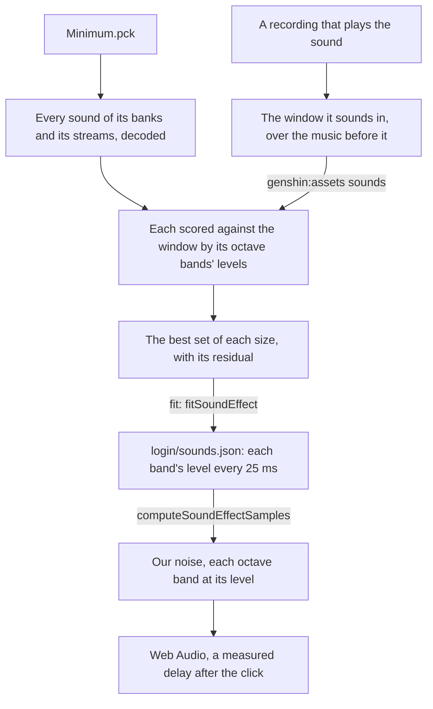

# Sound effects

The login's door sounds as it opens, and so does ours. The game's own sounds stay on the machine that measures them; each sound's levels and the engine's noise that plays them are what ships.

## How it works

- **A sound is found by the recording that plays it.** A sound has no name, only an id, so `genshin:assets sounds` finds it by matching: every sound of the packages it is given, `Minimum.pck` by default ([game data formats](/docs/genshin/game-data-formats)), whose bank holds the login's own sounds, is scored against the recording's window by the cosine of its octave bands' levels from 1 kHz up, at every start, over the level of what plays in the quarter second before the window. The best five are then played together at their stored levels in every set of them, each start refined a frame at a time, and the best set of each size is printed with what it leaves of the window unexplained: each band's level against the set's, in decibels, over the cells within 30 decibels of the window's loudest, after one gain over every band. The gain is never one a band, since the game's sounds keep their own balance and a gain a band lets one sound stand in for another's octaves: under it the rumble alone reads better than the pair. For the door, the rumble alone leaves 4.19 decibels, the rumble and a broadband rush 75 milliseconds after it 3.31, and any further sound a few hundredths at most, so the door is the pair, both at the level they are stored at. Where each sound sits is the login music's reference (`Login/Music/Index.reference.ts`), and every search for them its door sound topic (`DoorSound.reference.ts` beside it).
- **A sound with no pitch is its bands' levels.** Neither door sound holds a harmonic series, so each is noise whose level moves in each octave band of `MUSIC_NOISE_BAND_CENTRES`. The fit reads each band's power every 25 milliseconds from the decoded sound's spectrum, a Hann window of 2048 samples over its own power, so each level is the noise's standard deviation in that band, and sums the sounds' powers at their offsets, since noise apart adds its power; `fitSoundEffect` takes the sounds and offsets the match printed. Its levels keep five decimals, a hundred decibels under full scale, so the tail dies away as the game's does.
- **The engine plays its own noise.** `computeSoundEffectSamples` sounds each band as its own seamless noise (`computeNoiseSamples`, that band alone), looped as long as the sound lasts, its level read between the fit's frames linearly, and the bands summed; `createSoundEffectBuffer` renders it once when the login's audio starts. Rendered so, the door's sound explains the recording's burst as well as the game's own two sounds do, within about three decibels across the bands and frames.
- **It sounds when the game's does.** The click sets off both sounds: the login's music component owns the one audio context, and the door's sound starts `LOGIN_DOOR_SOUND_DELAY_MS` after the click, 0.32 seconds, the time from the recording's first whitened frame to the rumble's rise, so the rush follows the click by about 0.4 seconds.

## Not yet

- **The login's other sounds.** The clicks on its buttons and the wind each wait on a recording that plays them clearly enough to match, and go through the same fit.

## Key files

| File                                                                   | Role                                                            |
| :--------------------------------------------------------------------- | :-------------------------------------------------------------- |
| `packages/genshin-engine/src/audio/computeSoundEffectSamples.ts`       | A sound effect as our noise, each band at its levels over time  |
| `packages/genshin-engine/src/audio/createSoundEffectBuffer.ts`         | A sound effect rendered once into a buffer                      |
| `scripts/src/services/genshinAssets/sound/matchGameSounds.ts`          | Which of the game's sounds a recording's window plays, and when |
| `scripts/src/services/genshinAssets/fit/fitSoundEffect.ts`             | The matched sounds read from the game and measured as levels    |
| `scripts/src/services/genshinAssets/music/parseSoundBankSounds.ts`     | The sounds a sound bank holds in itself                         |
| `packages/genshin-world/src/components/Login/Music/Index.vue`          | The login's music and its door's sound, through one context     |
| `packages/genshin-world/src/components/Login/Music/Index.reference.ts` | Where the door's sounds sit, and their topic of every search    |

## Sources

- [GENSHIN IMPACT | CELESTIA DOOR | LOADING SCREEN](https://www.youtube.com/watch?v=rBnfA4pXw6U): the English client's door, clicked, with its sound.
