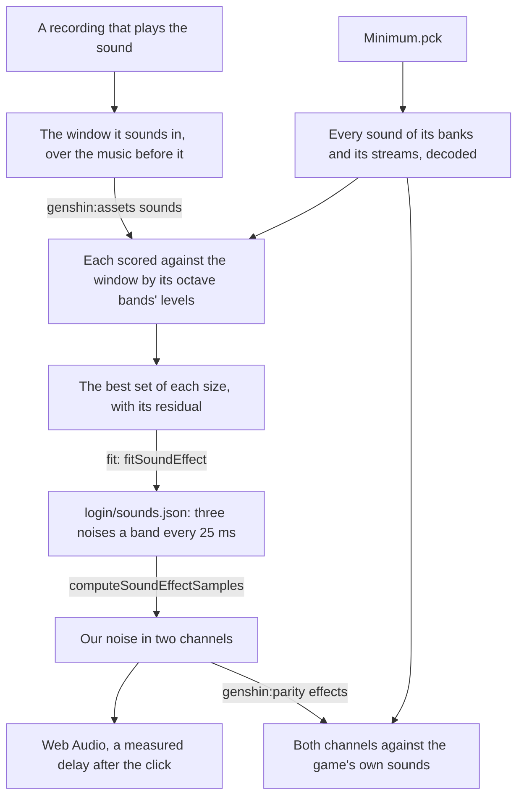

# Sound effects

The login's door sounds as it opens, and so does ours. The game's own sounds stay on the machine that measures them; each sound's levels and the engine's noise that plays them are what ships.

## How it works

- **A sound is found by the recording that plays it.** A sound has no name, only an id, so `genshin:assets sounds` finds it by matching: every sound of the packages it is given, `Minimum.pck` by default ([game data formats](/docs/genshin/game-data-formats)), whose bank holds the login's own sounds, is scored against the recording's window by the cosine of its octave bands' levels from 1 kHz up, at every start, over the level of what plays in the quarter second before the window. The best five are then played together at their stored levels in every set of them, each start refined a frame at a time, and the best set of each size is printed with what it leaves of the window unexplained: each band's level against the set's, in decibels, over the cells within 30 decibels of the window's loudest, after one gain over every band. The gain is never one a band, since the game's sounds keep their own balance and a gain a band lets one sound stand in for another's octaves: under it the rumble alone reads better than the pair. For the door, the rumble alone leaves 4.19 decibels, the rumble and a broadband rush 75 milliseconds after it 3.31, and any further sound a few hundredths at most, so the door is the pair, both at the level they are stored at. Where each sound sits is the login music's reference (`Login/Music/Index.reference.ts`), and every search for them its door sound topic (`DoorSound.reference.ts` beside it).
- **A sound with no pitch is its bands' levels, in both channels.** Neither door sound holds a harmonic series, so each is noise whose level moves band by band. The game's sounds are stereo and wide, their channels correlated about a half, so the fit lays the matched sounds at their offsets in both channels as the game plays them (`readGameSoundEffect`) and reads the mix every 25 milliseconds in a Hann window of 2048 samples over its own power, so a power is the noise's variance (`computeStereoSoundBandPowers`). Each band's two channels and their cross power become three noises apart: the cross power is what the channels share, and each channel's own is the rest of its power, so each channel's level and how alike the two sound both survive. One channel averaged from the two keeps neither: FFmpeg's mono downmix read the door about three decibels over each channel's own level, and the octave bands it was read in stopped at 11 kilohertz where the game's sound runs to the top of hearing. The bands are `SOUND_EFFECT_BAND_EDGES`: a third of an octave each from 178 hertz up, and under that as wide as two of the window's bins, since a narrower band holds no bin of its own.
- **The engine plays its own noise, frame by frame.** `computeSoundEffectSamples` builds each of the three noises from a spectrum flat across each band at its level at that moment, a frame a quarter of the window apart, each turned into samples by one inverse transform and laid over the frames before under a Hann window, whose overlaps sum to a constant; the shared noise is added to each channel's own. A noise of a band each built in one long transform would cost most of a second on the login's thread, where the frames cost a few hundred short transforms. `createSoundEffectBuffer` renders it once into two channels when the login's audio starts. A window reads a band of few bins short of what the noise plays in it, so the fit renders its levels once, reads the render back as it read the game's sound, and scales each band by the game's power over the render's; the render is the same every time, so what is scaled is what plays. The levels keep five decimals, a hundred decibels under full scale, so the tail dies away as the game's does.
- **Scored against the game's own sounds.** `genshin:parity effects` renders each of the login's effects and reads both channels against the game's matched sounds in the effect's own bands every 5 milliseconds, finer than the fit's frames, over the cells within 40 decibels of the game's loudest. The door now sits about two decibels off, every band's bias within about a decibel, its channels correlated as the game's are. Two renders of the same levels with their noise seeded apart sit further from each other than that, so what is left is the noise's own grain, and no finer band or frame closes it: only the game's own samples would, which never ship.
- **It sounds when the game's does.** The click sets off both sounds: the login's music component owns the one audio context, and the door's sound starts `LOGIN_DOOR_SOUND_DELAY_MS` after the click, 0.32 seconds, the time from the recording's first whitened frame to the rumble's rise, so the rush follows the click by about 0.4 seconds.

## Not yet

- **The login's other sounds.** The clicks on its buttons and the wind each wait on a recording that plays them clearly enough to match, and go through the same fit.

## Key files

| File                                                                       | Role                                                            |
| :------------------------------------------------------------------------- | :-------------------------------------------------------------- |
| `packages/genshin-engine/src/audio/computeSoundEffectSamples.ts`           | A sound effect as two channels of our noise, frame by frame     |
| `packages/genshin-engine/src/audio/createSoundEffectBuffer.ts`             | A sound effect rendered once into a buffer of two channels      |
| `scripts/src/services/genshinAssets/sound/computeStereoSoundBandPowers.ts` | Two channels' powers as the shared noise and each channel's own |
| `scripts/src/services/genshinAssets/sound/readGameSoundEffect.ts`          | The matched sounds laid at their offsets in both channels       |
| `scripts/src/services/genshinParity/sound/scoreSoundEffect.ts`             | Our render against the game's sounds, both channels, every 5 ms |
| `scripts/src/services/genshinAssets/sound/matchGameSounds.ts`              | Which of the game's sounds a recording's window plays, and when |
| `scripts/src/services/genshinAssets/fit/fitSoundEffect.ts`                 | The matched sounds read from the game and measured as levels    |
| `scripts/src/services/genshinAssets/music/parseSoundBankSounds.ts`         | The sounds a sound bank holds in itself                         |
| `packages/genshin-world/src/components/Login/Music/Index.vue`              | The login's music and its door's sound, through one context     |
| `packages/genshin-world/src/components/Login/Music/Index.reference.ts`     | Where the door's sounds sit, and their topic of every search    |

## Sources

- [GENSHIN IMPACT | CELESTIA DOOR | LOADING SCREEN](https://www.youtube.com/watch?v=rBnfA4pXw6U): the English client's door, clicked, with its sound.
