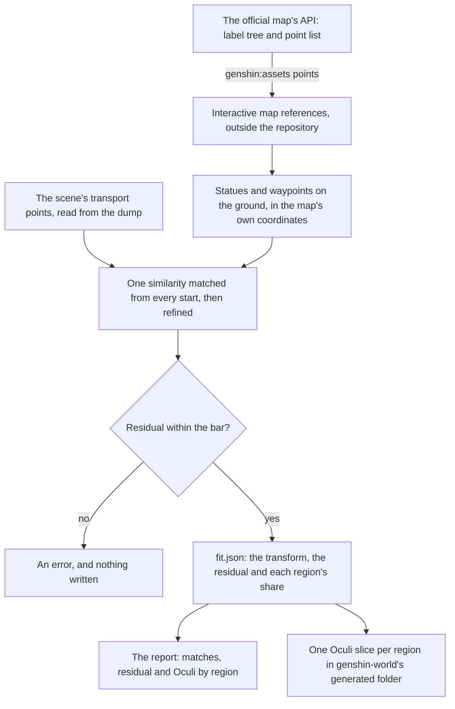

# Spawned places

The game's servers spawn chests, Oculi, puzzles and camps, and the client's data does not place them, so the official Teyvat Interactive Map's public points stand in for them. This page is the first half of the [spawned places](/docs/proposals/genshin/spawned-places) proposal: the map's points read into the references folder, and its statues and waypoints fitted onto the scene's own transport points. Chests are the first kind written, into their own slices by the [chests](/docs/genshin/chests) page, and the puzzle mechanisms follow in slices of their own by the [puzzles](/docs/genshin/puzzles) page, and the plants and specialties by the [gathering](/docs/genshin/gathering) page. The Oculi are written here, in the [Oculi](#the-oculi) section, for the [statues of The Seven](/docs/proposals/genshin/statues-of-the-seven) proposal to read; each other kind's places land with the page that uses them.

## How it works

## The read

`pnpm -C scripts genshin:assets points` fetches the map's label tree and its point list from the map's public API, and writes both as the API gives them to `interactive-map/` under the references folder, where every other reference is kept. Each point carries its label, its place in the map's own coordinates, its area and its layer, the layer being zero for the ground and above. The point list runs to tens of megabytes, and nothing from it is committed.

## The fit

`pnpm -C scripts genshin:assets points-fit` fits one similarity to the whole map.

- **The anchors are the statues and waypoints on the ground.** These are the map's labels for the Statue of The Seven and the Teleport Waypoint at layer zero. Its underground points are kept for their own floors and left out of the fit.
- **The scene side is the scene's transport points.** The dump files a statue and a waypoint as one kind of point, which `readSceneTransportPoints` reads by the kind Windrise's statue holds. The fit reads them from the scene directly, so it does not wait on the waypoints that [exploring](/docs/proposals/genshin/exploring) will fit into region data.
- **The match starts from every turn.** A start is taken at each of sixteen turns, each both as drawn and mirrored, at a scale of one, which is the map's own unit, carrying each set's median point onto the other's. The medians are not pulled by the far-off points one set holds and the other does not. Each start is refined over sixty passes. A pass pairs every carried point with its nearest scene point, one to one, within three residuals of the last fit and never closer than the bar, then solves the least-squares similarity on those pairs. The start that matches the most pairs wins, and the smaller residual breaks a tie.
- **The bar is twenty game units.** A fit whose residual is over it is an error that names the residual, and writes nothing. The fitted residual sits near ten, so a fit twice that has matched the wrong points.

The solved turn is a quarter turn mirrored (a turn of minus ninety degrees, the map's down running against the game's z axis), and the scale comes out within a few hundredths of one: the map's coordinate is one game unit.

## The checks

Each region is reported in turn, Mondstadt first, with its matched points, the residual of those, and its Oculi counted by its kind's label against the wiki's count. A shortfall or a surplus is printed as it stands.

- **Mondstadt** matches about fifty of its statues and waypoints, and its Anemoculi count is the wiki's sixty-six.
- **Liyue, Inazuma, Sumeru and Snezhnaya's Oculi** count as the wiki gives them, Snezhnaya with no point matched.
- **Fontaine, Natlan and Nod-Krai** count shortfalls against the wiki's figure of 271 for each. The wiki gives that same figure for three different elements, so these three are the wiki's to settle, not the fit's.
- **Snezhnaya** matches none of its points. The dump holds no transport points for its areas yet, as [region capitals](/docs/genshin/region-buildings) records, so its residual is reported as none.

## The Oculi

`pnpm -C scripts genshin:assets oculi` writes each Oculus the official map marks on the ground into its region's slice, as a compact list of places, each with its id (the map's point id), its kind and its position in the game's coordinates. Its kind is the map's own label, one of eight, named as the map labels them: Anemoculus, Geoculus, Electroculus, Dendroculus, Hydroculus, Pyroculus, Lunoculus and Cryoculus. Each region's area and kind are set in the region map, which the fit's report reads too, and the writer keeps only its points on the ground (below).

- **Ground only.** Oculi on a layer under the ground stand on floors of their own, which the place does not yet know, so they are counted and left out. Fontaine holds the only ones, which is why its ground count sits below the fit's count of its Oculi.
- **Not landmarks.** A place is acted on by the statues' rules, so it lives in its own model rather than in `LandmarkKind`, and no kit draws it.
- **No height is written.** An Oculus stands on the ground at its point, its height read where it is stood on, as the [chests](/docs/genshin/chests) page sets out.

## Key files

| File                                                                   | Role                                                                      |
| :--------------------------------------------------------------------- | :------------------------------------------------------------------------ |
| `scripts/src/services/genshinAssets/points/readInteractiveMap.ts`      | Fetches the map's label tree and point list into the references folder    |
| `scripts/src/services/genshinAssets/fit/fitInteractiveMap.ts`          | Fits the map to the scene, gates the fit on its bar and writes the report |
| `scripts/src/services/genshinAssets/points/matchSimilarity.ts`         | Matches one similarity from every start and refines each                  |
| `scripts/src/services/genshinAssets/points/solveSimilarity.ts`         | Solves the least-squares similarity over a set of pairs                   |
| `scripts/src/services/genshinAssets/world/readSceneTransportPoints.ts` | Reads the scene's transport points, shared with the region capitals' fit  |
| `scripts/src/services/genshinAssets/points/InteractiveMapRegionMap.ts` | Each region's map area and Oculus kind, with the wiki's count             |
| `scripts/src/services/genshinAssets/oculi/writeOculusPlaces.ts`        | Writes each region's Oculi slice from the points and the fit              |
| `scripts/src/services/genshinAssets/oculi/OculusKindLabelIdMap.ts`     | Each Oculus kind's label on the official map                              |
| `packages/genshin-world/src/models/oculus/OculusPlace.ts`              | A placed Oculus: its id, kind and ground position                         |
| `packages/genshin-world/src/generated/oculi/`                          | One slice per region, imported on demand by the world                     |
| `scripts/src/services/genshinAssets/points/constants.ts`               | The API, the references paths, the bar and the match's passes             |

## Sources

- [Teyvat Interactive Map](https://act.hoyolab.com/ys/app/interactive-map/index.html), HoYoLAB: the official map. Its label tree and point list are the public data the read keeps as references.
- [Oculus](https://genshin-impact.fandom.com/wiki/Oculus), Genshin Impact Wiki: each region's Oculi, the counts the checks hold the map to.
