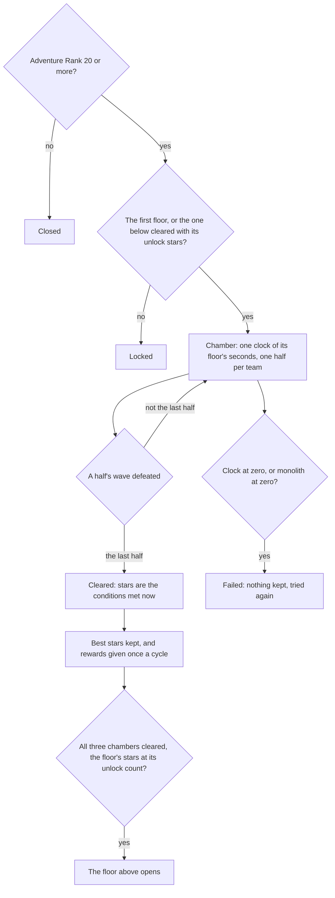

# Spiral Abyss

The Spiral Abyss's rules over the game's tower tables: which floors and chambers exist, how a chamber is cleared against its clock and its monolith, how many stars a clear earns and keeps, which floor opens next, which rewards a clear gives once, and which period of the Abyssal Moon Spire runs now. This page is the first build of the [Spiral Abyss](/docs/proposals/genshin/spiral-abyss) proposal, covering its floors, chambers, clock, halves, monolith, stars, unlocks, rewards and periods. The chambers' enemies and scenes, the screen that enters them, the wormhole at Cape Oath and the blessings stay in the proposal.

## How it works

## The floors and chambers

`pnpm -C scripts genshin:assets spiral-abyss` writes three slices from the game's tower tables, each imported on demand from `packages/genshin-world/src/generated/spiralAbyss/`. The tables are not in the community dump the scripts read, so the five tower tables were fetched from the AnimeGameData repository into the dump and never committed. The repository's master matched the dump's combine and forge tables byte for byte, so the two share a revision.

- **Floors.** Every floor the tower table holds: its id and its place in the twelve, the level group that lists its three chambers, its teams and the stars its chambers must hold for the floor above. The Corridor's eight floors and each Moon Spire period's four are among them.
- **Chambers.** Each chamber's three star conditions. A time condition is a mark on the clock's seconds left, and a monolith condition a mark on the monolith's health percent, each as the table names it.
- **Rewards.** Each floor's rewards in every reward group of the tower table: the three star milestones (three, six and nine stars) and the first clear of each of its chambers, in order.
- **Periods.** Each Moon Spire period: its schedule id, the reward group its floors draw from, the four floors it runs and the moment it begins.

## The rules

- **The clock.** A chamber's clock is its floor's seconds: five minutes on the first four floors of the Corridor and ten minutes on every floor above. A chamber of two halves has one clock for both, so the second half starts on the seconds the first left.
- **Failure.** A chamber is lost when its clock reaches zero or its monolith reaches zero health. A cleared chamber is never lost.
- **Stars.** A clear earns one star for each condition that holds when it clears: the clock left above a time mark, or the monolith's health above a health mark. A chamber's stars are the most any of its clears has earned, and a chamber cleared with no condition met still counts as cleared.
- **Floors open.** The first floor is always open. A floor opens when the one below has all three chambers cleared and holds its unlock count of stars, six on every floor of the table. The Moon Spire's first floor, floor nine, opens on the Corridor's floor eight.
- **Rewards once a cycle.** A chamber's first clear gives its own reward, and each star milestone a floor's stars reach gives its reward. Each reward is given only the first time in its cycle, and a clear returns the rewards it gives now for the caller to hand out.
- **Cycles.** The Corridor is one cycle that never resets. Each Moon Spire period is a cycle of its own, so its chambers, stars and rewards start again when the next period begins.
- **Opening.** The Abyss is open from Adventure Rank 20, a constant the proposal settles.
- **The period.** The Moon Spire runs the period that began latest before now, read in the game's time zone, UTC+8. A period has no recorded end, so a dump read months on keeps its last period rather than none.

## Decisions

- **One clock, read at the clear.** The table's time marks name a half, 1 or 2, but a chamber has one clock, so each mark is read against the seconds left when the chamber clears, whichever half cleared it.
- **A chamber's halves are its floor's teams.** One half for a one-team floor, two for a two-team floor. A two-team chamber can have no second wave in the table, as the monolith chambers have none, since their enemies come from their scene, so an empty half is still a half.
- **The Corridor draws reward group 1.** Its floors 1 to 8 give the same rewards in reward groups 1, 2 and 13, so the group the Corridor reads does not change its rewards. The rewards slice holds every group, and a reader names the group it needs.
- **The floor table's reward columns are not read.** Its three, six and nine-star columns agree with the reward table for the Corridor and differ for some Moon Spire floors, and its five, ten and fifteen-star columns repeat the three, six and nine on all but a few floors. The reward table names every floor's rewards.
- **A monolith is not named.** A chamber has a monolith when one of its conditions reads a monolith, and the caller reports its health. The table's gadget and group ids for the monolith are not kept.
- **A period starts at its first set of floors.** Each schedule row holds one set of floors with its start, and the next period's start is its end, so the close time is not read. A row with a second set of floors is refused rather than cut.
- **The period's star milestones are not built.** The schedule's forty-to-one-hundred-and-twenty-star rewards are zero in every row the table holds, so there is nothing to give.

## Key files

| File                                                                             | Role                                                               |
| :------------------------------------------------------------------------------- | :----------------------------------------------------------------- |
| `scripts/src/services/genshinAssets/spiralAbyss/writeSpiralAbyss.ts`             | The three slices written from the tower tables                     |
| `scripts/src/services/genshinAssets/spiralAbyss/toAbyssFloor.ts`                 | One floor and its three chambers from the floor and level rows     |
| `scripts/src/services/genshinAssets/spiralAbyss/toAbyssStarCondition.ts`         | A star condition read by its kind and its mark                     |
| `scripts/src/services/genshinAssets/spiralAbyss/toAbyssPeriod.ts`                | One Moon Spire period from its schedule row                        |
| `packages/genshin-world/src/models/spiralAbyss/AbyssFloor.ts`                    | A floor: its chambers, its teams and its unlock stars              |
| `packages/genshin-world/src/services/spiralAbyss/createAbyssChallenge.ts`        | A chamber about to be fought, its clock and its monolith           |
| `packages/genshin-world/src/services/spiralAbyss/checkIsAbyssChallengeFailed.ts` | A chamber lost to its clock or its monolith                        |
| `packages/genshin-world/src/services/spiralAbyss/computeAbyssChamberStars.ts`    | The stars a clear earns from the conditions it meets               |
| `packages/genshin-world/src/services/spiralAbyss/recordAbyssChamberClear.ts`     | A clear's best stars kept, and its rewards given once a cycle      |
| `packages/genshin-world/src/services/spiralAbyss/checkIsAbyssFloorUnlocked.ts`   | Whether the floor above a floor is open in a cycle                 |
| `packages/genshin-world/src/services/shared/findLatestBegun.ts`                  | The Moon Spire's period at a moment, the search the Theater shares |
| `packages/genshin-world/src/services/spiralAbyss/checkIsAbyssOpenAtRank.ts`      | Whether the Abyss is open to a player's Adventure Rank             |
| `packages/genshin-world/src/generated/spiralAbyss/floors.json`                   | The floors and their chambers, every floor the table holds         |

## Not built yet

- **The chambers' enemies and scenes.** Each half's wave is the table's list for that half, placed as camps of the chamber's scene, which is not derived. A caller reports a half defeated until then.
- **The screen and the chamber's end.** Nothing enters a chamber or returns from one, and a chamber's cleared health and energy are not carried into the next chamber's start.
- **The wormhole at Cape Oath.** It waits on Musk Reef's scene being derived.
- **The blessings.** The Moon Spire's blessing is named only by a text hash and an icon, its effect is not in the tables, and the wiki could not be read. The Corridor's blessing choices are not settled by the proposal, so none is read.
- **The rewards' items.** A clear returns reward ids, and nothing resolves them to items in the wallet.

## Notes

- **The dump ends at a period.** The community dump's schedule ends with the period that began on 2026-06-16, so the Moon Spire runs that period until a newer dump holds the later ones.
- **Nothing calls the readers yet.** The three readers load their slices on demand, and the screen that would call them is not built.

## Sources

- [AnimeGameData](https://github.com/DimbreathBot/AnimeGameData), the community's per-patch dump: `TowerScheduleExcelConfigData`, `TowerFloorExcelConfigData`, `TowerLevelExcelConfigData` and `TowerRewardExcelConfigData`, the tables the slices are written from. `TowerBuffExcelConfigData` is fetched beside them but not read.
- [Spiral Abyss](https://genshin-impact.fandom.com/wiki/Spiral_Abyss), Genshin Impact Wiki: the source the proposal's clock, unlock rank and reset statements cite. The page refused the read when this was built, so those statements are the proposal's, checked only against the tables' marks, and the clock and the rank are provisional until a recording measures them.
