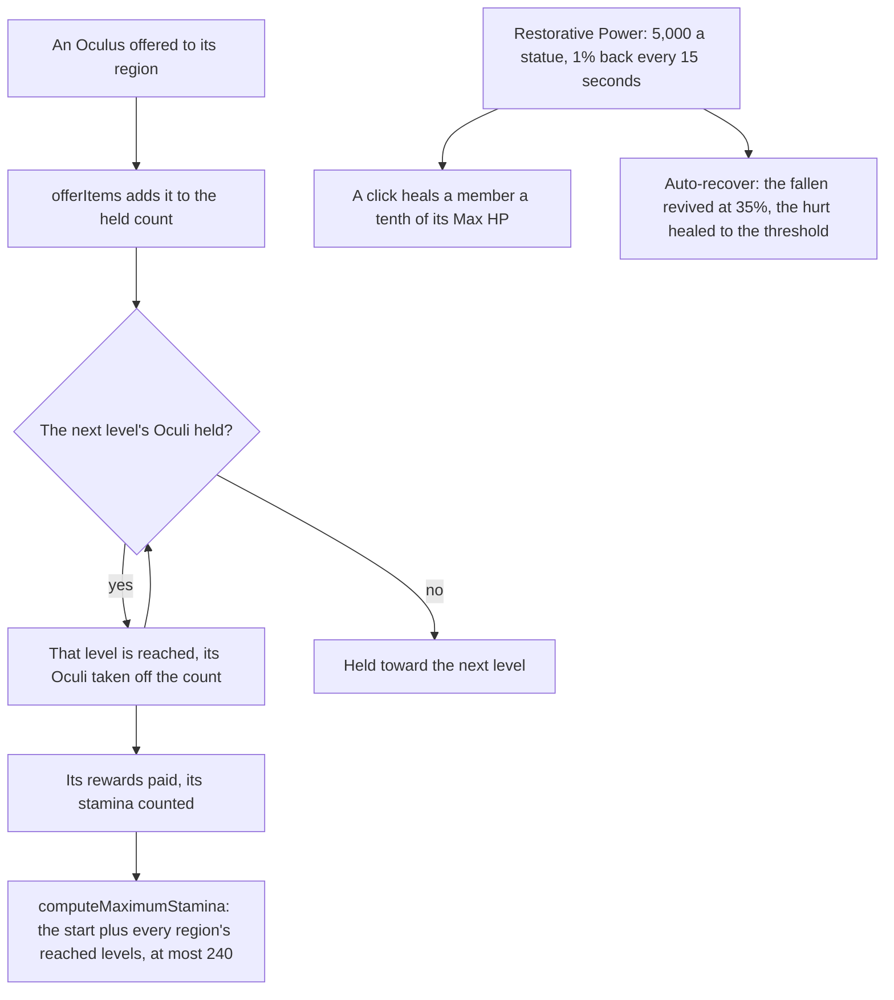

# Statues of The Seven

In the game a region's statues stand for its Archon and level together as Oculi are offered to them. This page is what is built of [Statues of The Seven](/docs/proposals/genshin/statues-of-the-seven): a region's levels and what each pays, the maximum stamina they raise, and the Statue's Blessing's pool with its two ways of healing. Their rules are pure functions, as the [offering systems](/docs/genshin/offering-systems) page's are. Nothing in the world calls them yet, so every statue still stands as a jump and the maximum stays at its start.

## How it works

- **Mondstadt's levels are read from the dump.** `pnpm -C scripts genshin:assets statues` builds them from its level-up table and its reward table and publishes them as `statueLevels/mondstadt`, one row a level holding the Oculi it takes, its items and the stamina its actions add. `readMondstadtStatueLevels` fetches the slice by its key from the hosted game data and checks it against its schema as it arrives. The other regions' levels join with their own pages.
- **Oculi are offered, and levels are reached in turn.** `offerItems`, the rule every [offering](/docs/genshin/offering-systems) shares, adds the Oculi offered to a region's held count, and reaches its levels as that page describes. Past the last level the Oculus is held with no level to reach. The levels take 65 Oculi in all, one short of the 66 Anemoculi the wiki counts in Mondstadt.
- **The maximum stamina rises with the levels reached.** `computeMaximumStamina` adds the stamina share of each reached level in every region to the controller's start, `STAMINA_MAX`, and stops at 240. Mondstadt alone takes the maximum to 170 at its tenth level. The engine's stamina takes its maximum as the controller's `staminaMaximum` option and keeps it on `stamina.maximum`, so a raised maximum reaches the body without a new stamina.
- **The pool regenerates from its last change.** `regenerateRestorativePower` holds the Restorative Power as an amount and the moment it last changed, with 5,000 for each unlocked statue as its maximum. A refill of 1% of that maximum comes every 15 seconds, and the moment moves on by the refills that came, so the time to the next keeps its place. At the maximum the moment is now. The maximum is a multiple of 50, so every refill is a whole number.
- **A click heals a tenth of a member's Max HP from the pool.** `healPartyMemberWithPower` pays what the pool holds when that is less than the tenth, heals nothing at full HP, and heals nothing for a fallen member, since a fallen team is revived by auto-recover rather than by a click.
- **Auto-recover revives the fallen and heals to a threshold.** `autoRecoverParty` revives the deployed team's fallen at the revive share, which costs the pool nothing, then heals every member under the threshold up to it from the pool, slot by slot. A pool that runs short leaves the last slots where they stand.

## Key files

| File                                                                       | Role                                                                                |
| :------------------------------------------------------------------------- | :---------------------------------------------------------------------------------- |
| `scripts/src/services/genshinAssets/statues/buildStatueLevels.ts`          | Builds Mondstadt's levels, each reward joined from the reward table, for publishing |
| `scripts/src/services/genshinAssets/statues/toStatueLevelRow.ts`           | One level's row: the Oculi it takes, its items and its stamina share                |
| `packages/genshin-world/src/generated/statueLevels/mondstadt.json`         | The written slice, imported on demand                                               |
| `packages/genshin-world/src/services/statue/readMondstadtStatueLevels.ts`  | Loads Mondstadt's levels, failing on a row the schema rejects                       |
| `packages/genshin-world/src/services/offering/offerItems.ts`               | Offers Oculi and reaches each level they cover, the rule offerings share            |
| `packages/genshin-world/src/services/statue/computeMaximumStamina.ts`      | The maximum: the start, raised by the reached levels, at most 240                   |
| `packages/genshin-world/src/services/statue/regenerateRestorativePower.ts` | The pool regenerated to now from its last change                                    |
| `packages/genshin-world/src/services/statue/healPartyMemberWithPower.ts`   | A click's heal, paid from the pool                                                  |
| `packages/genshin-world/src/services/statue/autoRecoverParty.ts`           | Auto-recover: the fallen revived, then the hurt healed to the threshold             |
| `packages/genshin-engine/src/locomotion/createStamina.ts`                  | The pool takes its maximum, held on `maximum`                                       |
| `packages/genshin-engine/src/locomotion/createCharacterController.ts`      | Takes `staminaMaximum` as an option                                                 |

## Notes

- **Not yet wired.** The world screen holds the unlocked statues, but the region's level, the pool and the auto-recover setting are not yet its state. Until they are, the character component passes the start maximum, and no Oculus is offered to a region.
- **Oculi wait on the spawned places.** Oculi are not in the world's data, and their places come from the spawned places' fit ([spawned places](/docs/proposals/genshin/spawned-places)).
- **Decided here.** A click on a fallen member does nothing, since the fallen are revived by auto-recover at no cost to the pool. A click that the pool cannot cover in full heals what it holds.

## Sources

- [Statue of The Seven](https://genshin-impact.fandom.com/wiki/Statue_of_The_Seven), Genshin Impact Wiki: the regions' shared levels, the maximum stamina to 240, the Restorative Power pool and its refill, the 10% heal, and auto-recover's revive at 35%.
- [Oculus](https://genshin-impact.fandom.com/wiki/Oculus), Genshin Impact Wiki: the Anemoculi of Mondstadt, one count the levels are checked against.
- [AnimeGameData](https://github.com/DimbreathBot/AnimeGameData), the community's per-patch dump: the city level-up table and the reward table the slice is built from.
