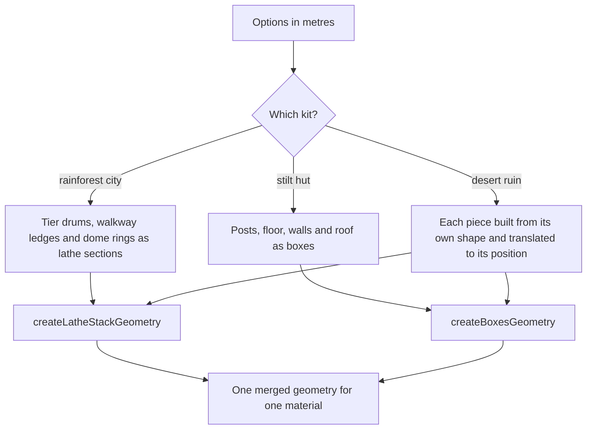

# Sumeru kits

Sumeru has two building kits, one per biome. The rainforest kit builds the city grown into the colossal tree and the village huts on stilts; the desert kit builds the sandstone ruins. Both are generators in the world package's `services/sumeru` folder, built from the same two primitives the other kits use, so a building is a few numbers rather than an authored mesh.

## How a building is made

The city's tiers narrow by a fixed step each, every walkway ledge overhangs its tier, and the dome is a hemisphere stepped through a few rings, so the whole city is one lathe. The desert ruin's columns, obelisk and pyramid are lathe stacks too, the obelisk and pyramid faceted over four sides and turned a quarter so their faces sit on the axes. A hall is one box from below the sand to its roof.

## Key files

| File                                                                         | Role                                                                               |
| :--------------------------------------------------------------------------- | :--------------------------------------------------------------------------------- |
| `packages/genshin-world/src/services/sumeru/createRainforestCityGeometry.ts` | The city's tiers, walkways and dome as one stacked lathe                           |
| `packages/genshin-world/src/services/sumeru/createStiltHutGeometry.ts`       | A hut's posts, floor, walls and overhanging roof as boxes                          |
| `packages/genshin-world/src/services/sumeru/createDesertRuinGeometry.ts`     | The ruin's pieces, each built from its shape and placed, merged into one geometry  |
| `packages/genshin-world/src/models/sumeru/DesertRuinPiece.ts`                | The four piece kinds a ruin is made of, each with its own dimensions and position  |
| `packages/genshin-engine/src/kits/architecture/createLatheStackGeometry.ts`  | The stacked lathe every tier, column, dome and pyramid is built on                 |
| `packages/genshin-engine/src/kits/architecture/createBoxesGeometry.ts`       | The boxes every post, floor, wall, roof and hall is built from                     |
| `packages/genshin-world/src/data/regions/sumeru.json`                        | Sumeru's region data, empty of landmarks until the regions' placements are settled |
