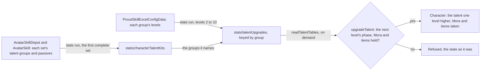
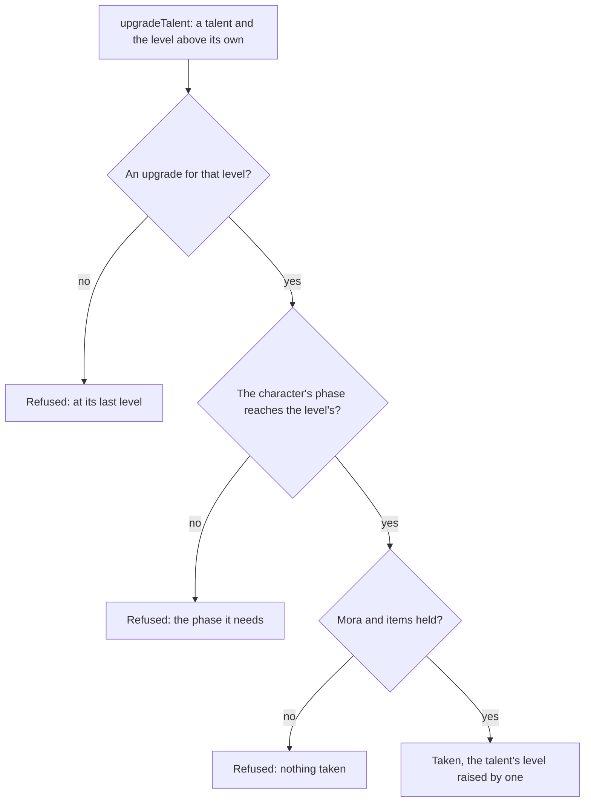

# Talents

A character's three combat talents, the normal attack, the Elemental Skill and the Elemental Burst, are levelled from 1 by the game's own rule: each level costs Mora and talent materials, and needs an ascension phase the character has reached. The table side is built, published by the stats run beside the other stat tables, and the upgrade as a pure rule over the character, its wallet and its bag. The passives are read as the phases open them. The Talents tab that presses an upgrade is not built, and stays in the [talents proposal](/docs/proposals/genshin/talents). A constellation's extra levels are added by the [constellations](/docs/genshin/constellations) page, which no kit reads yet.

## The tables

- **The proud skill table is the source.** `ProudSkillExcelConfigData` holds each combat talent's rows under its proud skill group, one a level from 1 to 15. The rows from 2 to 10 carry the phase the level needs (`breakLevel`), its Mora (`coinCost`) and its materials (`costItems`). The rows past 10 are a constellation's and cost nothing, so they are not written.
- **A skill set names its talents by group.** A skill row names the proud skill group of the talent it is. A set's first slot is the normal attack, its second the Elemental Skill, and its energy skill the burst. The third slot is the alternate sprint, which has one row and no level, so it is never levelled.
- **The first set that names all three is the character's.** That is its own form's set, and then the element forms' in the order the game lists them. The Traveler's own form names only its normal attack, so the Traveler reads its Anemo set, the form it takes by default, which the world's Traveler kit also reads. A statue's element will pick another set once the [statues page](/docs/proposals/genshin/statues-of-the-seven) holds the resonance, and until then the stats run puts the Anemo set first.
- **Passives come from that same set.** The skill depot's inherent proud skill opens name each passive and the phase it opens at. Across the roster the phases are 0, 1 and 4: the utility passive comes with the character, and the first and fourth ascension passives open at phases 1 and 4. A passive has no level.
- **The table is taken from the repository the dump came from.** The dump the game text is read from did not hold this table at its revision. The community repository's master had it, and its skill depot, skill and character tables matched the dump byte for byte, so the table is that revision's, fetched beside the dump as [genshin-parity](/docs/genshin/parity) does for any table the dump lacks. It is not committed.

## Levelling

- **Every combat talent starts at level 1.** `createCharacter` sets all three to `TALENT_START_LEVEL`.
- **An upgrade raises one talent one level.** The level above the talent's own is looked up among its upgrades. The upgrade is refused where there is none, which is past level 10 for the materials, where the character's ascension phase is below the level's phase, where the wallet lacks the Mora, and where the bag lacks an item. Those items leave the bag as [inventory](/docs/genshin/inventory) describes.
- **A refusal leaves nothing behind.** The rule throws before it returns anything, so the caller keeps the character, the wallet and the bag it passed in, with no part of the cost taken.
- **The phase numbers are the ascension phases'.** Level 2 needs the second phase, levels 3 and 4 the third, 5 and 6 the fourth, 7 and 8 the fifth, and 9 and 10 the sixth. A character at the first phase can therefore be raised to level 1 only, and a character must reach the sixth phase to bring any talent to level 10.

## Passives

A passive has no level. It is open where the character's ascension phase has reached the phase its kit holds for it, and the kit keeps the phase beside the group. Nothing reads that yet: the passives' effects are a kit's modules, and the [character kits](/docs/proposals/genshin/character-kits) are still a proposal.

## Not built yet

- **The kit's read of the constellations' levels.** The levels a constellation adds are built, on the [constellations](/docs/genshin/constellations) page. The kit that plays a talent at its own level plus them is the [character kits](/docs/proposals/genshin/character-kits)' and is not built.
- **The Talents tab's upgrade.** It is pressed on the character screen, whose tabs are a proposal. Nothing calls `upgradeTalent` or `readTalentTables` yet.

## Key files

| File                                                                | Role                                                                                |
| :------------------------------------------------------------------ | :---------------------------------------------------------------------------------- |
| `packages/genshin-world/src/models/character/Character.ts`          | Each combat talent's level, kept with the character                                 |
| `packages/genshin-world/src/models/character/CombatTalent.ts`       | The three combat talents                                                            |
| `packages/genshin-world/src/models/character/TalentUpgrade.ts`      | A level's phase, Mora and items                                                     |
| `packages/genshin-world/src/models/character/TalentUpgradeMap.ts`   | Each proud skill group's upgrades, from the second level                            |
| `packages/genshin-world/src/models/character/CharacterTalentKit.ts` | A character's talent groups and passives                                            |
| `packages/genshin-world/src/models/character/Passive.ts`            | A passive's group and the phase it opens at                                         |
| `packages/genshin-world/src/services/character/upgradeTalent.ts`    | The upgrade rule: phase, Mora and items checked before any is taken                 |
| `packages/genshin-world/src/services/character/readTalentTables.ts` | The two tables, fetched by their keys and checked against their shapes              |
| `packages/genshin-world/src/services/character/createCharacter.ts`  | Every combat talent at level 1                                                      |
| `scripts/src/services/genshinAssets/stats/toCharacterTalentKit.ts`  | A character's talents from the first skill set that names all three                 |
| `scripts/src/services/genshinAssets/stats/toTalentUpgradeMap.ts`    | Each named group's levels from the second to the tenth, costs as the table has them |
| `scripts/src/services/genshinAssets/stats/buildStatTables.ts`       | Builds both tables with the other stat tables, published under their `stats/` keys  |

## Sources

- [AnimeGameData](https://github.com/DimbreathBot/AnimeGameData), the community's per-patch dump: `ProudSkillExcelConfigData`, the skill depot's inherent proud skill opens, and the skill and character tables the sets are read from.
- [Talent](https://genshin-impact.fandom.com/wiki/Talent), Genshin Impact Wiki: the combat talents to level 10 by materials and the ascension phase, and the passives opened at the first and fourth phases.
- [Combat Talents](https://genshin-impact.fandom.com/wiki/Combat_Talents), Genshin Impact Wiki: the talents upgraded with Character Talent Materials and the weekly bosses' materials, and the alternate sprint never levelled.
