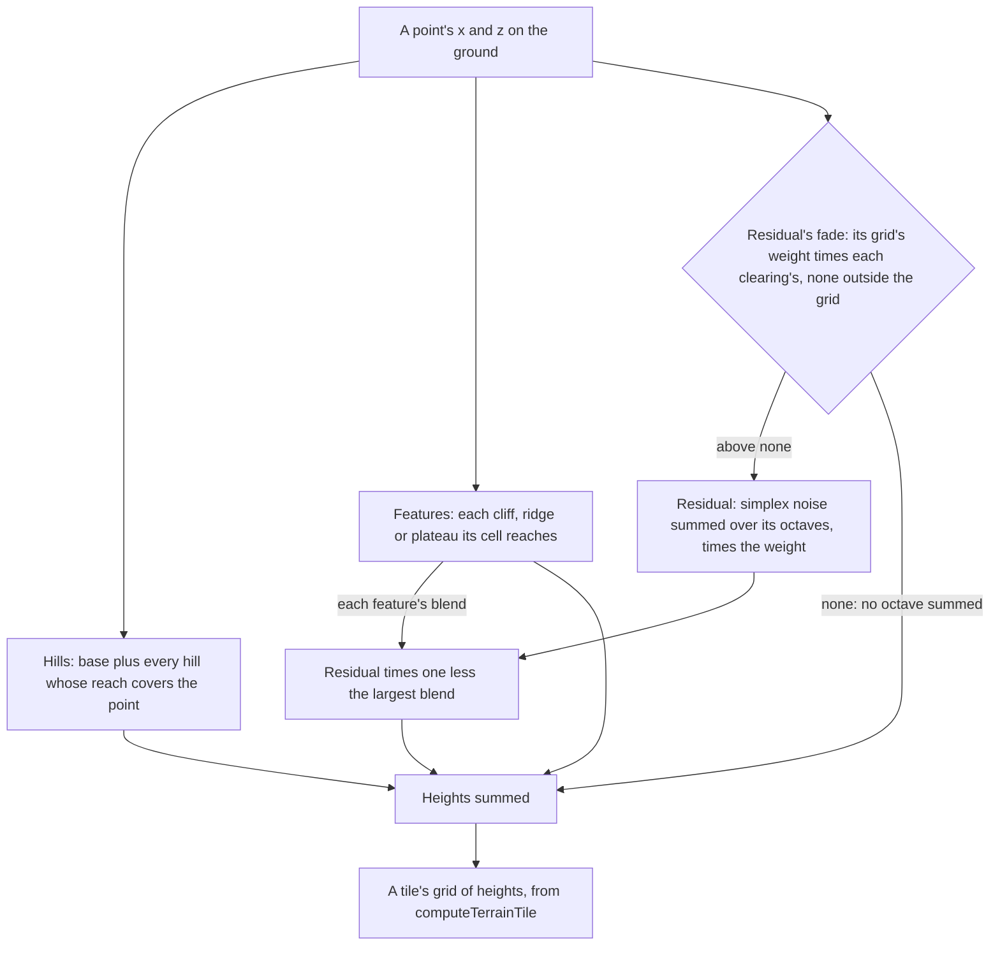

# Terrain shape height

A region's ground is a [terrain](/docs/genshin/terrain) heightfield, and its height is composed in layers so the least representation that holds is what is stored: hills first, because a few hundred of them carry most of a valley; the sharp features they smear next; and noise last, only for what is left. Each layer adds to the one below it, so a point's height is the sum of the three, and a layer a region leaves out adds nothing.

## How it works

Hills and features are filed under the cells of a grid of 64 metres, each item once under every cell its reach covers, so a point reads one cell's list rather than every item in the region. A hill is its Gaussian cut to none past three of its widths along either axis (`getGaussianHillBlend`), the square a fit reads it over, so a point skips a hill its cell lists whose reach does not cover it and the ground draws each hill exactly as it was fitted. A feature's reach is its bounds: a cliff's terrace width and falloff past its segment, a ridge's three widths past its segment, a plateau's radius and falloff.

The three feature kinds are:

- **Cliff.** A terrace raised by its height up the side of its segment's line its left normal points to, out to its width across the line. Each edge is blended across the falloff, and the terrace fades past the segment's ends over the same falloff.
- **Ridge.** A Gaussian profile of its height over the distance from its segment, its width the distance at which it stands at about three fifths of its height.
- **Plateau.** A flat top at its height inside its radius, its edge blended down across the falloff past the radius. A negative height is a basin, which is how a coastline's water is drawn.

The residual is simplex noise with the given seed, its first octave's amplitude and scale in metres, each octave after at half the amplitude and half the scale. Noise drawn by its statistics is not the ground point for point, so wherever it is drawn it adds its own error, and it is read only where it reaches. Its optional fade is a grid of weights from none to one on nodes a cell apart, read bilinearly between the four round a point, and the residual's height there is scaled by that weight. A point outside the grid draws none of it, since nothing was fitted there, and each of the fade's clearings, a disc with a radius and a falloff, holds it at none inside the radius and fades it in across the falloff. Without a fade every point draws the whole residual, so a residual without one is the residual it was. Where the weight is none no octave is summed at all.

The features keep the residual off their own ground too: the composed height multiplies the residual by one less the largest blend any feature stands at there, the same share of its height each feature adds, so a plateau's top, a terrace or a ridge's crest carries no noise and the residual comes back across their falloffs.

## Not yet

- **A smooth window on each hill.** A hill is cut at its reach, where its Gaussian still stands at about a hundredth of its height (the exponential of minus four and a half, 1.1%), so the ground steps by that much where a tall hill's square ends. A window falling smoothly to none at the reach would close the step, but the fit would then read a different shape, so the hills would have to be fitted again with it.
- **One bilinear read for the fitted grids.** `sampleTerrainResidualFade` reads its weights between four nodes exactly as `sampleGroundLayerField` reads each layer's shares, over the same row-major grid, and differs only past the edges, where the fade draws none and the field keeps to its edge. One read of a grid's value at a point would serve both; the layer field's side waits until its owner's work on the ground's layers lands.

## Key files

| File                                                                 | Role                                                                      |
| :------------------------------------------------------------------- | :------------------------------------------------------------------------ |
| `packages/genshin-engine/src/terrain/createTerrainShapeHeight.ts`    | The three layers summed into one ground's height                          |
| `packages/genshin-engine/src/terrain/createGaussianHillsHeight.ts`   | The hills layer: a base plus every hill whose reach covers the point      |
| `packages/genshin-engine/src/terrain/getGaussianHillBlend.ts`        | One hill's share at a point, cut at its reach, the kernel the fit reads   |
| `packages/genshin-engine/src/terrain/createTerrainFeaturesHeight.ts` | The features layer, each feature read only in the cells it reaches        |
| `packages/genshin-engine/src/terrain/getTerrainFeatureBounds.ts`     | The rectangle each feature's height reaches past zero within              |
| `packages/genshin-engine/src/terrain/TerrainFeatureKindBlendMap.ts`  | Each kind's share of its height at a point, the one blend both read       |
| `packages/genshin-engine/src/terrain/getCliffBlend.ts`               | A cliff's terrace, blended across its falloff and past its ends           |
| `packages/genshin-engine/src/terrain/getRidgeBlend.ts`               | A ridge's Gaussian profile over its distance from the segment             |
| `packages/genshin-engine/src/terrain/getPlateauBlend.ts`             | A plateau's flat top and blended edge                                     |
| `packages/genshin-engine/src/terrain/createTerrainFeaturesBlend.ts`  | The largest blend any feature stands at, which the residual is kept off   |
| `packages/genshin-engine/src/terrain/createResidualHeight.ts`        | The residual's octaves of simplex noise, scaled by its fade's weight      |
| `packages/genshin-engine/src/terrain/sampleTerrainResidualFade.ts`   | The fade's weight at a point, bilinear in its grid, none outside it       |
| `packages/genshin-engine/src/terrain/fileByCell.ts`                  | Items filed under the cells their bounds cover, read by a point           |
| `packages/genshin-world/src/services/world/getWorldHeight.ts`        | The world's ground, Windrise's fitted ground with every region's plateaus |

## Notes

- **Windrise's ground is hills and a faded residual.** Its data is the fitted hills, no plateau and the residual's noise, faded out where the hills hold and cleared from the bar's 60 metres round the oak and from every place a region file stands a landmark on inside the fitted extent ([terrain shapes](/docs/proposals/genshin/terrain-shapes)). The world's features are the other regions' provisional plateaus, each raised under its capital ([region buildings](/docs/genshin/region-buildings)), and past the fitted extent no residual is drawn; cliffs, ridges and the world's merge of Windrise's own features are the [terrain shapes](/docs/proposals/genshin/terrain-shapes) proposal's.
- **A feature's falloff is positive.** The blends divide by their falloff, so a sharp edge is a falloff of a small positive length rather than zero.
