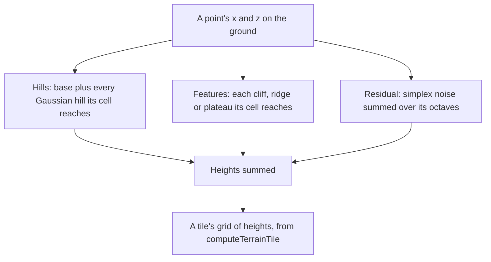

# Terrain shape height

A region's ground is a [terrain](/docs/genshin/terrain) heightfield, and its height is composed in layers so the least representation that holds is what is stored: hills first, because a few hundred of them carry most of a valley; the sharp features they smear next; and noise last, only for what is left. Each layer adds to the one below it, so a point's height is the sum of the three, and a layer a region leaves out adds nothing.

## How it works

Hills and features are filed under the cells of a grid of 64 metres, each item once under every cell its reach covers, so a point reads one cell's list rather than every item in the region. A feature's reach is its bounds: a cliff's terrace width and falloff past its segment, a ridge's three widths past its segment, a plateau's radius and falloff.

The three feature kinds are:

- **Cliff.** A terrace raised by its height up the side of its segment's line its left normal points to, out to its width across the line. Each edge is blended across the falloff, and the terrace fades past the segment's ends over the same falloff.
- **Ridge.** A Gaussian profile of its height over the distance from its segment, its width the distance at which it stands at about three fifths of its height.
- **Plateau.** A flat top at its height inside its radius, its edge blended down across the falloff past the radius. A negative height is a basin, which is how a coastline's water is drawn.

The residual is simplex noise with the given seed, its first octave's amplitude and scale in metres, each octave after at half the amplitude and half the scale.

## Key files

| File                                                                | Role                                                                 |
| :------------------------------------------------------------------ | :------------------------------------------------------------------- |
| `packages/genshin-engine/src/terrain/createTerrainShapeHeight.ts`   | The three layers summed into one ground's height                     |
| `packages/genshin-engine/src/terrain/createGaussianHillsHeight.ts`  | The hills layer: a base plus every hill its cell reaches             |
| `packages/genshin-engine/src/terrain/createTerrainFeaturesHeight.ts` | The features layer, each feature read only in the cells it reaches   |
| `packages/genshin-engine/src/terrain/getTerrainFeatureBounds.ts`    | The rectangle each feature's height reaches past zero within         |
| `packages/genshin-engine/src/terrain/getCliffHeight.ts`             | A cliff's terrace, blended across its falloff and past its ends      |
| `packages/genshin-engine/src/terrain/getRidgeHeight.ts`             | A ridge's Gaussian profile over its distance from the segment        |
| `packages/genshin-engine/src/terrain/getPlateauHeight.ts`           | A plateau's flat top and blended edge                                |
| `packages/genshin-engine/src/terrain/createResidualHeight.ts`       | The residual's octaves of simplex noise                              |
| `packages/genshin-engine/src/terrain/fileByCell.ts`                 | Items filed under the cells their bounds cover, read by a point      |
| `packages/genshin-world/src/services/windrise/getWindriseHeight.ts` | Windrise's ground, composed from its fitted shape                    |

## Notes

- **Windrise's ground has hills only.** Its data is the fitted hills and no features or residual, so its heights are those of the hills layer alone. Fitting features and the residual to the game's tiles is the [terrain shapes](/docs/proposals/genshin/terrain-shapes) proposal, not yet built.
- **A feature's falloff is positive.** The blends divide by their falloff, so a sharp edge is a falloff of a small positive length rather than zero.
