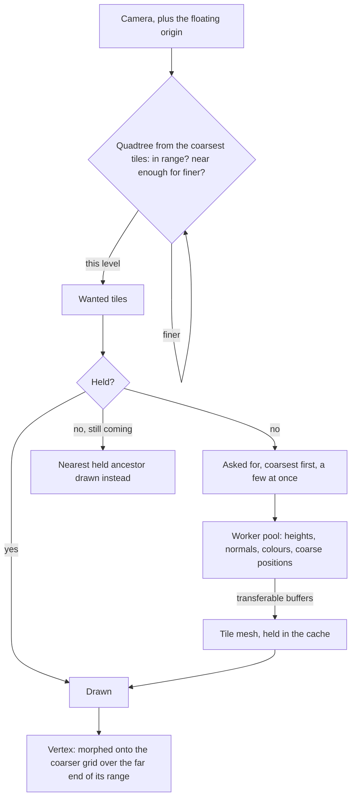

# Terrain

The world is a single connected land, so its ground is one heightfield rather than a set of scenes. It is drawn at the detail the camera needs and generated only where the camera can see, so its cost follows the view and never the size of the continent.

## How it works

- **A quadtree of equal tiles.** Every tile is the same grid of cells, and each level's tiles are twice the side of the level below and are drawn out to twice the distance (`TerrainOptions`). `selectTerrainTiles` walks the coarsest tiles tiled around the eye and descends by true three-dimensional distance to each tile's bounds, so detail follows the camera's height as well as its position. A tile in its level's range but too far for the level below is drawn at its level. A nearer one tries its four children, and a child out of even its own range is still drawn at its level, fully morphed onto its parent's grid. A tile outside the frustum is skipped. Nothing bounds the world: the coarsest level simply reaches its range in every direction.
- **Vertices morph, so nothing pops.** Each vertex carries the position it collapses onto on the next level's grid, the even vertex beside it, with its tile's level in the fourth component (`computeTerrainTile`). The ground material (`createTerrainMaterial`) morphs every vertex toward it over the far end of its level's range, by its distance from the eye, so a tile reaching the end of its range already is the coarser tile that replaces it, and no seam needs stitching. The morph is the material's position node, which the shadow passes use too, so shadows fall on the ground as it is drawn.
- **Tiles are generated off the main thread.** A small pool of workers each runs the region's height and colour functions over a tile's grid, one vertex wider on every side so each normal comes from its neighbours and a tile's edge normal matches its neighbour's. The arrays come back as transferable buffers, and every tile shares one index buffer.
- **A cache, asked coarsest first.** `createTileStreamer` holds a few hundred tiles, asks for the coarsest missing ones first and only a few at once, and frees the tile wanted longest ago once the cache is full, never one wanted or drawn this frame; a tile arriving after the view moved on counts as wanted when it was last wanted, so it is freed before one in view. Until a tile arrives, `resolveTerrainDraws` draws its nearest held ancestor in its place and drops whatever that ancestor covers, so the ground is always covered once, coarser for a moment where it is still streaming.
- **Every held tile is a mesh, shown only while drawn.** A tile coming back into view costs a flag, not a rebuild. When a tile arrives, the god rays' shadow map is marked for a redraw, since the ground under the view has changed.
- **The origin floats.** Single-precision positions tremble far from the origin, so once the camera has gone a kilometre out across the ground, `useFloatingOrigin` moves the world back under it (`computeOriginShift`). The camera and its controls' target are pulled back by the shift, rounded to a coarsest tile so tile edges stay on whole numbers, and the group every placed thing sits in is offset by the new origin. Tile keys stay in world coordinates, and the selection adds the origin to the camera, so it never sees the shift.

## What it costs to run

- **A frame's selection allocates nothing.** The quadtree, the draw resolution and the streamer's bookkeeping write into buffers kept for the page. The benches beside `selectTerrainTiles` and `resolveTerrainDraws` hold their cost flat from the origin to fifty kilometres out, at an eye on the ground and one high above.
- **A tile costs its vertices.** The bench beside `computeTerrainTile` holds its cost to the grid's size, with the region's noise on top.
- **Draws are the tiles in view**, a few dozen, each sharing the one ground material and the one index buffer.

## Key files

| File                                                            | Role                                                                |
| :-------------------------------------------------------------- | :------------------------------------------------------------------ |
| `packages/genshin-engine/src/terrain/selectTerrainTiles.ts`     | The quadtree walk by distance and frustum                           |
| `packages/genshin-engine/src/terrain/resolveTerrainDraws.ts`    | Held tiles drawn, a held ancestor in place of one still coming      |
| `packages/genshin-engine/src/terrain/computeTerrainTile.ts`     | One tile's heights, normals, colours and coarse positions           |
| `packages/genshin-engine/src/terrain/createTerrainMaterial.ts`  | The unoutlined toon ground, morphing by distance                    |
| `packages/genshin-engine/src/streaming/createTileStreamer.ts`   | The tile cache: asked coarsest first, freed least recently wanted   |
| `packages/genshin-engine/src/world/computeOriginShift.ts`       | When the world is moved back under the camera, and by how much      |
| `packages/genshin-world/src/components/World/Terrain/Index.vue` | The worker pool, the tile meshes, and the frame's selection         |
| `packages/genshin-world/src/workers/terrainTile.worker.ts`      | A tile generated from the region's heights and colours              |
| `packages/genshin-world/src/composables/useFloatingOrigin.ts`   | The shift applied to the camera, its controls and the world's group |
| `packages/genshin-world/src/services/windrise/constants.ts`     | Windrise's quadtree: its tile size, levels and ranges               |

## Notes

- **Heights are a region's function for now.** Windrise's is a knoll, a ring of hills opening east onto a lake's bowl, and noise, written in code, and its colours are grass in patches and rock on steep faces. Authored shapes, ground layers and paint strokes are the [terrain shapes](/docs/proposals/genshin/terrain-shapes) proposal.
- **A tile is its own mesh, not an instance.** The proposal's single instanced draw over a height texture array would take the ground to one draw call, at the price of a texture array and an indirection table to stream into. With a few dozen tiles in view the draws are within the engine's budget, so it waits ([one instanced draw](/docs/genshin/deferred/terrain-instanced-draw)).
- **The finest range must clear twice a finest tile's diagonal.** Otherwise a tile's neighbour can change level before the tile has finished morphing, and a crack opens between them.

## Sources

- [CDLOD: Continuous distance-dependent level of detail for rendering heightmaps](https://github.com/fstrugar/CDLOD), Filip Strugar, 2010: the quadtree of regular grids, a level of detail chosen by true three-dimensional distance, and morphing between levels in place of stitching.
- [Transferable objects](https://developer.mozilla.org/en-US/docs/Web/API/Web_Workers_API/Transferable_objects), MDN: handing tile buffers from the worker without copying.
