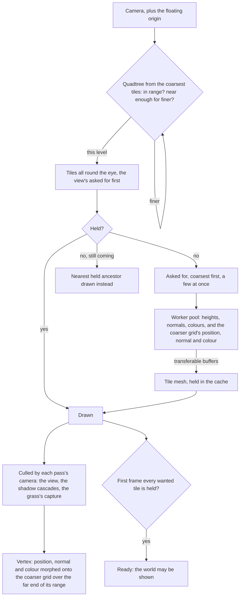

# Terrain

The world is a single connected land, so its ground is one heightfield rather than a set of scenes. It is drawn at the detail the camera needs and generated only within reach of the camera, so its cost follows the camera and never the size of the continent.

## How it works

- **A quadtree of equal tiles.** Every tile is the same grid of cells, and each level's tiles are twice the side of the level below and are drawn out to twice the distance (`TerrainOptions`). `selectTerrainTiles` walks the coarsest tiles tiled around the eye and descends by true three-dimensional distance to each tile's bounds, so detail follows the camera's height as well as its position. A tile in its level's range but too far for the level below is drawn at its level. A nearer one tries its four children, and a child out of even its own range is still drawn at its level, fully morphed onto its parent's grid. The walk with the view's frustum decides what is asked for first and when the ground is ready. A second walk with no frustum decides what is held and drawn, all round the eye: drawn from the view's walk alone, a turn of the camera wanted ground nothing had generated and the sky flashed through, the hills just off screen cast no shadow into the view, and the grass's capture held only the ground in front of the camera. Nothing bounds the world: the coarsest level simply reaches its range in every direction.
- **Vertices morph, so nothing pops.** Each vertex carries the position it collapses onto on the next level's grid, the even vertex beside it, with its tile's level in the fourth component, and the normal and colour the next level has there, its normal taken across that level's wider cells (`computeTerrainTile`). The ground material (`createTerrainMaterial`) morphs every vertex's position, normal and colour toward them over the far end of its level's range, by its distance from the eye, so a tile reaching the end of its range already is the coarser tile that replaces it, and no seam needs stitching. Morphing the position alone left each tile's normals at its own level's, taken across cells half as wide as its parent's, so whenever the eye moved and a tile changed level its patch of hill took the other level's shading at once, and the ramp's hard step showed it as a piece of the hill vanishing and coming back. The morph starts a tile's diagonal past half its level's range (`getTerrainMorphStart`): a tile splits into its children once its bounds come within half its range, its farthest vertex then stands no more than its diagonal beyond them, so a splitting tile is wholly at its own level and its children, fully morphed onto its grid, draw it unchanged. A vertex's distance is measured as the selection measures a tile's, the eye's height counting only past the band every tile's bounds span. Started at a fixed share of the range and measured through the eye's height, the morph had a splitting tile's far side most of the way onto the next level's grid while its children drew its own, so a piece of hill changed shape and shade at every split, and morphing the shading with the position made each one plainer. The morph is the material's position node, which the shadow passes use too, so it is measured from the view's eye, a uniform the terrain writes each frame, and never from the camera rendering: each shadow cascade has a camera of its own that moves whenever the view turns, and morphing by it reshaped the ground the cascade drew, so patches of the hills flickered between lit and shadowed on every turn. Measured from one eye, every pass draws the same ground and shadows fall on it as it is drawn.
- **Tiles are generated off the main thread.** A small pool of workers each runs the region's height and colour functions over a tile's grid, two vertices wider on every side so each normal, its own level's and the next's, comes from its neighbours and a tile's edge normal matches its neighbour's. The arrays come back as transferable buffers, and every tile shares one index buffer.
- **A cache, asked coarsest first.** `createTileStreamer` holds as many tiles as a selection does, every tile round the eye among them, asks for the coarsest missing ones the view wants first, then those round it, only a few at once, and frees the tile wanted longest ago once the cache is full, never one wanted, drawn or round the eye this frame; a tile arriving after the view moved on counts as wanted when it was last wanted, so it is freed before one in view. Until a tile arrives, `resolveTerrainDraws` draws its nearest held ancestor in its place and drops whatever that ancestor covers, so the ground is always covered once, coarser for a moment where it is still streaming.
- **Every held tile is a mesh, shown only while drawn, and each pass culls by its own camera.** A tile coming back into range costs a flag, not a rebuild. Drawn all round the eye, the ground is the same whichever way the camera looks: the view culls the tiles behind it, a shadow cascade keeps the hills off screen that shade what is on it, and the grass's capture keeps the ground under it. The terrain writes the tiles it draws each frame into a selection its parent passes, which whatever reads the ground, the grass's footing among it, compares against what it last read.
- **The ground is ready once its first view has arrived.** The first frame every tile the view wants is held, the terrain reports it, and the world's screen is ready only then, with the regions in reach of the view fetched as well, so a host showing the world never shows the bare water under a ground still streaming in. The selection runs before every frame even while a paused canvas draws none, so a world loading under the opening streams its ground meanwhile, and it brings the camera's matrices up to date first, since no render has yet.
- **The origin floats.** Single-precision positions tremble far from the origin, so once the camera has gone a kilometre out across the ground, `useFloatingOrigin` moves the world back under it (`computeOriginShift`). The camera and its controls' target are pulled back by the shift, rounded to a coarsest tile so tile edges stay on whole numbers, and the group every placed thing sits in is offset by the new origin. Tile keys stay in world coordinates, and the selection adds the origin to the camera, so it never sees the shift.

## What it costs to run

- **A frame's selection allocates nothing.** The quadtree, the draw resolution and the streamer's bookkeeping write into buffers kept for the page. The benches beside `selectTerrainTiles` and `resolveTerrainDraws` hold their cost flat from the origin to fifty kilometres out, at an eye on the ground and one high above.
- **A tile costs its vertices.** The bench beside `computeTerrainTile` holds its cost to the grid's size, with the region's noise on top.
- **Draws are the tiles in each pass's camera**, a few dozen in the view, each sharing the one ground material and the one index buffer; the tiles round the eye cost each pass a bounding-sphere test.

## Key files

| File                                                                | Role                                                                |
| :------------------------------------------------------------------ | :------------------------------------------------------------------ |
| `packages/genshin-engine/src/terrain/selectTerrainTiles.ts`         | The quadtree walk by distance and frustum                           |
| `packages/genshin-engine/src/terrain/resolveTerrainDraws.ts`        | Held tiles drawn, a held ancestor in place of one still coming      |
| `packages/genshin-engine/src/terrain/computeTerrainTile.ts`         | One tile's heights, normals, colours and the coarser grid's         |
| `packages/genshin-engine/src/terrain/createTerrainMaterial.ts`      | The unoutlined toon ground, morphing by distance                    |
| `packages/genshin-engine/src/terrain/getTerrainMorphStart.ts`       | Where a level's morph starts, past any tile that splits             |
| `packages/genshin-engine/src/streaming/createTileStreamer.ts`       | The tile cache: asked coarsest first, freed least recently wanted   |
| `packages/genshin-engine/src/world/computeOriginShift.ts`           | When the world is moved back under the camera, and by how much      |
| `packages/genshin-world/src/components/World/Terrain/Index.vue`     | The worker pool, the tile meshes, and the frame's selection         |
| `packages/genshin-world/src/workers/terrainTile.worker.ts`          | A tile generated from the region's heights and colours              |
| `packages/genshin-world/src/composables/useFloatingOrigin.ts`       | The shift applied to the camera, its controls and the world's group |
| `packages/genshin-world/src/services/windrise/constants.ts`         | Windrise's quadtree: its tile size, levels and ranges               |
| `packages/genshin-engine/src/terrain/createTerrainShapeHeight.ts`   | A ground composed in layers: hills, sharp features and residual     |
| `packages/genshin-world/src/services/windrise/getWindriseHeight.ts` | Windrise's ground, its fitted hills                                 |
| `scripts/src/services/genshinAssets/fit/fitGaussianHills.ts`        | The hills fitted to a heightfield, widest first, with their error   |

## Notes

- **Heights are a region's function.** Windrise's is our own Gaussian hills over a base height, composed by [terrain shape height](/docs/genshin/terrain-shape-height) (`createTerrainShapeHeight`), several thousand of them fitted by `genshin:assets fit windrise` to the game's terrain tiles round the oak's foot, which stands at the origin. The fit prints the error it leaves, under a metre round the oak and a few metres at the valley's edge, and writes the heights the ground stands between, which bound every tile's box. Past the kilometre it is fitted over, the ground falls back to its base. Its colours are painted in layers by rules of its slope and height ([ground paint](/docs/genshin/ground-paint)). A fitted ground for every region, its sharp features and its layers, is the [terrain shapes](/docs/proposals/genshin/terrain-shapes) proposal.
- **A tile is its own mesh, not an instance.** The proposal's single instanced draw over a height texture array would take the ground to one draw call, at the price of a texture array and an indirection table to stream into. With a few dozen tiles in view the draws are within the engine's budget, so it waits ([one instanced draw](/docs/genshin/deferred/terrain-instanced-draw)).
- **The finest range must clear twice a finest tile's diagonal.** The morph runs from a tile's diagonal past half a level's range to the range, so half of what the finest range clears beyond twice the diagonal is the distance a vertex blends over. Windrise's blends over about nine metres; at a share of a range as wide as the CDLOD paper's, the ground would draw several times the tiles.

## Sources

- [CDLOD: Continuous distance-dependent level of detail for rendering heightmaps](https://github.com/fstrugar/CDLOD), Filip Strugar, 2010: the quadtree of regular grids, a level of detail chosen by true three-dimensional distance, and morphing between levels in place of stitching.
- [Transferable objects](https://developer.mozilla.org/en-US/docs/Web/API/Web_Workers_API/Transferable_objects), MDN: handing tile buffers from the worker without copying.
