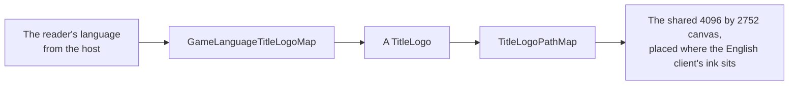

# Title splash

The opening's second splash shows the game's title logo in flat grey on white, after the publisher's logo and before the health notice. The game draws a different logo for some client languages, and the splash draws the reader's.

- **Five logos, by language.** Simplified Chinese shows 原神 alone, Traditional Chinese 原神 over "Genshin Impact", Japanese 原神 over "Genshin", and Korean 원신 over "Genshin Impact"; every other language shows the English "GENSHIN IMPACT". Those are the five sprites the game's login interface picks between by language.
- **Each is traced from the game's own sprite.** The white sprites, flattened on black, are traced at four times their size, and the Latin line under the Chinese, Japanese and Korean marks is traced again as a region of its own, where its i's dots are not taken for specks of the whole canvas. The sprites are references and never ship; the traced paths do.
- **One canvas places them all.** The game's five sprites share one 1024 by 688 canvas, so the splash places that canvas once, fitted so the English logo's ink lands where the English client's does against its recording, and every other logo then stands where its own client's does. The English texture's trace and the wiki's render of the English logo agree in shape to a tenth of a percent, which is what fits the canvas to the recording.
- **Its name is the game's.** The splash is an image to a screen reader, named by the game's own window title in the reader's language.

## Key files

| File                                                                     | Role                                               |
| :----------------------------------------------------------------------- | :------------------------------------------------- |
| `packages/genshin-world/src/components/Splash/Title/Index.vue`           | The splash: the reader's logo on the shared canvas |
| `packages/genshin-world/src/models/splash/TitleLogo.ts`                  | The game's five title logos                        |
| `packages/genshin-world/src/services/splash/GameLanguageTitleLogoMap.ts` | The logo each language's client shows              |
| `packages/genshin-world/src/services/splash/TitleLogoPathMap.ts`         | Each logo's traced path on the shared canvas       |
