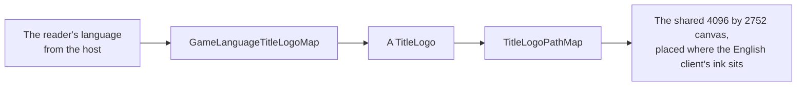

# Title splash

The opening's title splash shows the game's title logo in flat grey on white. The global client shows it after the publisher's logo and before the health notice; mainland China's, which a Simplified Chinese reader is shown, opens on it with no publisher's logo, its publishing licence under it. The game draws a different logo for some client languages, and the splash draws the reader's.

- **Five logos, by language.** Simplified Chinese shows 原神 alone, Traditional Chinese 原神 over "Genshin Impact", Japanese 原神 over "Genshin", and Korean 원신 over "Genshin Impact"; every other language shows the English "GENSHIN IMPACT". Those are the five sprites the game's login interface picks between by language.
- **Each is traced from the game's own sprite.** The white sprites, flattened on black, are traced at four times their size, and the Latin line under the Chinese, Japanese and Korean marks is traced again as a region of its own, where its i's dots are not taken for specks of the whole canvas. The sprites are references and never ship; the traced paths do, written as the world's data by `pnpm -C scripts genshin:assets fit login` (`fitTitleLogos`), which exports the sprites from the installed game itself, so a patch that changes a logo is one run.
- **One canvas places them all.** The game's five sprites share one 1024 by 688 canvas, so the splash places that canvas once, fitted so the English logo's ink lands where the English client's does against its recording, and every other logo then stands where its own client's does. The English texture's trace and the wiki's render of the English logo agree in shape to a tenth of a percent, which is what fits the canvas to the recording.
- **Mainland China's client carries its licence.** Under its logo it prints four lines of its publishing licence, the game's own text, measured off a public recording of its launch (`bili-av532052219`): forty units apart over the screen's foot, fading in 400 ms behind the logo. Its splash holds and fades on its own timings, and its health notice, the global client's own words, follows at once (`GameLanguageGameClientMap`). The licence's second line runs narrower than the recording's, since its digits and Latin letters fall back to a system face.
- **Its name is the game's.** The splash is an image to a screen reader, named by the game's own window title in the reader's language.

## Key files

| File                                                                      | Role                                                                      |
| :------------------------------------------------------------------------ | :------------------------------------------------------------------------ |
| `packages/genshin-world/src/components/Splash/Title/Index.vue`            | The splash: the reader's logo on the shared canvas                        |
| `packages/genshin-world/src/models/splash/TitleLogo.ts`                   | The game's five title logos                                               |
| `packages/genshin-world/src/services/splash/GameLanguageTitleLogoMap.ts`  | The logo each language's client shows                                     |
| `packages/genshin-world/src/services/splash/GameLanguageGameClientMap.ts` | The build each language's reader plays, global or mainland China's        |
| `packages/genshin-world/src/services/splash/TitleLogoPathMap.ts`          | Each logo's traced path on the shared canvas                              |
| `scripts/src/services/genshinAssets/fitTitleLogos.ts`                     | The logos exported from the game, traced and spliced, as the world's data |
