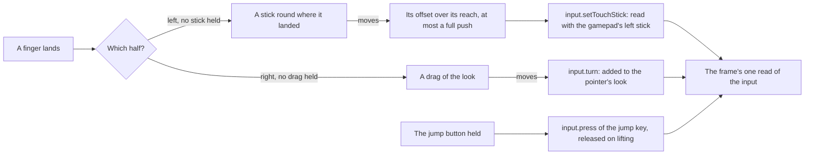

# Touch controls

A phone or a tablet has no keys or mouse to move and look with, so the game's mobile client draws its controls over the world. The world's touch controls are drawn the same way, as the bottom layer of the [HUD](/docs/genshin/hud), whenever the device's main pointer is a finger.

## How it works

- **One input for every device.** The touch controls write into the engine's `input` rather than moving the camera themselves: the stick's axes are added to the gamepad's left stick, a drag's turn to the pointer's look, and the jump button holds the jump key's code as a key would. So the camera, and the character after it, read one move and one look whatever drives them.
- **The left half is a stick, the right half a look.** A finger landing on the left half holds a stick round the point it landed on, drawn there while it is held; its offset over the stick's reach is the move, and a finger pushed past the reach holds the stick at its rim in its direction. A finger landing on the right half drags the look by how far it moves. One finger holds each, and lifting it lets go, the stick back at rest.
- **The jump button holds the jump.** It is the free camera's rise for now, as Space is, and the character's jump once one walks. It is a button named in the game's words for a screen reader.
- **Only on a touch screen.** The controls are drawn when the device's main pointer is coarse (`(pointer: coarse)`), so a computer's clicks still reach the world to lock the pointer. Hiding the HUD hides them, and they let go of whatever they held.

## Key files

| File                                                        | Role                                                               |
| :---------------------------------------------------------- | :----------------------------------------------------------------- |
| `packages/genshin-world/src/components/Hud/Touch/Index.vue` | The stick, the look's drag and the jump button                     |
| `packages/genshin-world/src/services/hud/constants.ts`      | The stick's reach and the look's turn for a pixel of a drag        |
| `packages/genshin-engine/src/input/createInput.ts`          | `press`, `release`, `setTouchStick` and `turn`, read with the rest |

## Notes

- **The stick's reach is in CSS pixels.** A thumb's travel is a distance on the glass, which CSS pixels follow on a phone where the game's screen units would shrink it with the window. The reach, the look's turn and the controls' sizes are provisional until the mobile client's recording is measured ([roadmap](/docs/genshin/roadmap)).
- **Touch rises but does not fall.** The game's touch layout has no button to descend, so the free camera flown by touch climbs on the jump button and has no way back down; the jump is the character's own once one walks, and the free camera is then photo mode alone.

## Sources

- [Controls](https://genshin-impact.fandom.com/wiki/Controls), Genshin Impact Wiki: the mobile client's every action done by touching the screen, the camera turned by touching and dragging it, and the jump that moves upward where the free camera flies.
- [Game accessibility guidelines](https://gameaccessibilityguidelines.com/full-list/): support for several input devices.
