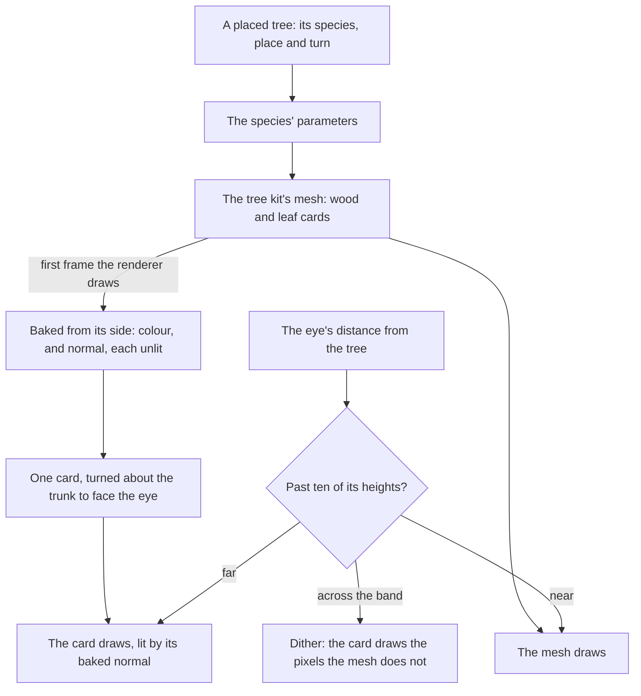

# Trees

A forest of the game's is a handful of species placed many times, so a tree here is a species, one set of the [tree kit's](/docs/genshin/vegetation) parameters, and a placed tree names its species rather than carrying parameters of its own. Near the eye a tree is its mesh, trunk and leaf cards; far from it, where its cards would cost the same and show a few pixels, it is an impostor: one card carrying a picture of the mesh baked from its side.

## How it works

- **A species is a set of parameters.** `TreeSpecies` names each species and `TreeSpeciesOptionsMap` holds its parameters, so a species placed a thousand times is fitted once. A tree landmark names its species in its region's data. Windrise's great oak is the first: its leaf clusters, the leaf each holds, its leaves' normal field and its trunk's taper are read off the game's own export (`data/windrise/oak.json`), its branches still the ones set against its reference screenshots.
- **The impostor is baked from the tree's own mesh.** On the first frame the renderer can draw, an orthographic camera standing off the trunk's axis renders the wood and the leaf cards twice into small targets (`bakeImpostor`): once in each part's own colour, unlit, and once in its normal as the camera sees it, the leaf cards cut to their shape as the crown's are. The target frames the mesh from its axis out to its widest on either side and from its foot to its crown.
- **The card turns about the trunk.** The impostor is one quad of that width and height, turned in the vertex stage about its upright axis to face the eye (`createImpostorMaterial`), so a tree stays standing however the eye looks at it, from the ground or from above. In a shadow pass it turns to the light instead, so it casts the shape the sun sees.
- **It is lit as the mesh is.** The card takes the baked colour, darkened when wet as every surface is, and the baked normal turned with the card as its own, through the toon ramp, so its crown shades as the mesh's does through the hour rather than a picture lit at bake time. It draws no outline, as the ground draws none.
- **The two cross over by a dither.** A tree hands its mesh to its impostor some ten of its own heights from the eye (`IMPOSTOR_SWITCH_HEIGHTS`), so a larger tree keeps its mesh further, across a band a tenth of that distance wide. Across the band a fixed noise over the screen picks which pixels each draws (`createDitherFadeNode`): the impostor's share is how far it has faded in and the mesh draws every pixel the impostor does not, so a pixel is never drawn twice nor left empty. Outside the band only one of the two is drawn at all.

## What it costs to run

- **One bake a tree, two small renders, once.** The targets are a few hundred texels on their longer side.
- **A far tree is two triangles.** Its card's cost is a few texture reads a pixel; its mesh is not drawn at all past the band.
- **A tree decides its detail from one distance a frame**, on the main thread.

## Key files

| File                                                                  | Role                                                                                                   |
| :-------------------------------------------------------------------- | :----------------------------------------------------------------------------------------------------- |
| `packages/genshin-world/src/models/world/TreeSpecies.ts`              | The species the game's trees are rebuilt as                                                            |
| `packages/genshin-world/src/services/world/TreeSpeciesOptionsMap.ts`  | Each species' tree kit parameters, the great oak's first, its branches provisional                     |
| `packages/genshin-world/src/data/windrise/oak.json`                   | The great oak's leaf clusters with the leaf each holds, its normal field and its trunk taper           |
| `scripts/src/services/genshinAssets/fit/fitWindriseOak.ts`            | The fit that clusters the leaf mesh's cards with their kept leaf and reads the bark's taper            |
| `packages/genshin-world/src/components/World/Landmark/Tree/Index.vue` | A placed tree: its mesh, its impostor, and the cross-over between                                      |
| `packages/genshin-world/src/components/World/Plants/Index.vue`        | Windrise's placed plants, one instanced draw per prefab: the oak's impostor for trees, domes otherwise |
| `packages/genshin-world/src/services/world/bakeTreeImpostor.ts`       | The impostor baked from a tree's bark and leaf meshes, shared by a placed tree and a plant             |
| `packages/genshin-engine/src/vegetation/bakeImpostor.ts`              | A mesh's colour and normal baked from its side                                                         |
| `packages/genshin-engine/src/nodes/createImpostorMaterial.ts`         | The card turned to the eye and lit by its baked normal                                                 |
| `packages/genshin-engine/src/nodes/createDitherFadeNode.ts`           | Which pixels each of two cross-fading details draws                                                    |
| `packages/genshin-engine/src/nodes/createLeafShapeNode.ts`            | A leaf card's cut, shared by the crown and its bake                                                    |
| `packages/genshin-engine/src/vegetation/constants.ts`                 | The impostor's resolution and where it takes over, provisional                                         |

## Notes

- **The great oak's leaf clusters are fitted to its export's leaves.** Each cluster's centre and reach are the k-means of the leaf mesh's card centres, 1280 of them, about five cards a cluster, and each holds the leaf its cards keep, a card's area times the share of its texture the material's cutoff keeps. The kit grows as many cards in a cluster as keep three times that leaf (`leafAreaScale`): our solid pointed ovals draw the crown as opaque as the export's cut cards at about twice its leaf, and the shape pass's envelope reads nearest at three times. Its trunk's radius steps down the bark's own taper, so the canopy is the export's layout rather than a species' random one. The bark's surface roots are not drawn yet, and they are about half of what the envelope's outline misses by ([scene derivation](/docs/genshin/scene-derivation), Decisions). Its branches and the switch are provisional: the switch is read off a recording walking away from one of the game's trees ([trees and scatter](/docs/proposals/genshin/trees-and-scatter)), and the oak's shape is judged by the outline, depth and normal of the shape pass.
- **The placed plants are one instanced draw per prefab.** Windrise's plants from its streams (`data/windrise/plants.json`) stand as stand-ins in `World/Plants`: a tree prefab as the oak's impostor, the baked card shared by every place, and any other plant as a low dome of the ground's green. Each prefab is one draw, so 2,200 places cost fifteen draws. The oak's own mesh is left to its landmark. Species for the placed trees, and culling their instances on the GPU, wait for the layout pass's next rows ([trees and scatter](/docs/proposals/genshin/trees-and-scatter)).
- **The impostor is baked from one side.** Seen from straight above, its card stands edge-on and a far tree all but vanishes; one view holds for the near-horizontal views a walk and a glide take of a far tree, and views from above are baked only if a reference from above needs them.
