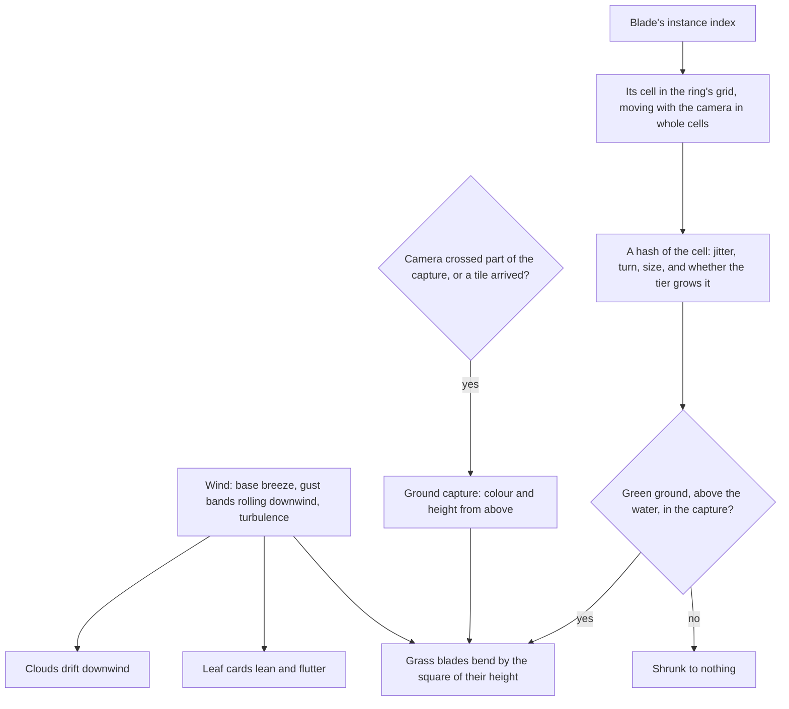

# Vegetation

Wind is what makes Genshin's meadows feel alive. Gusts roll across Mondstadt's grass in visible waves, crowns sway, and the clouds drift overhead. Here one wind field moves all of them together, and grass grows at the density the game shows without a blade being stored.

## How it works

- **One wind field.** The wind at a point on the ground (`createWindNode`) is the region's base breeze along its direction, gust bands travelling downwind that swell and fall, and a little noise so neighbouring plants never move in step. It is a TSL function of world position, so every sampler reads the same field: the grass, the trees' leaves, and the clouds, which drift downwind by its strength. Its direction, strength and gusts are `WindUniforms`, which a region sets. Mondstadt's is a steady breeze from the west with gusts every half minute.
- **Grass is blades generated in the vertex stage.** A ring is one draw of the same blade shape (`computeGrassBlade`), once per cell of a square grid around the camera (`createGrassMaterial`). A blade's instance index is its cell. The grid moves with the camera in whole cells, so a blade stays where it grew. A hash of the cell jitters the blade within it, turns it, sizes it and decides whether the quality tier grows it, so no blade is stored.
- **Two rings, then the ground.** The near ring is dense and fine under the eye. The middle ring is sparse, with taller, wider blades, and grows from where the near ring fades. Past it the terrain's own green carries the field, and since a blade takes the ground's colour, the rings fade into it with no seam (`GrassRing`).
- **Blades stand on a capture of the ground.** A camera looking straight down draws only the terrain's layer into a small half-float target: the ground's colour, and its height in alpha (`createGroundCapture`, `renderGroundCapture`). A blade reads its footing and its colour there. It grows only on green ground, never on rock or sand, and only above the water. The capture is redrawn only when the camera has crossed part of it or a terrain tile has arrived.
- **Grass shades as a field.** Every blade takes the ground's upward normal instead of its own, and a gradient from a darker root to a lighter tip in the ground's colour, so a meadow toon-shades as one surface with light rolling across it, as Genshin's grass does, rather than a noisy carpet of lit and shaded blades. Blades receive the sun's shadows and cast none.
- **The wind bends a blade by the square of its height**, so the root stays planted and the tip travels, and the blade dips a little as it bends.
- **Crowns sway.** The leaf material leans a crown downwind, more the higher up the tree, and each patch of cards flutters on its own phase (`createLeafMaterial`). The lean is the position node, so the crown's shadow sways with it.

## What it costs to run

- **A draw per ring**, each every blade of its grid in one instanced draw with no per-blade data, shrunk to nothing where nothing grows.
- **Blade density is the first thing a tier lowers** (`QualityTierSettingsMap`), since the look survives thinner grass better than it survives lost shadows.
- **The ground capture is one small render of the terrain's tiles**, only when it is owed.

## Key files

| File                                                            | Role                                                               |
| :-------------------------------------------------------------- | :----------------------------------------------------------------- |
| `packages/genshin-engine/src/nodes/createWindNode.ts`           | The wind at a point on the ground: breeze, gusts and turbulence    |
| `packages/genshin-engine/src/vegetation/createGrassMaterial.ts` | A ring's blades placed, grown, bent and shaded in the vertex stage |
| `packages/genshin-engine/src/vegetation/computeGrassBlade.ts`   | The one blade shape every blade is                                 |
| `packages/genshin-engine/src/vegetation/renderGroundCapture.ts` | The ground's colour and height under the camera, from above        |
| `packages/genshin-engine/src/nodes/createLeafMaterial.ts`       | Leaf cards that lean and flutter in the wind                       |
| `packages/genshin-world/src/components/world/Grass.vue`         | The rings, their tier's density, and when the capture is redrawn   |
| `packages/genshin-world/src/services/windrise/constants.ts`     | Mondstadt's wind and Windrise's grass rings                        |

## Notes

- **Trees beyond the oak, scatter and the trail are their own page.** Species, impostors, flowers and rocks scattered by biome, and grass that parts for the character are [trees and scatter](/docs/proposals/genshin/trees-and-scatter).
- **A blade stands on the ground as captured, not as drawn.** The capture camera stands above the ground, so the terrain it draws is morphed for its distance rather than the eye's, and a blade can sit a few centimetres off the drawn ground far from the eye, where no one sees it.

## Sources

- [Procedural grass in Ghost of Tsushima](https://gdcvault.com/play/1027214/Advanced-Graphics-Summit-Procedural-Grass), Eric Wohllaib, Sucker Punch Productions, GDC 2021: individual blades generated on the GPU with procedural shape and animation, acres of grass within a memory and frame budget, and wind moving a field as a whole.
