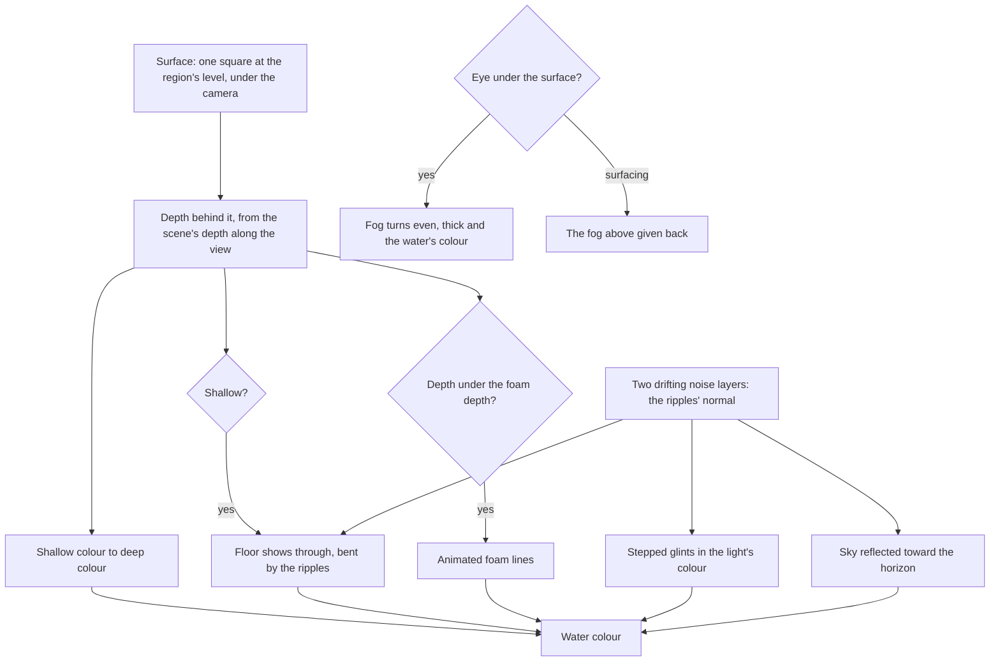

# Water

The game draws its water clear and bright. The floor shows through the shallows, a white band of foam marks every shore, and the sun breaks on the surface into hard glints. Windrise's valley opens east onto a lake, where the water is first shown.

## How it works

- **One surface for every sea and lake.** A single square at the region's water level is kept under the camera (`Water.vue`), so every place the ground dips beneath the level shows water through it and the ground hides it everywhere else. It is one draw for all of a region's still water.
- **Colour by depth.** The surface reads the scene's depth behind it, and the distance between the surface and the floor along the view grades its colour from the shallow tint to the deep one by the region's deep depth (`createWaterMaterial`).
- **The floor through the shallows.** The scene behind the surface is read and shown through the shallows, tinted by the shallow colour and bent by the ripples. Where the bend would pull in something standing in front of the water, the unbent floor is read instead.
- **Foam where water meets anything.** Where the depth behind the surface is under the foam depth, at every shore, rock and pillar, animated noise is cut into foam lines, so no foam mesh is authored.
- **Ripples, glints and the sky.** Two layers of noise drift apart, and their slopes tilt the surface's normal. The light's reflection off it goes through a narrow step, so the sun breaks into bright shapes brighter than white, which bloom lifts, rather than a smooth highlight. Toward the horizon the sky's colours are reflected by a Fresnel term.
- **Caustics on the floor.** The ground under the water shimmers with two layers of animated Voronoi cells, stepped into veins in the light's colour, fading out by the deep depth (`createCausticsNode`), so they dim at night with the light.
- **The world under the surface.** When the eye goes under the water's level, the fog turns even, thick from the eye outward and the water's own colour (`updateUnderwaterFog`). Diving saves the fog above and surfacing gives it back, so the sky and the tuning panel keep their values.
- **The water is region data.** Its level, colours, depths, caustics and underwater fog are `WaterUniforms`, which a region sets and the tuning panel's **Water** folder moves.

## What it costs to run

- **One draw**, a two-triangle square, whose shader samples the scene's depth twice and its colour once.
- **The caustics are arithmetic in the ground's shader**, only where there is water, and nothing where there is none.
- **Every frame writes a position and, under water, a colour**, with nothing allocated.

## Key files

| File                                                                | Role                                                                   |
| :------------------------------------------------------------------ | :--------------------------------------------------------------------- |
| `packages/genshin-engine/src/nodes/createWaterMaterial.ts`          | The surface: depth colour, floor, foam, ripples, glints and reflection |
| `packages/genshin-engine/src/nodes/createCausticsNode.ts`           | The shimmer on the ground under the water                              |
| `packages/genshin-engine/src/water/updateUnderwaterFog.ts`          | The fog turned to the water's under the surface, and given back above  |
| `packages/genshin-world/src/components/World/Water/Index.vue`       | The surface kept under the camera, and the fog swapped each frame      |
| `packages/genshin-world/src/services/windrise/constants.ts`         | Windrise's lake: its level, colours, depths and underwater fog         |
| `packages/genshin-world/src/services/windrise/getWindriseHeight.ts` | The valley opening east onto the lake's bowl                           |

## Notes

- **Still water is one level per region.** A lake above the sea would need its own surface; a region with one sets it when its shapes arrive. Rivers and waterfalls are the [flowing water](/docs/proposals/genshin/flowing-water) proposal.
- **The surface seen from below is the same surface.** The game's window of sky through the surface and the mirrored depths around it are [deferred](/docs/genshin/deferred/underwater-window) until Fontaine.
- **Screen-space reflections are deferred.** The sky's reflection carries the look, and the proposal never let it depend on them ([screen-space reflections](/docs/genshin/deferred/water-screen-space-reflections)).

## Sources

- [webgpu_backdrop_water](https://threejs.org/examples/webgpu_backdrop_water.html), three.js: water depth from the scene's depth behind a surface, the refracted backdrop, and Voronoi caustics.
- [Fontaine](https://genshin-impact.fandom.com/wiki/Fontaine), Genshin Impact Wiki: the nation whose explorable underwater areas make the world under the surface part of the engine rather than a special case.
