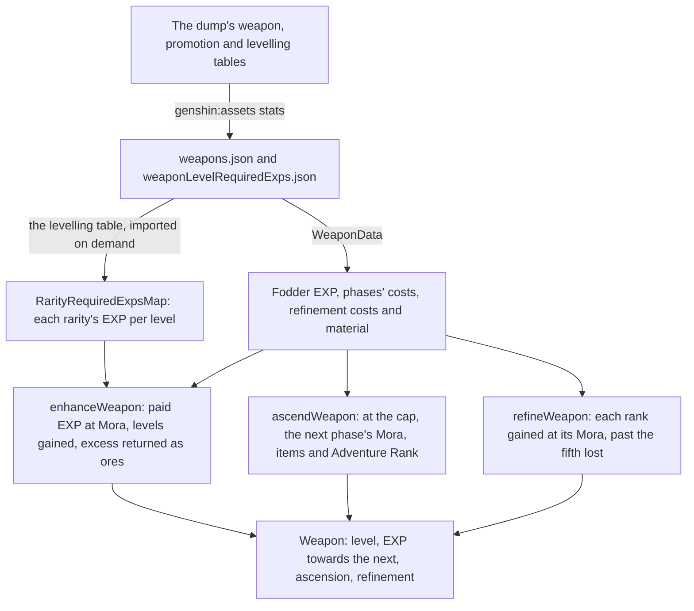

# Weapon enhancement

A weapon grows three ways a player spends on it: its level, its ascension phase and its refinement rank. Levelling takes the EXP of enhancement ores and fodder weapons, ascension takes the Mora, items and Adventure Rank of the next phase, and refinement takes a copy or a refinement material and the Mora each rank costs. Each change is a pure function over the game's own tables that refuses what the weapon cannot pay for, so a weapon's state moves only through a checked rule. A refinement's passive is not built here: it acts through a character's kit, so it stays in the [weapon enhancement proposal](/docs/proposals/genshin/weapon-enhancement).

## How it works

## The tables

- **The stats run writes the weapon's own rows.** Each `WeaponData` holds its fodder EXP (`baseExp`), its ascension phases each with the Mora, items and Adventure Rank that entering it costs, and its refinement costs and refinement material. A refinement material of zero means a copy alone refines it.
- **The levelling table is written once per rarity.** `weaponLevelRequiredExps.json` holds each rarity's EXP to rise past each level, one column per rarity, so the EXP is not copied into every weapon.
- **A phase's costs are its own row.** Entering a phase pays the row of that phase, and a weapon at a phase's cap starts the next phase at the same level.
- **A weapon with no refinement costs cannot be refined.** The one- and two-star weapons are given none, and so are the four-star weapons the table leaves without.

## Levelling

- **Each source gives its EXP.** An ore gives its own EXP, 400, 2000 or 10000 by id. A fodder weapon gives its base, plus 80% of the EXP it was levelled with, floored, where the invested EXP is every level it rose past from level 1 plus the EXP it holds towards the next.
- **Ten points of paid EXP cost one Mora.** Paid EXP is the ores' and the fodders' bases, floored to Mora; the recovered share costs nothing.
- **Levels are gained while the EXP holds each requirement.** The EXP left after a level carries towards the next, up to the phase's cap.
- **EXP past the cap comes back as ores.** The leftover is returned as the Enhancement Ores it fills, largest first. Mora is charged on all paid EXP even where the excess comes back. What is under the smallest ore is lost; that remainder is a provisional rule, settled by a recording on the [roadmap](/docs/genshin/roadmap).
- **A wallet short of the Mora refuses the whole enhancement**, and nothing is spent.

## Ascension

- **A weapon ascends at its cap.** Its level must be its phase's cap, and the next phase must exist. It stays at that level, which the next phase starts from.
- **The Adventure Rank and the bag are checked before anything is taken.** The player's Adventure Rank must reach the next phase's requirement, the wallet must hold its Mora, and the bag must hold each of its items. Items come out of the bag's stacks from the first onwards, and a stack emptied is dropped.

## Refinement

- **A copy or a material is a gain of ranks.** A copy adds its own refinement rank, and a refinement material adds one.
- **Each rank gained costs the Mora its rank asks.** The second rank costs the first entry of the weapon's costs, the third the second, and so on, so a three-star weapon pays 500, then 1000, 2000 and 4000 Mora for ranks two to five.
- **Ranks past the fifth are lost**, and the result counts them. A weapon already at rank five is refused.
- **A copy is never a wielded weapon.** A character's weapon sits on the character, outside the bag, so a copy or a material can only come from the bag.

## Not built yet

- **Passives.** A refinement's passive is its table's numbers and a module over the kits' shared effects, and the [character kits](/docs/proposals/genshin/character-kits) are still a proposal. The passive stays in the [proposal](/docs/proposals/genshin/weapon-enhancement).
- **Callers.** No screen or bag entry calls these services yet. A bag weapon carries only its level, so the EXP and refinement it would hold wait on the bag entry and the Weapons tab of the [character screen](/docs/proposals/genshin/character-screen).

## Key files

| File                                                                        | Role                                                                      |
| :-------------------------------------------------------------------------- | :------------------------------------------------------------------------ |
| `packages/genshin-world/src/models/weapon/Weapon.ts`                        | A weapon's level, EXP towards the next, ascension and refinement rank     |
| `packages/genshin-world/src/models/weapon/WeaponData.ts`                    | A weapon's fodder EXP, ascension phases, refinement costs and material    |
| `packages/genshin-world/src/models/weapon/WeaponAscensionPhase.ts`          | A phase with the Mora, items and Adventure Rank that entering it costs    |
| `packages/genshin-world/src/models/weapon/RarityRequiredExpsMap.ts`         | Each rarity's EXP to rise past each level                                 |
| `packages/genshin-world/src/services/weapon/enhanceWeapon.ts`               | Paid EXP at Mora, levels gained, and the excess returned as ores          |
| `packages/genshin-world/src/services/weapon/ascendWeapon.ts`                | The next phase's gate, and its Mora and items taken                       |
| `packages/genshin-world/src/services/weapon/refineWeapon.ts`                | Ranks gained at each rank's Mora, past the fifth lost                     |
| `packages/genshin-world/src/services/weapon/readWeaponLevelRequiredExps.ts` | The levelling table imported on demand and checked against its shape      |
| `packages/genshin-world/src/services/inventory/takeInventoryItems.ts`       | Items taken out of the bag's stacks, refused when the bag holds too few   |
| `scripts/src/services/genshinAssets/stats/getWeaponDatas.ts`                | A weapon's fodder EXP, phases' costs and refinement costs from the tables |
| `scripts/src/services/genshinAssets/stats/toWeaponLevelRequiredExps.ts`     | The levelling table turned into one column per rarity                     |

## Sources

- [Weapon EXP](https://genshin-impact.fandom.com/wiki/Weapon_EXP), Genshin Impact Wiki: EXP from ores and fodder, the 80% share recovered, excess returned as ores, and ten points of EXP to the Mora.
- [Refinement](https://genshin-impact.fandom.com/wiki/Refinement), Genshin Impact Wiki: ranks 1 to 5, a copy's refinements carried over, the excess lost, the Mora per rank and rarity, and one- and two-star weapons never refined.
- [AnimeGameData](https://github.com/DimbreathBot/AnimeGameData), the community's per-patch dump: `WeaponExcelConfigData`, `WeaponPromoteExcelConfigData` and `WeaponLevelExcelConfigData`, the tables the stats run reads.
