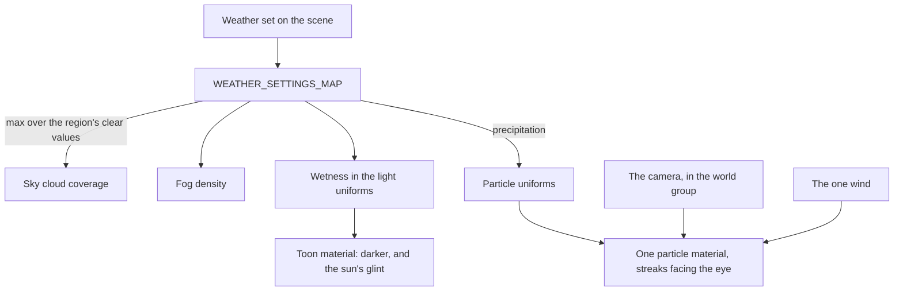

# Weather

Weather moves the same sky, haze and ground that the [sky and time](/docs/genshin/sky-and-time) page lights, rather than a second set of them. A weather is a small table of settings, and the world applies the active one over the region's own clear sky. Its particles are one instanced draw, placed in the vertex stage, so the cost is the same whichever weather is on.

## How it works

- **A weather raises the region's clear values; it never lowers them.** Cloud coverage and fog density take the larger of the region's own and the weather's, so a clear weather leaves the region's sky as it was.
- **Particles fall in a box round the eye.** A particle's base is a hash of its instance's index. It falls on the wind's drift over its fall speed, and is wrapped inside a box of sixty metres across and thirty up, so the particles stay put in the world and the box never empties.
- **A streak faces the eye.** Each is a quad stretched along the particle's velocity, turned to face the camera, and lit by the light's colour, so it dims at night with the sky.
- **Wet ground darkens and takes a glint.** Every toon material reads the one wetness uniform: its colour darkens by up to a third, and the sun's half-way highlight adds a glint in proportion.

## What each weather sets

| Weather      | Cloud cover  | Fog density  | Wetness | Particles                        |
| :----------- | :----------- | :----------- | :------ | :------------------------------- |
| Clear        | the region's | the region's | none    | none                             |
| Cloudy       | raised       | the region's | none    | none                             |
| Fog          | raised       | raised       | none    | none                             |
| Rain         | raised       | raised       | full    | rain streaks                     |
| Thunderstorm | full         | raised       | full    | rain streaks, drawn denser       |
| Snow         | raised       | raised       | none    | snowflakes, drifting and swaying |
| Sandstorm    | raised       | raised       | none    | sand streaks along the wind      |

The values are starting points, not the game's: they are fitted to the game's own weather settings, as listed under [deferred](/docs/proposals/genshin/weather).

## Cost

- **One draw for every particle.** The streaks are an instanced geometry, placed and turned in the vertex stage, so no particle is stored and no frame writes per particle.
- **A frame writes the eye and nothing else for the particles.** The weather's settings are written once when it changes.
- **A dry world costs nothing extra.** The wetness darkening and glint multiply by zero and add nothing, so a clear scene draws as it did before.

## Key files

| File                                                                    | Role                                                                   |
| :---------------------------------------------------------------------- | :--------------------------------------------------------------------- |
| `packages/genshin-engine/src/atmosphere/constants.ts`                   | Each weather's settings, and each particle kind's look                 |
| `packages/genshin-engine/src/nodes/createPrecipitationMaterial.ts`      | The particles: the wrapped box, the sway, the streaks facing the eye   |
| `packages/genshin-engine/src/atmosphere/createPrecipitationGeometry.ts` | The unit streak drawn once per particle                                |
| `packages/genshin-engine/src/nodes/createToonMaterial.ts`               | The wetness darkening and the sun's glint on every environment surface |
| `packages/genshin-world/src/components/World/Weather/Index.vue`         | Writes the active weather's sky, fog, wetness and particles            |
| `packages/genshin-world/src/services/windrise/constants.ts`             | Windrise's weather, set clear as its reference screenshots are         |

## Notes

- **Windrise stays clear.** Its reference screenshots are clear, so `WINDRISE_WEATHER` is clear. Setting it to rain shows the rain over the valley, which the parity pages do not measure.
- **Grass keeps its own colour.** The grass material sets its own colour node, so wet grass does not darken yet.
- **Weather changes at once.** A weather set on the scene takes effect on the next frame, with no blend between two of them.

## Sources

- [Weather](https://genshin-impact.fandom.com/wiki/Weather), Genshin Impact Wiki: the weathers each region has, and the rain, snow and sandstorms they bring.
