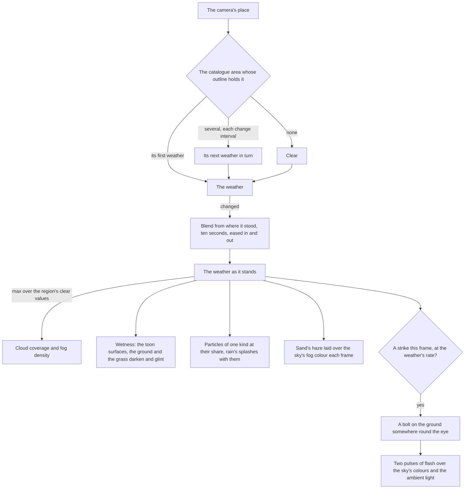

# Weather

Weather moves the same sky, haze and ground that the [sky and time](/docs/genshin/sky-and-time) page lights, rather than a second set of them. A weather is a small table of settings, and the world blends from where the weather stands toward the active one's over the region's own clear sky. Its particles and splashes are one instanced draw each, placed in the vertex stage, so their cost is the same whichever weather is on.

## How it works

- **The area names the weather.** Each catalogue area lists the weathers it can have, the first its own, the weather a visit finds it in ([world map](/docs/genshin/world-map)): most areas clear, cloudy, rain and thunderstorm, deserts clear and cloudy, the Desert of Hadramaveth clear and sandstorms, Dragonspine snow, Tsurumi Island fog and Yashiori Island its thunderstorm, as the wiki gives them. The world draws the weather of the area its camera stands in, checked each time the camera has moved a stretch (`useAreaWeather`), and clear where no drawn outline holds it. An area with several weathers turns to the next of them in list order each `AREA_WEATHER_CHANGE_SECONDS`, the change blending as below; a special climate with one weather holds it. Entering an area starts its first weather again.
- **A change blends.** When the weather changes, every field moves from where it stood toward the new weather's settings over `WEATHER_TRANSITION_SECONDS`, eased in and out by a smoothstep, so the sky darkens and the rain thickens together (`blendWeatherState`). A change begun part way through another starts from where the first had reached. One kind of particle falls at a time: where the kind changes, rain into snow say, the old fades out over the first half and the new fades in over the second. The weather the world loads with is set at once.
- **A weather raises the region's clear values; it never lowers them.** Cloud coverage and fog density take the larger of the region's own and the weather's, so a clear weather leaves the region's sky as it was (`applyWeatherState`). These are written only while a change runs, so the tuning panel's cloud and fog sliders hold otherwise.
- **A sandstorm's haze takes the sand's colour.** A weather may tint the haze (`fogColor`). The sky writes the fog's colour every frame, so the weather lays its tint over it every frame it holds one, by its share, as a scene colour through the tone curve's inverse, as the sky's own colours are.
- **Particles fall in a box round the eye.** A particle's base is a hash of its instance's index. It falls on the wind's drift over its fall speed, and is wrapped inside a box of sixty metres across and thirty up, so the particles stay put in the world and the box never empties. Each streak is a quad stretched along its velocity, turned to face the camera, and lit by the light's colour, so it dims at night with the sky.
- **Rain splashes where it meets the ground.** A second draw of small rings lies flat round the eye, each widening and fading over a third of a second and then landing somewhere new, its place a hash of its instance and its life's count (`createSplashMaterial`). It stands on the ground capture's height, the one the grass grows on, or on the water where the ground lies under it, so rain rings the lake too. Its share is the rain's, so snow and sand splash nothing.
- **Lightning flashes and strikes.** A thunderstorm strikes a few times a minute, at random at its rate, one strike at a time. A strike's flash is two pulses, the second dimmer, each dying away within a tenth of a second or so (`computeLightningFlash`), laid over the sky the clock has just written: the sky's and the clouds' colours turned toward the flash's and the ambient light raised (`applyLightningFlash`). Its bolt stands on the ground between one and six hundred metres from the eye, turned at random: a seeded channel climbing to the cloud base in jagged segments with a few branches falling away from it (`computeLightningBolt`), each segment a ribbon turned to face the eye, adding light, writing no depth and glowing as bright as the flash.
- **Wet ground darkens and takes a glint.** Every toon material, the ground's and the grass's read the one wetness uniform: its colour darkens by up to a third (`createWetDarkeningNode`), and the sun's half-way highlight adds a glint in proportion. The grass glints off the ground's upward normal it shades by, so a wet meadow shines as one surface.
- **Under the water the water's haze wins.** The weather runs ahead of the water each frame, so the water's haze replaces the weather's colour under its surface, and a density the weather writes while the eye is under water is kept for surfacing rather than drawn (`updateUnderwaterFog`).

## What each weather sets

| Weather      | Cloud cover  | Fog density  | Haze tint | Wetness | Particles                         | Lightning      |
| :----------- | :----------- | :----------- | :-------- | :------ | :-------------------------------- | :------------- |
| Clear        | the region's | the region's | none      | none    | none                              | none           |
| Cloudy       | raised       | the region's | none      | none    | none                              | none           |
| Fog          | raised       | raised       | none      | none    | none                              | none           |
| Rain         | raised       | raised       | none      | full    | rain streaks and splashes         | none           |
| Thunderstorm | full         | raised       | none      | full    | rain streaks and splashes, denser | a few a minute |
| Snow         | raised       | raised       | none      | none    | snowflakes, drifting and swaying  | none           |
| Sandstorm    | raised       | raised       | sand      | none    | sand streaks along the wind       | none           |

The values are starting points, not the game's: each is marked provisional where it stands, and fitted as the [weather](/docs/proposals/genshin/weather) proposal lists.

## Cost

- **One instanced draw for the particles and one for the splashes.** Both are instanced geometries placed in the vertex stage, so no particle is stored and no frame writes per particle.
- **A frame writes the eye, and the blend while a change runs.** The flash writes a handful of colours while it lasts, and the bolt is one small mesh shown for under a second.
- **A dry world costs nothing extra.** The wetness darkening and glint multiply by zero and add nothing, and a weather that tints no haze writes no colour.

## Key files

| File                                                               | Role                                                                       |
| :----------------------------------------------------------------- | :------------------------------------------------------------------------- |
| `packages/genshin-engine/src/atmosphere/constants.ts`              | Each weather's settings, the transition, the lightning and splashes' looks |
| `packages/genshin-engine/src/atmosphere/blendWeatherState.ts`      | The weather part way from where it stood to the next one's settings        |
| `packages/genshin-engine/src/atmosphere/applyWeatherState.ts`      | The weather as it stands written into the sky, fog, wetness and particles  |
| `packages/genshin-engine/src/atmosphere/computeLightningFlash.ts`  | A strike's two pulses of flash                                             |
| `packages/genshin-engine/src/atmosphere/applyLightningFlash.ts`    | The flash laid over the sky's colours and the ambient light                |
| `packages/genshin-engine/src/atmosphere/computeLightningBolt.ts`   | A bolt's seeded channel and branches                                       |
| `packages/genshin-engine/src/nodes/createLightningBoltMaterial.ts` | The bolt's segments facing the eye and glowing with the flash              |
| `packages/genshin-engine/src/nodes/createPrecipitationMaterial.ts` | The particles: the wrapped box, the sway, the streaks facing the eye       |
| `packages/genshin-engine/src/nodes/createSplashMaterial.ts`        | The rain's splashes on the ground capture or the water                     |
| `packages/genshin-engine/src/nodes/createWetDarkeningNode.ts`      | How far a wet surface darkens                                              |
| `packages/genshin-engine/src/water/updateUnderwaterFog.ts`         | The water's haze under its surface, keeping what the weather writes above  |
| `packages/genshin-world/src/composables/useAreaWeather.ts`         | The weather of the area the camera stands in, turning through its weathers |
| `packages/genshin-world/src/services/constants.ts`                 | The area weather's change interval, provisional                            |
| `packages/genshin-world/src/components/World/Weather/Index.vue`    | The blend, the particles, the splashes, the haze's tint and the lightning  |

## Notes

- **Windrise stays clear.** Galesong Hill's own weather is clear, as its reference screenshots are. Moving its area's list to start at rain shows the rain over the valley, which the parity pages do not measure.
- **An area's weather turns on a provisional schedule.** The list-order turn and its change interval are the built stand-ins; the game's own schedule, which weathers an area turns between and how long each holds, replaces them when it is read ([weather](/docs/proposals/genshin/weather)).
- **The bolt shines through the haze.** It writes no depth, so the height fog, a post pass over the depth, does not reach it, as a strike reads through the game's rain.

## Sources

- [Weather](https://genshin-impact.fandom.com/wiki/Weather), Genshin Impact Wiki: weather tied to areas with only the current location's drawn, regular weather changing over time, no rain in cities or deserts, snow on Dragonspine, fog on Tsurumi Island, the perpetual thunderstorm of Yashiori Island, and sandstorms in the Desert of Hadramaveth.
- [Lightning](https://genshin-impact.fandom.com/wiki/Lightning), Genshin Impact Wiki: lightning striking the land during thunderstorms.
