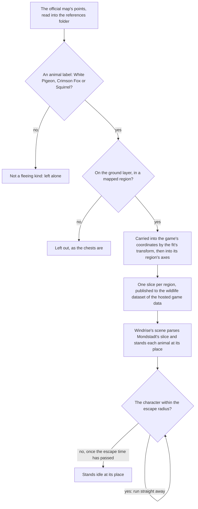

# Wildlife

The client does not place the game's animals, so the map's public points stand in for them, as [spawned places](/docs/genshin/spawned-places) describes. This page is the built part of the [wildlife](/docs/proposals/genshin/wildlife) proposal: the three kinds of bird and beast the map marks as fleeing are placed in the scene by the fit's transform and published into each region's slice, and in Windrise's scene each one stands at its place and runs from the character when it comes near. Nothing is struck, dropped or picked up yet.

## How it works

## The kinds

`WildlifeKind` names three: `CrimsonFox`, `Squirrel` and `WhitePigeon`. Each is one of the map's own labels under its Animals group, and `WildlifeKindLabelIdMap` gives its label id, so a point takes its kind by its label. The archive files each as an animal or aviary monster, which the capture table's rows and the monster rows hold for the parts still to come.

## The flight

`stepWildlife` runs on the enemies' fixed step, a sixtieth of a second. An idle animal with the character within its escape radius starts running straight away from it at the flight speed. A running one keeps running for the escape time, then stands idle, or runs again if the character is still in reach. A character that is gone leaves a running animal running on its last heading until its time is up, and then standing idle.

The numbers are provisional, each marked in `services/wildlife/constants.ts`:

- **The escape radius, four metres, and the escape time, one second.** The environment table holds no row for a bird or a beast, so these are its gadget rows' values, the closest it holds, until a recording of each kind's flight measures them.
- **The flight speed, six metres a second.** No table gives it, so it is a placeholder until a recording times it.

## The placement

`pnpm -C scripts genshin:assets wildlife` publishes each region's animals as one slice to the wildlife dataset of the [hosted game data](/docs/genshin/hosted-game-data), the chest slices' pattern. Mondstadt's slice holds about a hundred animals, and the other regions hold the same kinds where their labels are marked.

`WorldWildlife` stands each animal in Windrise's scene as a capsule of one instanced draw, the enemies' stand-in, stood on the ground under it and turned to its heading. The world's screen reads the Mondstadt slice from the hosted game data before it opens (`readMondstadtWildlifePlaces`, each place's id unique) and hands it down to Windrise, and the animals are not drawn in a witness render, as the enemies are not.

Every animal of the slice exists from the scene's load. The rule that most animals come into being only when the player is near is not built, and neither are their shadows nor the elemental sight over them.

## Key files

| File                                                                          | Role                                                        |
| :---------------------------------------------------------------------------- | :---------------------------------------------------------- |
| `packages/genshin-world/src/models/wildlife/WildlifeKind.ts`                  | The three fleeing kinds                                     |
| `packages/genshin-world/src/models/wildlife/WildlifePlace.ts`                 | A placed animal, and the schema its slice is parsed with    |
| `packages/genshin-world/src/models/wildlife/Wildlife.ts`                      | One animal as its flight moves it                           |
| `packages/genshin-world/src/services/wildlife/stepWildlife.ts`                | The flight, one fixed step at a time                        |
| `packages/genshin-world/src/services/wildlife/constants.ts`                   | The provisional escape radius, escape time and flight speed |
| `packages/genshin-world/src/components/World/Wildlife/Index.vue`              | The instanced stand-ins, stepped and drawn                  |
| `packages/genshin-world/src/components/World/Windrise/Index.vue`              | Mounts the stand-ins over Mondstadt's slice                 |
| `packages/genshin-world/src/services/wildlife/readMondstadtWildlifePlaces.ts` | Mondstadt's slice, read at the world's gate                 |
| `scripts/src/services/genshinAssets/wildlife/buildWildlifePlaces.ts`          | Carries the map's animals into each region's slice          |
| `scripts/src/services/genshinAssets/wildlife/WildlifeKindLabelIdMap.ts`       | Each kind's label on the official map                       |
| `scripts/src/services/genshinAssets/commands/wildlifeCommand.ts`              | `genshin:assets wildlife`                                   |

## Sources

- [Teyvat Interactive Map](https://act.hoyolab.com/ys/app/interactive-map/index.html), HoYoLAB: the official map. Its label tree and point list are the public data the builder reads as references.
- [AnimeGameData](https://gitlab.com/Dimbreath/AnimeGameData), the community's per-patch dump: the environment animal table whose gadget rows give the closest escape radius and time held for the kinds.
