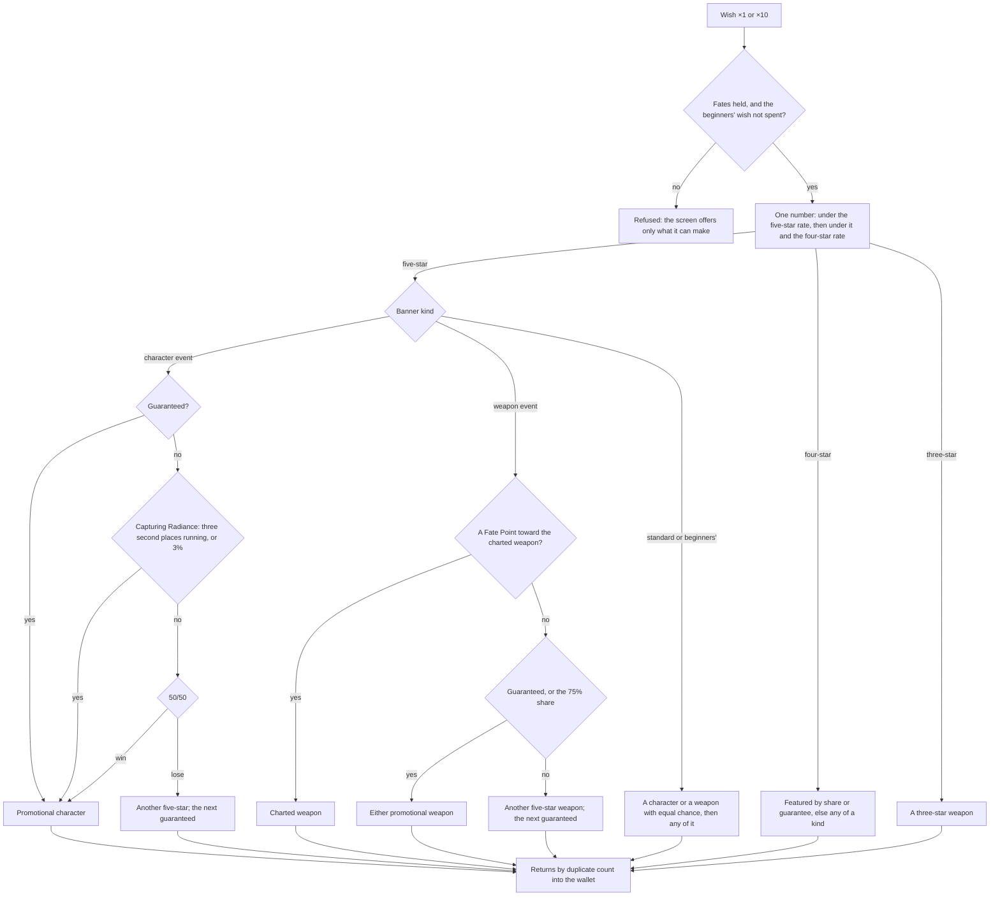

# Wish

A wish draws one character or weapon from a banner, by rates and guarantees the game publishes in each banner's details. The world package pulls it with pure functions over a banner, its kind's counters and a random source, so a test replays any sequence from the numbers it hands in, and its screen spends the wallet's Fates.

## How it works

- **Four banner kinds.** `BannerKind` is the character event wish, the weapon event wish, the standard wish (Wanderlust Invocation) and the beginners' wish, each named by the game's own text. A `Banner` is one banner's pool: its promotional five-stars, its featured four-stars, and the rest at each rarity.
- **Each kind keeps its own counters.** `WishPity` is what a kind carries from one wish and one banner to the next: the wishes made, the wishes since the last five-star and since the last four-star or better, whether the next of each is featured, how many character event five-stars running came second to the promotional character, and the Epitomized Path's course and Fate Points. A second character event banner shares its kind's counters, as Character Event Wish-2 shares the first's.
- **The rates.** `BannerKindWishRatesMap` gives each kind its five-star and four-star `RarityRate`. The base rates and the hard pity are the game's published details: a five-star 0.6% a wish, or 0.7% on the weapon wish, certain on the 90th wish since the last, or the 80th; a four-star 5.1%, or 6%, certain on the 10th. The soft pity is the community's model from millions of recorded wishes, which the wiki publishes: the five-star rate climbs six points a wish from the 74th, or seven from the 63rd, and the four-star rate 51 points at the 9th, or 60 at the 8th.
- **One number decides the rarity.** `pullWish` draws one number: under the five-star rate it is a five-star, under that and the four-star rate a four-star, the four-star's rate capped so the two fill every number at its guarantee, and a three-star weapon otherwise. A five-star leaves the four-star counter running, so its guarantee passes to the next wish, as the details say.
- **The featured share and its guarantee.** A character event five-star is the promotional character half the time, and a four-star one of the featured three half the time; the weapon wish's shares are three quarters. A miss guarantees the next of that rarity.
- **Capturing Radiance as the game publishes it.** On a character event five-star the 50/50 decides, `pullFiveStar` first checks Capturing Radiance, which makes it the promotional character and marks the result. Its published base rate, 0.018% a wish, is a share of the five-star's 0.6%, so it triggers on 3% of those five-stars (`CAPTURING_RADIANCE_RATE`), and for certain once the promotional character has come second three times running. It never touches the guarantee, and with it the promotional character takes about 55% of the 50/50s, the consolidated share the wiki gives.
- **The Epitomized Path.** On the weapon wish, with a course charted for one of the two promotional weapons, a five-star that is not that weapon earns a Fate Point, and at one Fate Point (`FATE_POINT_LIMIT`) the next five-star is the charted weapon. Drawing it resets the points; without a course none are earned.
- **What is not featured.** A non-featured draw, on the standard wish or an event wish, is a character or a weapon with equal chance where the pool holds both, as the standard wish's details give each kind an equal share of a rarity, then any one of that kind (`pickWishItem`).
- **The beginners' wish.** It takes Acquaint Fates, eight for a ×10, holds no four-star or five-star weapon, draws its featured four-star, Noelle, on its eighth wish, and ends after its twentieth.
- **A draw returns Starglitter or Stardust.** `getWishReturn` gives nothing for a new character and Masterless Starglitter for a duplicate: 10 at five stars and 2 at four while its six constellations are incomplete, 25 and 5 once they are. A weapon returns 10 Starglitter at five stars and 2 at four, and a three-star 15 Masterless Stardust. A duplicate among its first six also brings its character's own Stella Fortuna, which `makeWishes` counts to that character, and what a five-star past six copies brings is the [constellations](/docs/genshin/constellations) page's too.
- **A wish ×1 or ×10 spends from the wallet.** `makeWishes` spends the set's Fates (`getWishCost`: Intertwined Fate on the event wishes, Acquaint Fate on the others), pulls each wish in turn, adds each return to the wallet, and counts a character drawn twice in one set as held by the second. A set the wallet cannot pay for, or past the beginners' twentieth wish, is refused by `checkIsWishSetOffered`, the same check that disables the screen's button for it.
- **Nothing is bought with money.** Fates are the wallet's, which the world fills; no Genesis Crystal is sold and no Fate is bought with money.
- **The screen opens on F3.** `InputAction.OpenWish` is on F3, and the screens' map opens `ScreenKind.Wish` from it or from the Paimon menu. `Wish/Screen` offers the banners the world has in the game's order, the beginners' wish gone once spent, with Primogems and the open banner's Fate counted beside them, the Epitomized Path's Fate Points on the weapon wish, and Wish ×1 and ×10 with their costs, each disabled when the wallet cannot pay. It lists the open banner's pool by rarity, each rarity under its stars with its featured items first. A wish draws from `Math.random`, puts each weapon drawn into the bag, adds a character drawn for the first time to the roster, and shows a card for each wish drawn with its name, its stars and what it returned, in the game's order (the highest rarity first, a character ahead of a weapon of the same rarity, the rest in the order drawn) until a click goes on.

## Key files

| File                                                                 | Role                                                                           |
| :------------------------------------------------------------------- | :----------------------------------------------------------------------------- |
| `packages/genshin-world/src/services/wish/pullWish.ts`               | One wish: the rarity from one number, the four-star's share and guarantee      |
| `packages/genshin-world/src/services/wish/pullFiveStar.ts`           | Which five-star: the 50/50, Capturing Radiance and the Epitomized Path         |
| `packages/genshin-world/src/services/wish/BannerKindWishRatesMap.ts` | Each kind's rates and featured shares                                          |
| `packages/genshin-world/src/services/wish/constants.ts`              | The rates, the guarantees' limits, the returns and the pools' ids              |
| `packages/genshin-world/src/services/wish/getWishReturn.ts`          | What a draw returns by duplicate count                                         |
| `packages/genshin-world/src/services/wish/makeWishes.ts`             | A set's Fates spent, its wishes pulled, their returns and Stella Fortuna added |
| `packages/genshin-world/src/services/wish/createBanners.ts`          | The two banners the world offers, from the stat tables and the names           |
| `packages/genshin-world/src/services/wish/sortWishResults.ts`        | A set's results in the order the game shows them                               |
| `packages/genshin-world/src/services/character/NameTextLoaderMap.ts` | One language's names the stat tables cite, imported on first use               |
| `packages/genshin-world/src/components/Wish/Screen/Index.vue`        | The wish's screen in the reader's language                                     |
| `packages/genshin-interface/src/components/WishScreen/Index.vue`     | The banners, the sets, the counts and the results                              |

## Notes

- **The banners' pools are the wiki's, by the game's ids.** `services/wish/constants.ts` lists the standard wish's and the beginners' characters and weapons as the wiki's Wanderlust Invocation and Beginners' Wish item pools give them, and `createBanners` builds the two banners the world offers from the stat tables, each item's rarity read from them and its name from the world's names in the reader's language. The beginners' wish takes the standard wish's three-star weapons alone. A member the wiki's pool lists that the dump's tables do not hold yet, Alyosha, is left out until a later dump carries it. The event banners wait on the schedule of the current ones, which no stable table names ([wish proposal](/docs/proposals/genshin/wish)).
- **The beginners' wish keeps counters of its own.** The game's details do not say whether it shares the standard wish's, and the guides that say anything say it does not.

## Parity

Not yet compared with the game: no `compare` score exists for the wish screen, and no fixture reaches the parity page yet.

- **References held.** The published 1080p clip (`yt-uhCW3MZTgL8`) shows the Character Event banner whole, Born of Ocean Swell with Eula, at about 96 to 117 seconds and again at about 136 seconds, with its Shop, Details and History and its Wish ×1 and ×10 buttons. Later in the clip come the single pulls' reveals, from about 104 seconds. Its ten-pull results grid is not in it, so `wish-ten.mkv` stays on the Recordings owed list. The wiki's Details popups (`wish-details-1` to `wish-details-4`, 2560 by 1440) are popups over a blurred sky, not the screen beneath them; `wish-details-1` is the Promotional Items tab of a Viridescent Vigil event wish.
- **No state comparable yet.** The world wrapper builds the Beginners' and Standard banners alone, so the Character Event banner the clip shows has no state to compare against. The Standard banner has no whole-frame reference until `wish-standard.png` lands, and the parity suite fails a screen with no reference, so no wrapper fixture is registered and no `compare` score exists.
- **Results have no seam.** The wrapper draws its results from `Math.random` inside the screen and takes no results prop, so a single or ten-pull state cannot be set by a fixture. The interface's own fixture sets them through `variants`, which the parity page does not reach.
- **The pool is not on the game's main screen.** The game lists a banner's items in the Details popup's List of Items tab, beside Promotional Items and Details, and the screen itself shows only the banner card. The screen here lists the pool across its body, a deviation the next pass resolves.
- **The world offers two banners.** The game's shown banner is a character event wish, which the world does not build yet; the event banners wait on the schedule the proposal names.
- **Banner art is the game's asset.** It cannot ship, so the banner card's art stays a placeholder.

## Sources

- [Wish](https://genshin-impact.fandom.com/wiki/Wish), Genshin Impact Wiki: the banner kinds, the Fates, the separate counters carried between banners, and the Starglitter and Stardust each draw returns.
- [Character Event Wish](https://genshin-impact.fandom.com/wiki/Character_Event_Wish), Genshin Impact Wiki: the rates, the community's soft pity model, the guarantees, Capturing Radiance's published rules and Character Event Wish-2's shared counters.
- [Weapon Event Wish](https://genshin-impact.fandom.com/wiki/Weapon_Event_Wish), Genshin Impact Wiki: the weapon wish's rates, its soft pity, its 75% shares and the Epitomized Path.
- [Wanderlust Invocation](https://genshin-impact.fandom.com/wiki/Wanderlust_Invocation), Genshin Impact Wiki: the standard wish's rates, its item pool, and its equal chance of a character or a weapon at each rarity.
- [Beginners' Wish](https://genshin-impact.fandom.com/wiki/Beginners%27_Wish), Genshin Impact Wiki: its item pool, twenty wishes, eight Acquaint Fates for ten, no four-star or five-star weapons, and Noelle on the eighth wish.
- [Controls](https://genshin-impact.fandom.com/wiki/Controls), Genshin Impact Wiki: the wish screen on F3.
