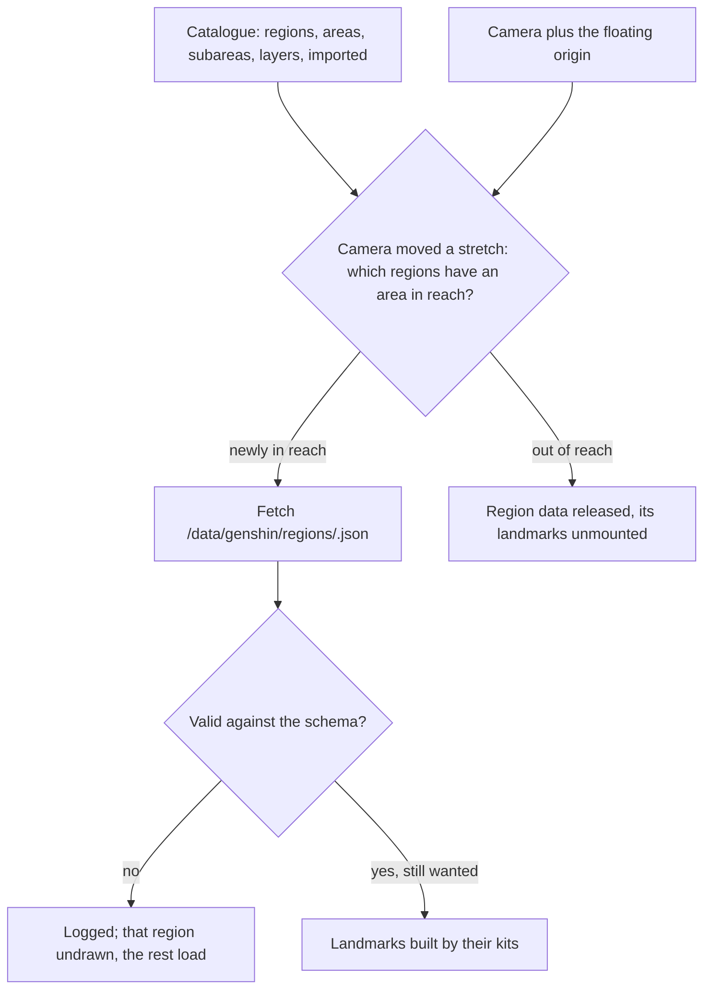

# World map

The world map is the one place a region is described. Every other page reads the world through it: the terrain will take its shapes from it, the weather each area's weather, the vegetation its biomes, and exploring its waypoints. It is organised as the game organises its own map, and world units are metres, with x east, z south and y up.

## How it works

- **The catalogue follows the game's hierarchy.** It runs region, then area, then subarea, with the names the game and its wiki use, and an area's subregion where it has one, such as Liyue's Chenyu Vale or Sumeru's Dharma Forest. Windrise is a subarea of Galesong Hill in Mondstadt. The catalogue is imported with the world's code, since every view needs it, and parsed against its schema as it loads (`catalogueSchema`).
- **Layers for places on their own map.** The surface is one layer. Enkanomiya, the Chasm's underground mines and the Sea of Bygone Eras, which the game draws on maps of their own, are layers (`WorldLayer`) that will carry their own terrain, sky and water, entered at their gates.
- **An area's outline decides reach.** An area carries its outline in world metres, drawn by the reference board over the official map. Until it is drawn the outline is empty and counts as infinitely far, so a region with no drawn area never loads. Galesong Hill's outline is provisional, drawn around the Windrise valley and the lake east of it as the scene has them.
- **Regions load by reach and are released.** Once the camera has moved a stretch, `useRegionData` finds every region with an area within reach (`computeOutlineDistance`, zero inside an outline) and fetches the ones it does not hold as `/data/genshin/regions/<region>.json`, which the app's server serves from the world package's `src/data/regions` (`GENSHIN_REGION_DATA_BASE_URL`). It releases those that have left reach. A region is fetched rather than imported because the browser keeps an imported module for the life of the page, so an imported region could never be released. A region that leaves reach while it is still fetching is not kept.
- **Landmarks are kits with parameters.** A landmark records its kind, its area, where it stands on the ground, how far above or into the ground its base sits, and which way it faces. Its kind decides the kit that builds it and the options it carries (`landmarkSchema`, a union by kind). Windrise's great oak is a tree landmark with its tree options, and its Statue of The Seven a statue landmark. `Landmarks` builds every landmark of every region in reach, so a region's landmarks appear as its data arrives and go when it is released.
- **A schema failure hides one region, not the world.** A region whose data fails validation is logged and left undrawn while the rest of the continent loads.

## Key files

| File                                                                 | Role                                                            |
| :------------------------------------------------------------------- | :-------------------------------------------------------------- |
| `packages/genshin-world/src/data/catalogue.json`                     | Every region, area and subarea the game ships, and their layers |
| `packages/genshin-world/src/models/world/Catalogue.ts`               | The catalogue's shape: regions, areas, subareas and outlines    |
| `packages/genshin-world/src/models/world/RegionData.ts`              | A region's authored data: its landmarks                         |
| `packages/genshin-world/src/models/world/Landmark.ts`                | A landmark, by kind, with the options its kit builds it from    |
| `packages/genshin-world/src/data/regions/mondstadt.json`             | Mondstadt's landmarks: Windrise's oak and statue                |
| `packages/genshin-world/src/composables/useRegionData.ts`            | Regions fetched by reach, validated and released                |
| `packages/genshin-engine/src/world/computeOutlineDistance.ts`        | How far a point is from an area's outline                       |
| `packages/genshin-world/src/components/world/landmark/Landmarks.vue` | Every landmark in reach, built by its kind's kit                |

## Notes

- **Names are facts, and outlines are drawn.** The catalogue's names come from the game's wiki. Each outline is drawn by hand over the official map on the reference board's authoring page, which is why no region's shape is imported from any map's data.
- **The continent transform is the reference board's.** The single transform taking the official map's pixel coordinates to metres in the world is what the reference board calibrates, so it joins the catalogue with that page.
- **Event areas are left out.** Places that existed only for an event, such as the Golden Apple Archipelago, are not part of the continent the catalogue describes.

## Sources

- [Area](https://genshin-impact.fandom.com/wiki/Area), Genshin Impact Wiki: the areas of each region and their subregions, and each area lit on the map by its Statue of The Seven.
- [Map](https://genshin-impact.fandom.com/wiki/Map), Genshin Impact Wiki: Enkanomiya and the Chasm's underground mines unlocked as maps of their own, which is where the layers come from.
