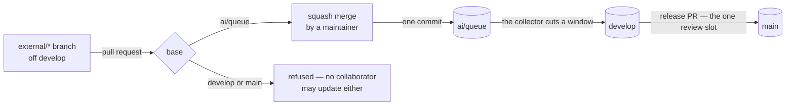

# Branch Namespaces

A branch's name says who may create it, who may push it, and how it reaches a release. Nothing else has to be written down, and nothing has to be kept in sync: the rulesets in `apps/infra/src/github/rulesets/` are the rule, and this page is what they spell.

| Namespace     | Created by       | Pushed by                                                                                    | Reaches `main` how                                                                               |
| :------------ | :--------------- | :------------------------------------------------------------------------------------------- | :----------------------------------------------------------------------------------------------- |
| `main`        | —                | the collector (a release merge, an express cut), Renovate (a branch automerge), a maintainer | it is the release                                                                                |
| `develop`     | —                | the collector                                                                                | the release pull request, one reviewed window at a time                                          |
| `ai/*`        | the collector    | the collector and the working session — one GitHub account                                   | cut from `ai/queue` into windows onto `develop`                                                  |
| `renovate/*`  | Renovate         | Renovate                                                                                     | automerged onto `main`, or a pull request a maintainer merges                                    |
| `external/*`  | any collaborator | any collaborator                                                                             | a pull request against `ai/queue`, squash-merged there by a maintainer, then cut like any commit |
| anything else | a maintainer     | a maintainer                                                                                 | merged into the maintainer's own `ai/queue` and pushed                                           |

The one review slot CodeRabbit grants an hour belongs to the release pull request, and the rest of the table exists to keep it that way: every pull request against the default branch is reviewed on arrival, so `main` takes no pull request but the release, and everyone else's work reaches the bot inside a window the collector measured under its file cap ([review collector](/docs/infra/review-collector)).

## The contributor's path

A collaborator branches off `develop` — always an ancestor of `ai/queue`, so the pull request shows their commits alone — under `external/`, the one prefix the creation rule leaves open, and opens the pull request against `ai/queue`. No review runs on it, so it may be pushed freely. A maintainer squash-merges it: the pull request's title and body become the one commit that lands on the queue, and from there it is the collector's like any session commit.

Someone without write access forks instead and opens the same pull request from the fork; CI runs only on pushes to the repository, so their pull request arrives untested and the queue's own CI is its first run.

## The rulesets

Bypass is granted per ruleset and never per rule, so a ref that needs one actor exempt from one rule and held to another is covered by two rulesets. The Admin repository role is the working session, the collector and a maintainer merging by hand — one account; a ruleset cannot name an individual user.

| Ruleset                            | Refs                           | Rules                                                                    | Bypass          |
| :--------------------------------- | :----------------------------- | :----------------------------------------------------------------------- | :-------------- |
| `branch creation restriction`      | every branch but `external/**` | creation                                                                 | Admin, Renovate |
| `develop & main branch protection` | `develop`, `main`              | update, deletion, no force-push, a pull request merged as a merge commit | Admin, Renovate |
| `develop & main status checks`     | `develop`, `main`              | CI's required checks                                                     | Admin           |
| `one-writer refs`                  | `ai/**`                        | update, deletion                                                         | Admin           |

Renovate bypasses the second so its branch automerge can push `main` and, since `develop` shares the ruleset, `develop` — a ref it never writes. It stays off the third so its bumps land green, and off the fourth because a pipeline ref is nothing of its concern.

## Key files

| File                                  | Role                                                                       |
| :------------------------------------ | :------------------------------------------------------------------------- |
| `apps/infra/src/github/rulesets/`     | the four rulesets, one file each                                           |
| `apps/infra/src/github/repository.ts` | squash merge enabled, with the pull request's title and body as its commit |
| `CONTRIBUTING.md`                     | the contributor's steps                                                    |
| `.github/PULL_REQUEST_TEMPLATE.md`    | the base-branch checkbox                                                   |

## Notes

- **A ruleset refuses the merge, never the opening.** A pull request a collaborator opens against `main` is unmergeable but still reviewed on arrival, and the slot is spent; the pull request template's checkbox and this page are the guard against opening one.
- **A merge into `develop` or `main` is a bypass, never a plain merge.** The update rule restricts the ref itself, so the merge box refuses every pull request with `Cannot update this protected ref` — a maintainer's included, because a ruleset offers its bypass and never takes it silently the way classic branch protection did. Take it with the merge box's checkbox or with `gh pr merge <number> --merge --admin`, which is how the collector merges the release and how a Renovate pull request a person takes lands. The bypass clears the status checks ruleset too, so a branch behind `main` merges without a rebase first.
- **A commit whose author email belongs to no GitHub account costs the pull request an approval.** GitHub's pull request rule carries `require_extra_approval_for_unattributed_changes`, on by default and absent from `@pulumi/github` at the version the lockfile resolves, so it is neither in the ruleset's source nor removable from it: an unattributed commit makes the pull request require an approving review whatever `requiredApprovingReviewCount` says, and its own author cannot give one. Commits are authored as `Q16solver@users.noreply.github.com`; a work email left in `git config user.email` is what puts an unattributed commit on `develop`.
- **Rejected: a contributor pull request against `develop`.** It is a second writer on the collector's ref, its merge is a range no window measured — over the file cap it costs the release its review, and the collector cannot undo a merge — and no bot reviews a pull request whose base is not the default branch.
- **Rejected: an approving-review requirement on `main`.** Nobody but a bypass actor can update it, so the rule would gate only the actors it exempts.
- **Rejected: a ruleset pinning the queue's merge to a squash.** A merge method is a sub-option of the pull request rule, and bypass is per ruleset: inside `one-writer refs` the Admin bypass makes the rule inert, and in a ruleset of its own without that bypass it requires a pull request for every update to `ai/queue` — the session pushes it plain and the collector rewrites it under a lease, and neither goes through one. The squash is the maintainer's to choose from the merge button, and nothing enforces it.
