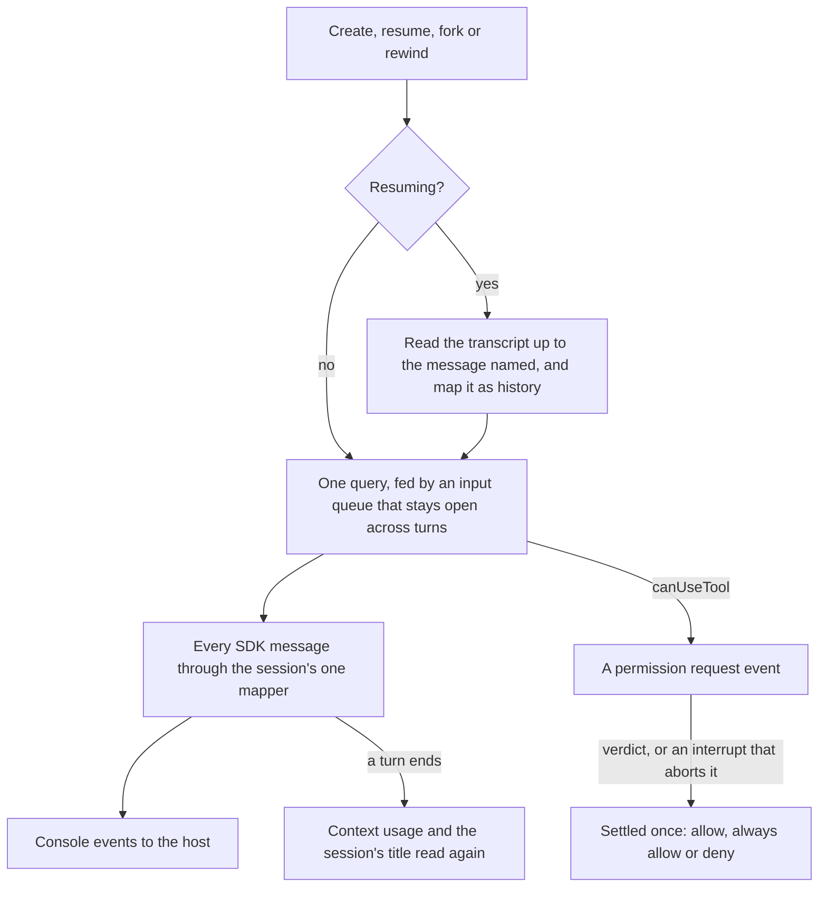

# Claude Agent SDK driver

The driver runs the [agent console](/docs/infra/claude-interface/agent-console)'s sessions through `@anthropic-ai/claude-agent-sdk`. The page never learns it is talking to Claude Code. The driver lists and opens sessions, reports what happens in them as the console's events, and takes commands back through the `Driver` interface, which any other agent's driver would implement the same way.

## How it works

- **One query per open session.** The query takes a streaming input: an input queue that stays open for as long as the session does, so every turn goes through the one query. A prompt sent while the agent is busy waits in the queue until the SDK asks for the next one. It is opened with `settingSources` set to the user, project and local layers, so CLAUDE.md, skills, hooks, plugins and output styles apply as they do in the terminal. The system prompt is Claude Code's own preset. Hook events are included, and thinking is summarized rather than omitted, since the SDK's default streams every thinking block empty.
- **Sessions are the terminal's.** A new session takes an id the host chose, and the SDK writes its transcript where the terminal writes every other one. `claude --resume <id>` picks it up, and the session list is the SDK's own list of recent sessions across every project, with the ones open on the host marked live.
- **One mapper.** Every SDK message becomes zero or more console events in one place, `createSdkMessageMapper`, so the page is insulated from the SDK's message types as they move between releases. Message content is parsed, not cast. A block or a message type the mapper does not know becomes an `Unknown` event carrying the whole message as JSON, which the page shows as a raw row, never dropped. The mapper keeps what later messages leave out: the model a mode change belongs beside, and the checklist the todo tools edit a piece at a time (`TodoWrite` rewrites it whole, `TaskCreate` and `TaskUpdate` patch it).
- **Permissions.** The SDK's `canUseTool` callback becomes a permission request event under the SDK's own request id, and waits on the page. Always-allow applies the rules the SDK offered with the prompt, as the terminal's "don't ask again" does. A deny carries what the person wrote, or the SDK's default wording. An interrupt aborts the request and settles it as a deny, so no request outlives its turn. A verdict for a request already settled, answered from another tab, does nothing.
- **Resume, fork and rewind.** Each reopens a query with the SDK's own options. Resume keeps the session's id. Fork takes a new id, optionally ending at a message. Rewind reopens the same session at a message, replacing the query that held it. Before the query starts, the transcript up to that message is read with `getSessionMessages` and mapped exactly as live messages are, so the page shows the conversation it is continuing, as `claude --resume` does.
- **Side reads.** When a session opens, and after every turn, the driver reads the palette's commands and models, the context usage, and the session's title. A failed side read is logged and the session carries on.

## The recorded session

The mapper is tested against one real session recorded through the SDK and checked in: a permission prompt, a file write, a Bash call, a subagent, and the persona plugin's hooks. Home-directory paths are rewritten to `/a` and the signatures on thinking blocks are cleared. The test maps it, checks every event against the wire schema, and writes the result into `__snapshots__/recordedSession.events.json` beside it. The app's store, component and visual tests replay that file through the same contract, so no test anywhere makes a live call.

## Key files

| File                                                                                              | Role                                                                 |
| :------------------------------------------------------------------------------------------------ | :------------------------------------------------------------------- |
| `packages/agent-console-server/src/models/driver/Driver.ts`                                       | The interface every driver implements                                |
| `packages/agent-console-server/src/services/drivers/claudeAgentSdk/createClaudeAgentSdkDriver.ts` | Sessions, prompts, verdicts, mode and model, resume, fork and rewind |
| `packages/agent-console-server/src/services/drivers/claudeAgentSdk/createSessionOpener.ts`        | The query options and the history replayed before it                 |
| `packages/agent-console-server/src/services/drivers/claudeAgentSdk/createSdkMessageMapper.ts`     | The one place SDK messages become console events                     |
| `packages/agent-console-server/src/services/drivers/claudeAgentSdk/createPermissionBridge.ts`     | `canUseTool` as a request the page answers, settled exactly once     |
| `packages/agent-console-server/src/services/drivers/claudeAgentSdk/watchSession.ts`               | Reads a query until it ends, and closes the session however it ended |
| `packages/agent-console-server/src/services/drivers/claudeAgentSdk/recordedSession.json`          | The recorded session every mapping and replay test runs on           |

## Notes

- The Claude Code build the SDK ships exposes no todo tool to SDK sessions: the recorded session's own reply says so. The mapper follows both todo shapes all the same, tested with the recorded tool call renamed, so the checklist appears the day a build offers one.
- Whether SDK use stays inside the subscription is the fact this driver's cost rests on, and the [terminal-mirror driver](/docs/proposals/infra/agent-console/terminal-mirror-driver) is the fallback that keeps the console free if it changes.
- A rewind here reopens the conversation at a message. It does not roll back the files the later turns edited, which the terminal's rewind can do from its checkpoints.
