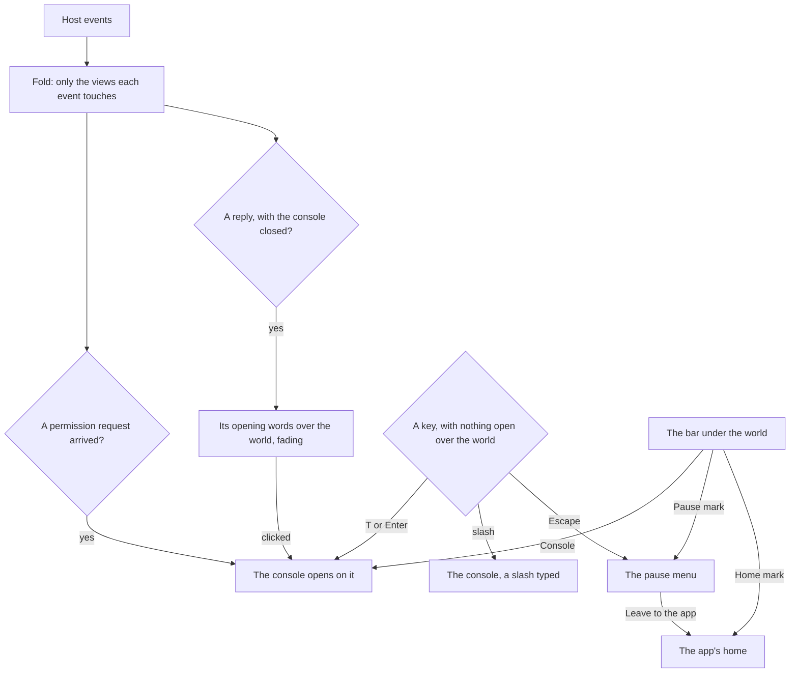

# Console overlay

The [agent console](/docs/infra/claude-interface/agent-console) is a place the session happens in, not an app page with a scene added to it. `/genshin` uses the `immersive` layout, which has no app bar, drawer, footer or progress bar. The Genshin world fills the page ([Genshin](/docs/proposals/genshin)). One heads-up bar runs along its foot. Everything a person types or reads is in the console, a sheet that opens above the bar the way a game calls up its chat. A pause menu over the world holds unpairing and leaving, and the bar's home mark also leaves, in one click from any input. The world needs no host: a page that has never been paired can be looked around like any other, and the console is where a host is paired, the first time it is opened. The game's opening plays first: its logos and health notice on white, its login screen, whose flight to the door follows the page's loading, and a loading screen that covers the page until the page, the world and any paired host are ready.

## How it works

- **The heads-up display is one bar.** It runs along the foot of the page as a game's hotbar does, under the world rather than over it, so it never covers the replies, and the world takes the height it leaves. It shows the session's avatar where its theme reads one, its title, its state, its context and its cost, then the host's connection status, then three buttons. The console button is the one raised button, with its key written on it. The pause mark opens the pause menu as Escape does, so a pointer or a touch reaches the same list the keys do rather than a second copy of it. The home mark's tooltip names it as leaving to the app; the way out stays outside the menu, as a close mark does. The session's words truncate before the buttons move, and the bar never wraps. While a permission request waits, the console button carries a warning mark.
- **The keys are the world's while nothing is open.** T or Enter opens the console on the conversation with the composer focused, and the slash key opens it with a slash already typed, as a game's command line does. Escape, or the bar's pause mark, opens the pause menu, and W and S walk it as the arrows do: back to the world, the sessions, unpair, and leave to the app. The keys are read only while focus is out of the console and no dialog is open, nothing editable has focus and no modifier is held, so a browser shortcut or a field is never taken over. The shortcuts dialog lists them.
- **A question from the agent opens the console.** A permission request opens the console on it, and the bar's mark stays lit until it has a verdict, so a request never waits where nobody looks.
- **The latest lines show over the world.** With the console closed, each new reply's opening words appear at the foot of the world, on one line, and fade after a few seconds, as a game's chat lines do. A click on one opens the console. A line is only ever a reply: a diff or a permission request always opens the console instead. A log replayed on connecting shows none.
- **Unpairing leaves nothing behind.** It drops the sessions, the console and the pause menu along with the host, so the world is left empty and the console asks for a host again.

## The panels

Everything typed or read is DOM, because text drawn into a canvas cannot be selected, copied, searched or read aloud. It all lives in the console, a sheet docked along the foot of the world, above the bar, at every width.

- **Size and position.** It opens over the world's lower part, with no animation. Its height is whatever the reader drags its top edge to (`UiResizeHandle`, remembered by the browser as `LocalStorageKey.AgentConsoleHeight`), and a little over half the window until then. Its panels scroll inside it. It never resizes the world, so nothing shifts as it opens and closes: the world stays in view above it, and the bar's session, state, context and cost stay in view under it.
- **Focus and keys.** Opening it moves focus into it, to the composer. The keys follow focus rather than whether the console is open. While focus is in the console the keys are its own. A click back in the world gives them to the world with the console still open, so Escape works beside it and T or Enter moves focus back to the composer.
- **Closing and expanding.** It has a close button, and Escape closes it, except while a turn runs, when Escape stops the turn as the terminal's does. An expand button grows it over the whole world, for a long diff or a wide conversation, and shrinks it again. The browser remembers which it was (`LocalStorageKey.AgentConsoleExpanded`).
- **What survives a reload.** Whether it is open, the tab it is on, the session it shows and the composer's draft are kept by the browser tab itself (`SessionStorageKey`). A refresh puts the reader back where they were once the host replays the session. The composer's draft outlives the tab.
- **The connection line.** A line saying the host is connecting, not answering, or stopped from its own window, with **Reconnect**, heads every tab.

Its tabs are the conversation, the sessions, the timeline, the changes and the usage. Each surface in and around the console:

- **Opening.** The game's opening plays over the page as it loads: the publisher's logo, the game's title and the health notice, each fading in, holding and fading out on white to the game's measured timings, with the white between them held as the game holds it. The [login screen](/docs/genshin/login-screen) follows, waiting for a click on its title, flying down its walkway as the page loads and waiting for a click on its door, and the loading screen follows it. The whole sequence is one component of the world package, which hands one screen to the next on the screens' own timings, so the page mounts it once, gives it how far loading has gone and hears when it is done.
- **Loading.** The game's own startup screen covers the page, matched to it on the [parity](/docs/genshin/parity) loop: the seven element marks in a row on white, pale until loading reaches them, then darkened by a wipe from the left. It shows no words, as the game's shows none, so the step under way is announced to a screen reader alone. The steps are starting the page, loading the world's code, drawing its first frame, and reaching the paired host, which a page with no host counts as done. The wipe moves a step at a time, since a lazily loaded chunk reports no progress of its own. It goes once all four are done, a world that cannot start counting as done so the console is never held behind it. It does not come back, so pairing again later shows its own connecting line instead. Behind it, the bar renders on the client alone, since what it shows comes from local storage and the socket, and it is inert until the loading screen goes. The console and the pause menu are not mounted until then, so no key opens either early.
- **Pairing.** Until a host is paired, the console holds only a pairing panel in place of its tabs, asking for the host's URL. It says when it is still looking for a host on this machine's loopback port, when it has found one, and when none answered, with a button to look again. Once a URL is paired, a line says the page is connecting, and it turns into a warning if the host does not answer. Retries leave that warning in place instead of flicking back to connecting on every attempt.
- **Conversation.** The first tab, holding the conversation, the permission requests and the composer.
  - **With no session.** The tab holds only the field that starts one, and the conversation opens as soon as the host has it. The list of the other sessions is the Sessions tab's, so the two tabs never show the same thing.
  - **Messages.** Replies are rendered as sanitized markdown, and every code block has its own copy button. Every message runs the panel's full width with no box of its own, and a prompt is told apart by its mark. Each carries one quiet mark over its corner rather than a row of buttons, shown while it is hovered or focused and always where nothing hovers. Its menu copies the message, forks from it, rewinds the conversation to it, and on a prompt rewinds the files to before it.
  - **Tool calls.** The main agent's tool calls sit in the conversation where they were made, as the terminal prints them. Each collapses to a single row (the tool, its target, how long it ran and whether it passed) above a preview of its output. The call, its output and that preview brighten under the pointer and toggle on a click, unless the click ends a selection.
  - **Replies and thinking.** A reply and its thinking stream in as they are written, and the whole block replaces the pieces. Thinking is folded as Claude folds it and toggles on a click anywhere on it, while hook output stays folded. A session the terminal wrote keeps no thinking text, so each of its thinking blocks is one line saying so rather than a fold that opens onto nothing.
  - **While a turn runs.** A working line at the end animates and names what the turn is doing: its current task, else one of Claude Code's verbs. It counts up from the prompt and the tokens written ([terminal parity](/docs/infra/claude-interface/agent-console/terminal-parity)).
  - **Search.** A search runs over the session.
- **Composer.** It holds the prompt, file paste and drop, the slash palette, the model and mode, and the stop button.
- **Permission requests.** A pending request stays open under the conversation until it has a verdict, as the terminal's prompt does.
- **Sessions, timeline, changes, usage.** The other tabs, each the full detail of what the bar summarises.

The panels are built from the [UI library](/docs/architecture/ui-library#components):

- `UiDialog` is the pause menu, and `UiTabs` the console's tabs. `UiFrame` draws each panel's edge, and `UiButton` is the raised capsule. The session search, a new session's folder and a denial's message are `UiTextField`s, and the new session's is inside a `UiForm`.
- The slash palette and the repositories offered for a new session are `UiSuggestions` under their fields, which keep focus while the arrows walk them. The model and the mode are `UiSelect`. A message's actions are `UiMenu`. Each opens in the browser's top layer, so no panel paints over one and no overflow clips it.
- The page's root is a theme scope in the Genshin design style and its dark palette, the navy of the game's HUD, whichever style and theme the app is in. The pause menu is a scope in its light palette, the cream of the game's menus. The loading screen is the game's own, drawn by the world package with its measured colours rather than the style's tokens.
- One size sets every panel, the agent's markdown included: prose in the style's rounded face, code and output in its mono, and headings standing out by colour and weight alone. Nothing in the page's scoped styles reaches another page.

## What it costs to run

The page is open all day beside an editor, so the overlay adds nothing per frame:

- **An event costs the event.** `foldAgentEvents` updates only what each event changes: the conversation, the tool calls, the timeline lanes, the file edits, the pending requests and the latest event of each kind. The duplicate check is a set of ids kept out of reactivity. A replay on reconnect is one pass over the log, and the bench beside the fold holds that its time per event does not grow with the log's length.
- **Only this page pays for three.js.** The world is a lazy client-only component, so its code loads after the page's first paint and on no other page.

## Key files

| File                                                               | Role                                                                                           |
| :----------------------------------------------------------------- | :--------------------------------------------------------------------------------------------- |
| `apps/web/app/layouts/immersive.vue`                               | The full-screen layout; `App.vue` drops the dock and loading bar for it                        |
| `apps/web/app/components/AgentConsole/Index.vue`                   | The world at full size with the overlays, its Genshin theme scope, its type                    |
| `apps/web/app/components/AgentConsole/Sheet.vue`                   | The console: a sheet of tabs docked above the bar, which a permission request opens            |
| `apps/web/app/components/AgentConsole/PauseMenu.vue`               | Back to the world, the sessions, unpair, and leave to the app                                  |
| `apps/web/app/components/AgentConsole/Panel/Hud.vue`               | The bar under the world: the session, the host, the console, pause and home                    |
| `apps/web/app/components/AgentConsole/ChatLines.vue`               | The latest replies' opening words over the world, fading                                       |
| `apps/web/app/components/AgentConsole/Panel/Opening.vue`           | The opening wired to the page: its loading steps as progress, and the step under way announced |
| `packages/genshin-world/src/components/Game/Opening/Index.vue`     | The game's opening as one sequence: the splashes, the login screen, then the startup screen    |
| `packages/genshin-world/src/components/Splash/Sequence/Index.vue`  | The opening: the logos and the health notice, one after another on white                       |
| `apps/web/app/composables/agentConsole/useAgentConsoleCommands.ts` | The page's keys, bound only while nothing is open over the world                               |
| `apps/web/app/store/agentConsole/panel.ts`                         | Whether the console and the pause menu are open, and the console's tab                         |
| `apps/web/app/services/agentConsole/foldAgentEvents.ts`            | The incremental fold every panel reads                                                         |

## Notes

- Escape does what the thing in front of the person needs. In the console while a turn runs, it stops the turn, as the terminal's does. In the console otherwise, it closes the console, and over the world it pauses. None of them leaves the page, since leaving is a choice (the bar's home mark or the pause menu's last entry), so a key pressed to stop the agent never takes the person out.
- Leaving the dock behind also leaves the account menu and notifications behind on this page. The bar's home mark is the way back to them. The app's toasts still show over the page, since the connection store's errors are raised through them.

## Settled

- **A column of panels beside the world, and a button that hid it.** The world is the page and the console a sheet over its lower part, so the world is never half the page when the console is closed and no mode can hide a question the agent asked.
- **The console as a modal dialog over the world.** A modal sheet down one side covered the world and made the page behind it inert, so the bar's session was hidden exactly while the person was talking to the agent. Docked above the bar at a set height, the console leaves the upper world and the bar in view. It stands over the world rather than shrinking it, since a world that resized on every open and close shifted the whole view.
- **Things in the world that open the console.** Props in the world each opening a console tab were a second way into what the bar's button and T, Enter and the slash key already open, so the world carried a second menu over the first. A thing in the world acts on the world only, and the console is reached from its button.
- **A title screen that holds the world back until a host is paired.** The world is the page whether or not a host is paired, and pairing is the console's, asked for when the person opens it to type.

## Sources

- [TresCanvas](https://docs.tresjs.org/api/components/tres-canvas), TresJS: the canvas and its `ready` event, which ends the loading screen's world step.
