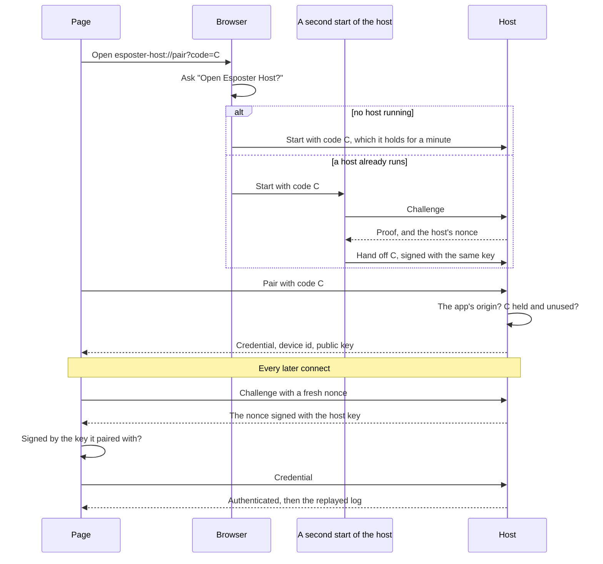

# Device Pairing

The [host](/docs/infra/claude-interface/agent-console/host) once shared one long-lived token with every page, carried in a URL the browser kept in its history, and the page handed it to whatever answered on the port. Each browser now pairs with a credential of its own, as T3 Code pairs each device through a one-time link ([T3 Code remote access](https://github.com/pingdotgg/t3code/blob/main/docs/user/remote-access.md)) and Claude Code's Remote Control enrols each browser separately ([Remote Control](https://code.claude.com/docs/en/remote-control)). The browser's own open-app prompt is the reader's consent.

## How it works

- **One button connects this computer.** The first screen keeps the [host installer](/docs/infra/claude-interface/agent-console/host-installer)'s download and open steps, and its last step is a **Connect** button (`Pairing.vue`). Connect makes a random one-time code, opens `esposter-host://pair?code=…` and starts connecting to the loopback port with it (`connectThisComputer`). The click is the reader asking, so nothing is asked of the loopback before it. The browser asks _Open Esposter Host?_, and the host that starts holds the code for a minute (`SCHEME_PAIRING_CODE_DURATION`). A host that already runs is handed the code by the second start instead (below). The page retries the code once a second until the host has it or the minute is up, since the reader may take a while to answer the prompt.
- **The origin is checked by the browser, not claimed by the page.** A browser sets a WebSocket's `Origin` itself. The host refuses any upgrade whose origin is another site's, and accepts a pairing only from the app's own origin — the deployed site, or the dev server's under `--origin`. A pairing with no origin at all, which only a program outside a browser sends, is refused too. Another site can still make the browser raise the open-app prompt, but its socket is refused, so a code it planted pairs nothing.
- **Each device gets its own credential, and the host keeps only its hash.** A valid code, from the app's origin, is used up and mints a random credential. `~/.agent-console-server/devices.json` keeps its SHA-256 hash beside the device's id, its origin, a name read from its user agent such as _Edge on Windows_ (`getDeviceName`), and the pairing date. The page keeps the credential, the device id, the address and the host's public key in local storage (`LocalStorageKey.AgentConsolePairedHost`). The credential travels in a message, never a URL, so it never reaches a history, a log or a referrer. A credential is compared by its hash, in constant time (`findDevice`).
- **The host proves itself before the page sends anything.** Anything on the computer can listen on the loopback port — another user's program on a shared machine, or one started while the host is closed. So every connect opens with the page's fresh nonce (`Challenge`). The host answers with the nonce signed by its Ed25519 key (`Proof`), kept in `~/.agent-console-server/host-key.pem` and handed to the page as a public key when it paired. The page verifies the signature with WebCrypto (`checkIsHostProofValid`) and sends its credential only if it holds. A squatter learns nothing, and the page shows the host as not answering and retries. Until the host has admitted it, the page takes nothing the socket sends.
- **A second start hands its code over, and proves itself doing so.** A link opened while a host runs finds the port taken. The second start challenges whatever holds the port and checks the proof against its own copy of the host key, so a program squatting on the port is never handed the code, and is reported as another program using the port. The running host's `Proof` also carries a nonce of its own, which the second start signs with the same key to hand the code off (`sendToRunningHost`, `HandOff`). Each signature names what it is for (`SignaturePurpose`), so a page's challenge cannot make the host sign another connection's nonce and pass it off as the executable's own.
- **Later visits connect on their own.** A page holding a credential connects on load. When this computer's host is stopped or not answering, the page offers **Start the host**, which opens `esposter-host://start` with no code and connects again. A host reached at another address offers **Reconnect** instead, since the page cannot start it.
- **Devices are listed and revoked one at a time.** `agent-console-server devices` lists them, and `devices --revoke <id>` removes one. The host's window names each device as it pairs, with the id that revokes it. Revoking closes the device's socket at once, through the same signed hand-over as a code, and the host reads the list on every connect, so a host that was not running refuses the device all the same. A page whose credential is refused (`HostCloseCode.CredentialRefused`) forgets it and shows the first screen again.
- **The printed link pairs once.** A host started from the command still prints a link, now carrying its address and a one-time code in the fragment. The code pairs one page, within ten minutes (`PRINTED_PAIRING_CODE_DURATION`). This is how a page that cannot open the scheme pairs, such as one reaching a host over an SSH forward. The page asks the reader to **Connect** before it uses the link, and warns when the link points at another computer.

## What is deliberately not in it

- **No provider keys for the local host.** This computer's Claude Code login stays with the host, where Claude Code keeps it.
- **No typed commands in the host's window.** A console window that reads keystrokes turns a stray key into an action, so revoking is the `devices` command's alone.
- **No proof at the pairing itself.** The page has no key to check until the host gives it one, so the pairing trusts the host that holds the code. The code travels only through the scheme to the host's own executable, and a second start hands it on only to a host that proves itself.

## Key files

| File                                                                            | Role                                                                          |
| :------------------------------------------------------------------------------ | :---------------------------------------------------------------------------- |
| `packages/agent-console-server/src/services/server/createAgentConsoleServer.ts` | The origin check, the handshake, the code exchange and the credential gate    |
| `packages/agent-console-server/src/services/server/createPairingCodes.ts`       | The one-time codes, each used once and only until it expires                  |
| `packages/agent-console-server/src/services/server/sendToRunningHost.ts`        | A second start proving the port's holder is the host, then signing to it      |
| `packages/agent-console-server/src/services/device/readHostKey.ts`              | The host key, made once in the home directory                                 |
| `packages/agent-console-server/src/services/device/findDevice.ts`               | A credential's device, by its hash in constant time                           |
| `packages/agent-console-server/src/services/device/runDevicesCommand.ts`        | `devices` and `devices --revoke`                                              |
| `packages/agent-console-server/src/models/handshake/SignaturePurpose.ts`        | What each signature is for, so one cannot stand in for another                |
| `packages/agent-console-server/src/cli.ts`                                      | The scheme's code, the printed one-time link and the devices command          |
| `apps/web/app/store/agentConsole/connection.ts`                                 | Opens the scheme, pairs, keeps the credential, and checks the proof before it |
| `apps/web/app/services/agentConsole/checkIsHostProofValid.ts`                   | The host's signature checked with WebCrypto                                   |
| `apps/web/app/components/AgentConsole/Panel/Pairing.vue`                        | Connect as the last step, and a printed link's host offered                   |

## Sources

- [T3 Code — remote access](https://github.com/pingdotgg/t3code/blob/main/docs/user/remote-access.md) — a fresh one-time pairing link per device, device sessions revoked one at a time, and provider credentials that stay on the machine running the agent.
- [Claude Code — Remote Control](https://code.claude.com/docs/en/remote-control) — a credential enrolled per browser and device, listed as trusted devices and revoked one at a time.
