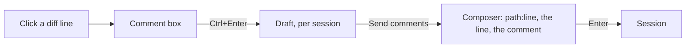

# Diff comments

The changes tab merges every edit to a file into one diff ([terminal parity](/docs/infra/claude-interface/agent-console/terminal-parity)), which is where a person reviews a turn. A comment on a line of that diff is left by clicking the line, and the comments reach the session as a prompt that names each line, so the person does not retype which line of which file they mean.

A click on a line of a file's whole diff opens a comment box under it, on either side of the diff; each such line is a button, so `Enter` or `Space` on it opens the box as a click does. An unchanged line takes its comment on its new side only. `Ctrl+Enter` saves the comment, and a saved comment stays drawn under its line with an Edit and a Remove. Saving an emptied comment removes it.

The comments are a draft, not a message. They collect across files until the person sends them: the **Send comments** button on the changes tab, with their count, puts them into the composer as one prompt and opens the conversation tab beside it. The person can add to the prompt, and Enter sends it as any prompt is sent. No command is added for this.

## Decisions

- **Only a file's whole diff takes comments.** A single edit to a file whose original text the session never saw is numbered from its own snippet, not from the file, so its lines are read without comment boxes rather than given line numbers that are wrong.
- **A removed line is named on its old side.** A comment on a line the change removed reads `path:line (removed)`, so the number is not taken for a line still in the file. An unchanged line is the same line on both sides, so only its new side takes a comment, and it is never marked removed.
- **The draft lives in the session's view.** Each session's view in the session store holds its comments under a key made of the side, the line number and the path. Switching sessions shows only the open session's draft.
- **A replay keeps the draft.** A reconnect replays the session's log into a fresh view, and the drafted comments are carried into it, since the log has no record of them.
- **Sending moves the draft into the composer.** The prompt is appended after any text already in the composer, separated by a blank line, and the draft is cleared at that point rather than when Enter sends the prompt.
- **The composer is unchanged.** The comments are ordinary composer text, so the composer's own send path, attachments and command handling apply to them as to anything typed.

## Notes

- A comment is held by its line number on its side, not by the text of the line. An edit that moves the line later in the file leaves the comment on the number it was given, and the prompt names that number.
- The draft is held in memory, so a page reload drops it.
- The agent does not leave comments into the diff. Review is the palette's own slash command, answered in the conversation.

## Key files

| File                                                         | Role                                                                                  |
| :----------------------------------------------------------- | :------------------------------------------------------------------------------------ |
| `apps/web/app/components/AgentConsole/Panel/Diff.vue`        | the comment box under a line, the saved comment with its Edit and Remove              |
| `apps/web/app/components/AgentConsole/Panel/Changes.vue`     | the Send comments button with its count, and the move of the draft into the composer  |
| `apps/web/app/services/agentConsole/toDiffCommentsPrompt.ts` | the prompt the comments are sent as, one `path:line`, the quoted line and the comment |
| `apps/web/app/services/agentConsole/toDiffRows.ts`           | each row's line number on each side, counted through the lines a fold hides           |
| `apps/web/app/store/agentConsole/session.ts`                 | the session's draft, kept in its per-session view and carried through a replay        |

## Sources

- [Claude Code desktop — diff view](https://code.claude.com/docs/en/desktop): "To comment on specific lines, click any line in the diff to open a comment box", submitted with `Ctrl+Enter`.
