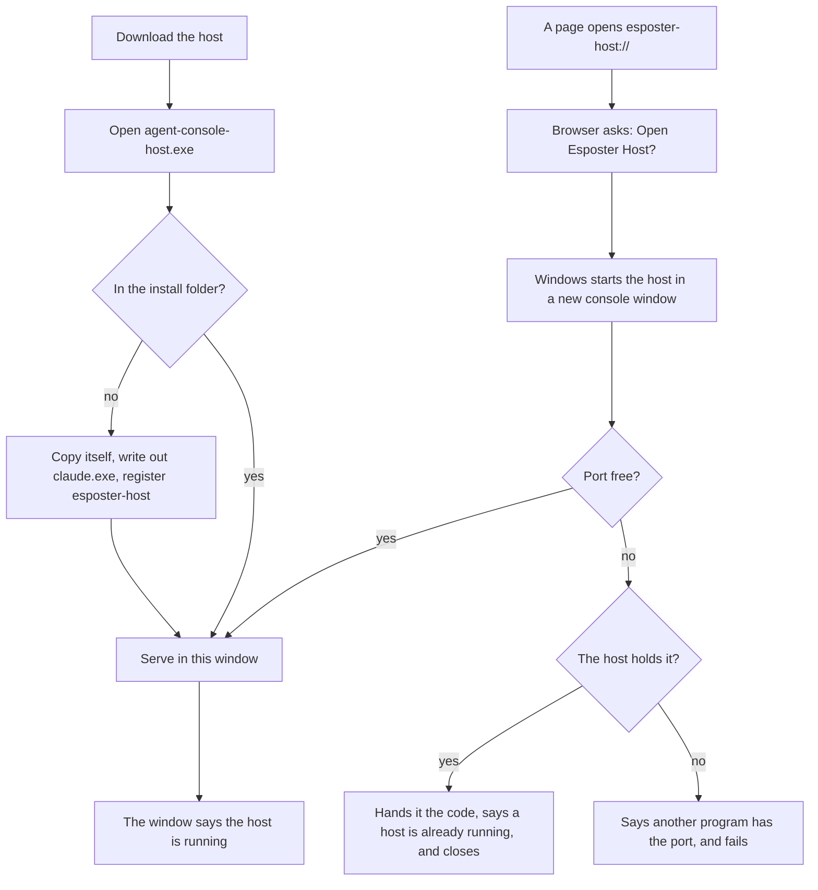

# Host Installer

The [host](/docs/infra/claude-interface/agent-console/host) started only as `pnpm dlx agent-console-server` in a terminal, which asked a reader to have Node and pnpm and to know what a terminal is. A web page cannot install or start a program on the reader's machine — the browser's sandbox exists to forbid exactly that — so the one step that cannot be removed is a single download, and it is made as small as it can be for the least technical reader ([simplest reader first](/docs/architecture/simplest-reader)). T3 Code makes the same split: an app runs its backend, and the command stays for anyone who wants it ([T3 Code](https://github.com/pingdotgg/t3code)).

## How it works

- **One Windows file, carrying everything.** `pnpm build:sea` in the package bundles `src/cli.ts` and every dependency into one file (`tsdown.sea.config.ts`), copies the SDK's own `claude.exe` next to it (`packages/agent-console-server/scripts/copyClaudeCodeExecutable.ts`), and embeds both into `agent-console-host.exe` with Node's `--build-sea`, the Claude Code binary as an asset (`sea-config.json`). It is one file rather than a zip because Windows lets a reader open a program from inside a zip without the files beside it, which is the first thing the reader would try. It is built for Windows alone, and unsigned: signing and the other platforms each cost a yearly fee ([signed host installers](/docs/infra/deferred/signed-host-installers)).
- **It is attached to every release.** The release workflow's `host-installer` job builds it on Windows and attaches the executable to the release, and the pairing screen links the newest one (`HOST_INSTALLER_URL`).
- **Opening it installs it.** Run from anywhere but its install folder, the executable copies itself to `%LOCALAPPDATA%\Esposter\Host`, writes out the Claude Code binary it carries beside the copy, and registers the `esposter-host` scheme in the user's own registry classes, so no administrator is asked (`installHost`). It then serves from the window it was opened in, as the installed host would. An install that cannot finish — most often an older host still running from the install folder, whose files Windows keeps locked — says what to do in plain words and exits. Inside the executable the SDK cannot find its own binary, which it looks up beside its module, so `getClaudeCodeExecutablePath` names the installed one; run from the package, the SDK finds its own.
- **Its window speaks plainly.** It says the host is running and to keep the window open, and that closing the window stops it. Opened from the download, it also says to press Connect on the page, with a one-time link to hold Ctrl and click instead ([device pairing](/docs/infra/claude-interface/agent-console/device-pairing)). No address, port or credential is shown.
- **A link starts it.** Opening `esposter-host://…` starts the installed executable with the link as its argument (`getSchemeLaunch`), after the browser's own _Open Esposter Host?_ prompt, which no page can skip. A console program started that way gets a console window of its own, which Windows 11 opens in Terminal, so the host runs where the reader can see it and closing that window stops it ([host](/docs/infra/claude-interface/agent-console/host)). **A link can only start the host, never configure it.** Any site can open an `esposter-host://` link, and Windows passes it as `"%1"`, so a link carrying a quote would close that argument early and smuggle in flags of its own — `--origin` making the attacker's site the one origin allowed to pair. A launch holding a link and anything else is refused before any argument is read (`checkIsSchemeLaunchTampered`). A link opened while a host already runs finds the port taken, has what holds it prove it is the host, and — when it is — hands it the link's pairing code, says it is running in another window and closes, leaving the page to the running one; a port some other program holds is never handed the code, is reported as that, and the host exits with a failure (`sendToRunningHost`).
- **`agent-console-host.exe uninstall`** removes the scheme at once and the install folder a moment after the window closes, through a detached PowerShell that reads the folder from its environment as a literal path, since a running executable cannot delete itself on Windows.

## What is deliberately not in it

- **No signing, and no macOS or Linux build.** Each costs a yearly fee; both are [deferred](/docs/infra/deferred/signed-host-installers).
- **No desktop window and no background service.** The console is the page and the host's console window is its only other surface, where T3 Code's desktop app is its whole interface. It does not start at login or hide in a tray, since a process the reader cannot see is one they cannot stop.
- **No updater of its own yet.** Opening a newer download installs over the old one once the old host's window is closed; an updater comes when releases are frequent enough to make that a chore.

## Key files

| File                                                                                       | Role                                                                         |
| ------------------------------------------------------------------------------------------ | ---------------------------------------------------------------------------- |
| `packages/agent-console-server/tsdown.sea.config.ts`                                       | The host bundled into one file with every dependency                         |
| `packages/agent-console-server/scripts/copyClaudeCodeExecutable.ts`                        | The SDK's Windows Claude Code binary, placed for the executable to embed     |
| `packages/agent-console-server/sea-config.json`                                            | The executable Node's `--build-sea` makes, with Claude Code as its asset     |
| `packages/agent-console-server/src/cli.ts`                                                 | Installs a download, takes a scheme link and `uninstall`, and serves         |
| `packages/agent-console-server/src/services/installer/installHost.ts`                      | The copy, the Claude Code binary written out, and the scheme in the registry |
| `packages/agent-console-server/src/services/installer/checkIsSchemeLaunchTampered.ts`      | A link launch carrying more than the link, refused                           |
| `packages/agent-console-server/src/services/installer/getSchemeLaunch.ts`                  | What an `esposter-host://` link asked for                                    |
| `packages/agent-console-server/src/services/server/sendToRunningHost.ts`                   | Whether the host is what holds a taken port, and the code handed to it       |
| `packages/agent-console-server/src/services/installer/getClaudeCodeExecutablePath.ts`      | The installed Claude Code binary, inside the executable                      |
| `packages/agent-console-server/src/services/drivers/claudeAgentSdk/createSessionOpener.ts` | Passes that binary to the SDK                                                |
| `.github/workflows/Release.yaml`                                                           | Builds the Windows host and attaches it to the release                       |
| `apps/web/app/components/AgentConsole/Panel/Pairing.vue`                                   | The steps with the download, and Connect as the last                         |

## Sources

- [Node.js — single executable applications](https://nodejs.org/api/single-executable-applications.html) — `--build-sea` since v25.5.0, assets embedded beside the main script, and native addons needing a real file to load from.
- [T3 Code](https://github.com/pingdotgg/t3code) — an app running the backend behind its web interface, with the command kept beside it.
