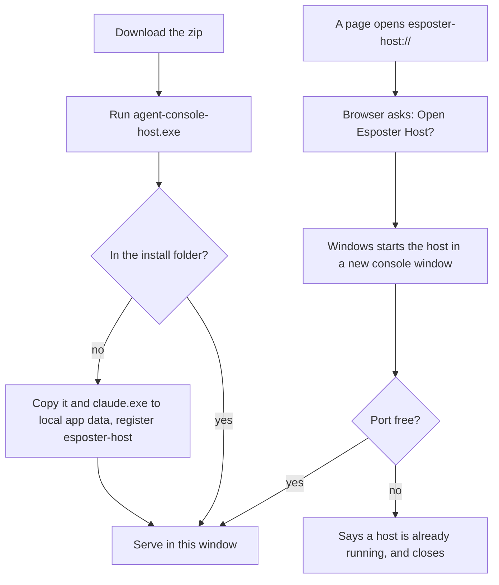

# Host Installer

The [host](/docs/infra/claude-interface/agent-console/host) started only as `pnpm dlx agent-console-server` in a terminal, which asked a reader to have Node and pnpm and to know what a terminal is. A web page cannot install or start a program on the reader's machine — the browser's sandbox exists to forbid exactly that — so the one step that cannot be removed is a single install. T3 Code makes the same split: an app runs its backend, and the command stays for anyone who wants it ([T3 Code](https://github.com/pingdotgg/t3code)).

## How it works

- **One Windows executable, carrying its own runtime.** `pnpm build:sea` in the package bundles `src/cli.ts` and every dependency into one file (`tsdown.sea.config.ts`), embeds it into `agent-console-host.exe` with Node's `--build-sea` (`sea-config.json`), and copies the SDK's own `claude.exe` beside it (`packages/agent-console-server/scripts/copyClaudeCodeExecutable.ts`). Inside the executable the SDK cannot find its binary, which it looks up beside its own module, so `getClaudeCodeExecutablePath` names the one beside the executable; run from the package, the SDK finds its own. It is built for Windows alone, and unsigned: signing and the other platforms each cost a yearly fee ([signed host installers](/docs/infra/deferred/signed-host-installers)).
- **It is attached to every release.** The release workflow's `host-installer` job builds it on Windows and attaches `agent-console-host.zip` — the executable and `claude.exe` — to the release, and the pairing screen links the newest one (`HOST_INSTALLER_URL`). The screen says that SmartScreen asks once, behind **More info → Run anyway**, and keeps the `pnpm dlx` command for any other platform.
- **The download installs itself.** Run from anywhere but its install folder, the executable copies itself and `claude.exe` to `%LOCALAPPDATA%\Esposter\Host` and writes the `esposter-host` scheme to the user's own registry classes, so no administrator is asked (`installHost`). It then serves from the window it was run in, as the installed host would. An install that cannot finish — `claude.exe` not unzipped beside it, or an older host still running from the install folder, whose files Windows keeps locked — says what to do and exits.
- **A link starts it.** Opening `esposter-host://…` starts the installed executable with the link as its argument (`getSchemeLaunch`), after the browser's own _Open Esposter Host?_ prompt, which no page can skip. A console program started that way gets a console window of its own, which Windows 11 opens in Terminal, so the host runs where the reader can see it and closing that window stops it ([host](/docs/infra/claude-interface/agent-console/host)). A link opened while a host already runs finds the port taken, says the host is running in another window, and closes, leaving the page to the running one.
- **`agent-console-host.exe uninstall`** removes the scheme at once and the install folder a moment after the window closes, through a detached shell, since a running executable cannot delete itself on Windows.

## What is deliberately not in it

- **No signing, and no macOS or Linux build.** Each costs a yearly fee; both are [deferred](/docs/infra/deferred/signed-host-installers).
- **No desktop window and no background service.** The console is the page and the host's console window is its only other surface, where T3 Code's desktop app is its whole interface. It does not start at login or hide in a tray, since a process the reader cannot see is one they cannot stop.
- **No updater of its own yet.** A newer download installs over the old one once the old host's window is closed; an updater comes when releases are frequent enough to make that a chore.

## Key files

| File                                                                                       | Role                                                                       |
| ------------------------------------------------------------------------------------------ | -------------------------------------------------------------------------- |
| `packages/agent-console-server/tsdown.sea.config.ts`                                       | The host bundled into one file with every dependency                       |
| `packages/agent-console-server/sea-config.json`                                            | The executable Node's `--build-sea` makes of it                            |
| `packages/agent-console-server/scripts/copyClaudeCodeExecutable.ts`                        | The SDK's Windows Claude Code binary, copied beside the executable         |
| `packages/agent-console-server/src/cli.ts`                                                 | Installs a download, takes a scheme link and `uninstall`, and serves       |
| `packages/agent-console-server/src/services/installer/installHost.ts`                      | The copy into local app data and the scheme in the user's registry classes |
| `packages/agent-console-server/src/services/installer/getSchemeLaunch.ts`                  | What an `esposter-host://` link asked for                                  |
| `packages/agent-console-server/src/services/installer/getClaudeCodeExecutablePath.ts`      | The Claude Code binary beside the executable, inside it                    |
| `packages/agent-console-server/src/services/drivers/claudeAgentSdk/createSessionOpener.ts` | Passes that binary to the SDK                                              |
| `.github/workflows/Release.yaml`                                                           | Builds the Windows host and attaches it to the release                     |
| `apps/web/app/components/AgentConsole/Panel/Pairing.vue`                                   | The download, the SmartScreen note and the command                         |

## Sources

- [Node.js — single executable applications](https://nodejs.org/api/single-executable-applications.html) — `--build-sea` since v25.5.0, and native addons needing a real file to load from.
- [T3 Code](https://github.com/pingdotgg/t3code) — an app running the backend behind its web interface, with the command kept beside it.
