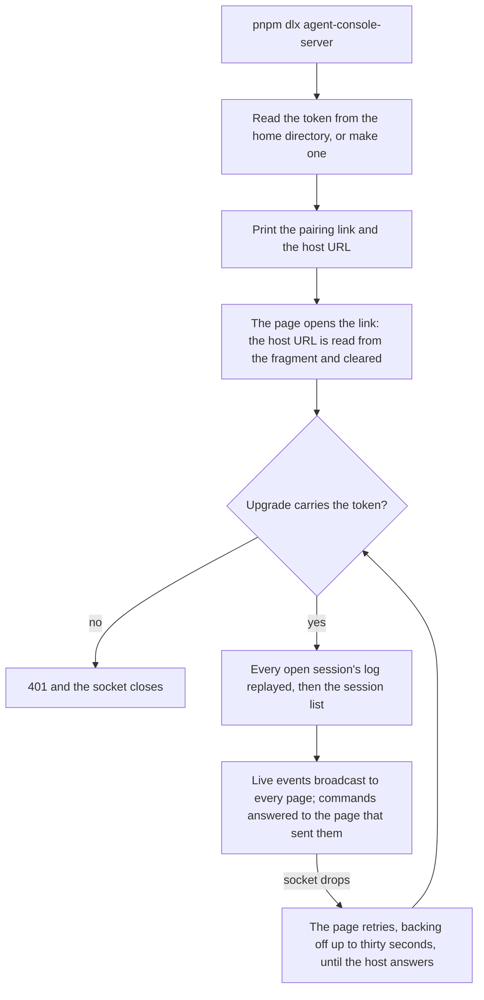

# Host

`agent-console-server` is the half of the [agent console](/docs/infra/claude-interface/agent-console) that runs where the code is. It holds everything sensitive: the Claude Code login, the repositories and the sessions. The page holds only the host's address and token, in the browser's own storage. No session, key or repository ever reaches Esposter's servers. The app serves the page and nothing else.

## How it works

- **One command, one socket.** The host is a plain HTTP listener with a WebSocket upgrade. It listens on `127.0.0.1` at a fixed default port, so the URL it prints is predictable. `--hostname 0.0.0.0` makes it reachable from another machine, over whatever network already reaches that machine. Esposter runs no relay. The deployed site can use that only through a tunnel: a page on `https` may open a plain `ws://` socket to the loopback and nowhere else. The loopback is a [potentially trustworthy origin](https://www.w3.org/TR/secure-contexts/#is-origin-trustworthy), and the browser blocks any other address as mixed content. So from the deployed site, a host on another machine is reached through something that makes it loopback again, such as an SSH port forward that brings the host's port to this machine's loopback. The host keeps its default loopback binding there, and the page pairs with the forwarded port under the printed token. The token and every message cross that path, so the tunnel is an encrypted one, never plain `ws://` across the network. A page on the local dev server is plain `http` and can reach the other machine directly.
- **The token.** It is made once and kept in `~/.agent-console-server/token`, readable by the person alone, so a page paired once stays paired across restarts. Every upgrade must carry it, and it is compared in constant time. Deleting the file revokes every paired page on the next start.
- **Pairing.** The host prints a link to the app's `/agent-console` with its own address in the URL fragment. A fragment never reaches a server, and the page reads it once and clears it. `--origin` points the link at a local dev server instead of the deployed site. The printed `ws://` URL can also be pasted into the page.
- **The private-network preflight.** A page on `https` reaching a loopback address is a local network request. Current Chrome gates it on its [Local Network Access](https://developer.chrome.com/blog/local-network-access) permission, a prompt the person answers once per site, rather than on the private-network preflight it replaced. The host still answers every `OPTIONS` with `Access-Control-Allow-Private-Network` for a browser that sends the preflight. A page on the local dev server is loopback to loopback and needs neither.
- **The replayed log.** The host keeps every open session's events from the moment it opened, and drops an event already logged under its id. A page that connects or reconnects receives the whole log first. A session reopened under the same id, which is what a rewind does, has its log reset, and every page is told to drop what it held.
- **Commands.** Each command carries an id the page chose. A command that opens a session is answered with the session it opened, so the page that asked moves to it. A command that fails is answered with why, and a message that is not a command at all is answered under an empty id.

## Key files

| File                                                                            | Role                                                                    |
| :------------------------------------------------------------------------------ | :---------------------------------------------------------------------- |
| `packages/agent-console-server/src/cli.ts`                                      | The command: flags, the token, the printed link, closing on Ctrl+C      |
| `packages/agent-console-server/src/services/server/createAgentConsoleServer.ts` | The listener, the token gate, the log replay and the command replies    |
| `packages/agent-console-server/src/services/server/answerHttpRequest.ts`        | The preflight answer, and a refusal for every other plain request       |
| `packages/agent-console-server/src/services/server/createEventLog.ts`           | Each open session's log, one event per id                               |
| `packages/agent-console-server/src/services/server/readToken.ts`                | The token, made once and kept in the home directory                     |
| `apps/web/app/store/agentConsole/connection.ts`                                 | The page's side: pairing, the socket, the backoff, routing what arrives |

## Notes

- **Nothing looks for a host before pairing.** The page once sent a plain request to the loopback port to say whether a host was running, and the host answered any origin. That let every site the reader visited learn the host was there, and had the deployed site reach into the reader's machine before being asked. The page now asks the loopback for nothing until the reader pastes a host URL or opens the printed link, and the host refuses every plain request other than the preflight with no CORS headers.
- Ctrl+C closes every session's Claude Code process before the host exits, rather than leaving them orphaned.
