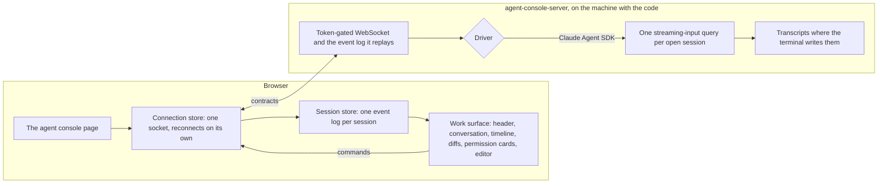

# Agent console

The agent console is one page of the app, `/agent-console`, that works the Claude Code sessions on a machine instead of the terminal: the conversation, every tool call and its result, the diffs, the permission prompts, the model, mode, context, cost and usage, subagents and the todo list, across every session on the host. It works the same sessions the terminal does. A session started here resumes with `claude --resume <id>`, and one started in a terminal resumes here. Nothing is lost moving between them, because both read and write the same transcripts.

It has two halves. The **host**, `agent-console-server`, runs on the machine with the code and the Claude Code login ([host](/docs/infra/claude-interface/agent-console/host)). The **page** is served by the app on the deployed site or on `pnpm dev`, and knows only which host it is paired with. Between them is one WebSocket carrying Zod contracts, which the page imports from the host's `contracts` subpath, so a change to the wire fails typecheck on both sides.

## How it works

- **The event log is the only state.** The host keeps each open session's events and replays them to a page that connects or reconnects. The page keeps them per session in a store keyed by session id. The header, the timeline, the diffs, the todo list and the permission cards are all computed from that log, so a reconnect that replays it rebuilds every one of them.
- **The agent is behind a driver.** The [Claude Agent SDK driver](/docs/infra/claude-interface/agent-console/claude-agent-sdk-driver) is the one that exists. Any other agent would be one more driver behind the same interface, and never a change to the page.
- **The look is behind a theme.** `AgentConsoleThemeMap` holds one theme, the default: the work surface in the app's own Vuetify theme, plus a browser notification when a turn ends or a permission prompt waits while the tab is hidden. A reload replays history without ringing, because only events newer than the page's connection trigger a reaction.
- **Nothing waits forever.** The page reconnects with a backoff capped at thirty seconds for as long as it is open. A permission prompt waits on a person, as the terminal's does, but an interrupt settles it as a deny, and so does closing its session.

What the terminal shows and does, and where the console carries each part, is [terminal parity](/docs/infra/claude-interface/agent-console/terminal-parity).

## The pages of this feature

| Page                                                                                          | What it covers                                                                    |
| :-------------------------------------------------------------------------------------------- | :-------------------------------------------------------------------------------- |
| [Host](/docs/infra/claude-interface/agent-console/host)                                       | the package, pairing, the token, the preflight, the replayed log and reconnection |
| [Claude Agent SDK driver](/docs/infra/claude-interface/agent-console/claude-agent-sdk-driver) | sessions, the one place SDK messages become events, permissions, resume and fork  |
| [Terminal parity](/docs/infra/claude-interface/agent-console/terminal-parity)                 | every terminal surface and action, and the part of the page that carries it       |

## Key files

| File                                                                                              | Role                                                                             |
| :------------------------------------------------------------------------------------------------ | :------------------------------------------------------------------------------- |
| `packages/agent-console-server/src/contracts.ts`                                                  | The wire the page imports: sessions, events, commands, server messages           |
| `packages/agent-console-server/src/services/server/createAgentConsoleServer.ts`                   | The host's socket, token gate, event log and command dispatch                    |
| `packages/agent-console-server/src/services/drivers/claudeAgentSdk/createClaudeAgentSdkDriver.ts` | The Claude Code driver                                                           |
| `apps/web/app/pages/agent-console.vue`                                                            | The route, and pairing from the link the host prints                             |
| `apps/web/app/store/agentConsole/connection.ts`                                                   | The socket, reconnection, and routing the host's messages into the session store |
| `apps/web/app/store/agentConsole/session.ts`                                                      | Every session's event log and the views the work surface reads from it           |
| `apps/web/app/services/agentConsole/themes/AgentConsoleThemeMap.ts`                               | The theme registry, holding the default theme                                    |

## Notes

- The Genshin theme, the views (the collector harbour, the codebase city), the terminal-mirror driver and the extension tiers are still [proposals](/docs/proposals/infra/agent-console). The default theme is the surface every one of them is measured against.
- Cost is what the SDK reports for the session's query since the host opened it. A session resumed in a new host process starts that count again, as a new terminal process does.
