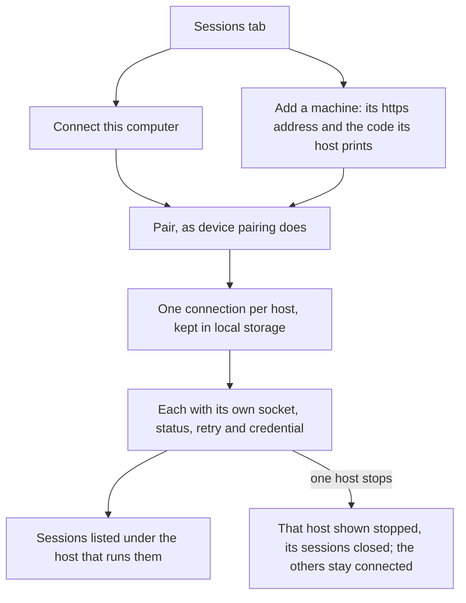

# Remote Connections

One page works the sessions of several hosts at once ([agent console](/docs/proposals/infra/agent-console)). Besides this computer's host, a reader can add a machine of their own — a desktop left running, or a server — and work its sessions from the same page. T3 Code's apps connect straight to a machine's HTTPS endpoint, usually a Tailscale address, and pair it with a one-time code ([T3 Code remote access](https://github.com/pingdotgg/t3code/blob/main/docs/user/remote-access.md)); the console does the same, with [device pairing](/docs/infra/claude-interface/agent-console/device-pairing)'s exchange.

## How it works

- **Connections are a list.** The page keeps every paired host in local storage (`LocalStorageKey.AgentConsoleConnections`), each with its address, this browser's credential for it, the device id and the host's public key. Each has its own socket, retry backoff and status, the status held per connection id in `useDataMap`, so one host stopping, or not answering, never touches another. The page as a whole reads as its best-placed host, so a reader with any host reached can work.
- **A machine is added from the sessions tab**, never the first screen, which stays one path for the least technical reader ([simplest reader first](/docs/architecture/simplest-reader)). The reader starts the host there, from the [host installer](/docs/infra/claude-interface/agent-console/host-installer) or the command, and enters two things: its address and the one-time code its window prints beside the link. An `https://` address, as a machine behind its own certificate is usually given, is read as its `wss://` socket (`toHostAddress`). A page on `https` may open a plain socket only to its own computer, so the address has to be encrypted end to end. The host itself serves a plain `ws://` socket on its port, and neither the command nor the installer puts a certificate in front of it — `--hostname 0.0.0.0` opens it to the network but encrypts nothing. The `https` address comes from what the reader runs in front of it: `tailscale serve`, which gives the machine's `ts.net` name its certificate, a reverse proxy with a certificate of its own, or an SSH forward, which makes the host loopback again. The pairing is the same exchange as a printed link's, so the reader never copies a credential.
- **Sessions are listed under the host that runs them.** Each session the page holds carries its connection's id (`ConnectionSessionSummary`), a host's list replacing only its own sessions. The sessions tab groups them by host, each group headed by its name, its status, **Start the host** or **Reconnect**, and **Remove**. A command about a session goes to the host holding it. A new session starts on the host the reader picks, asked only when more than one is reached.
- **A remote host's sessions stay inside it.** A host listening beyond the loopback runs its sessions through the Agent SDK in its own process, with no [session window](/docs/infra/claude-interface/agent-console/session-windows), since nobody sits at its desktop to see one. Its sessions are stopped from the page.
- **A remote host proves itself through its certificate and its key.** The page checks its signature against the key it was given at pairing. The port the host signed is checked only for an address on this computer: a remote host is reached through its own certificate, often behind a proxy on another port, so there the signature alone proves it.

## What is deliberately not in it

- **No relay of Esposter's own.** Remote Control's outbound-only relay would reach a machine behind any firewall, but it is a service Esposter would run and answer for. An encrypted address or a forward reaches the same machines without one.
- **No name of the reader's choosing.** A connection is named by its address — this computer's host, or the host on its machine's name — which is what tells two apart.
- **No Anthropic-hosted sessions yet.** Sessions run by Anthropic on the reader's API key are the later half of this ([Anthropic-hosted sessions](/docs/proposals/infra/agent-console/anthropic-hosted-sessions)).

## Key files

| File                                                           | Role                                                                      |
| :------------------------------------------------------------- | :------------------------------------------------------------------------ |
| `apps/web/app/store/agentConsole/connection.ts`                | One socket, status and credential per connection, and each command's host |
| `apps/web/app/store/agentConsole/session.ts`                   | Every host's sessions, each tagged with its connection                    |
| `apps/web/app/components/AgentConsole/Panel/Sessions.vue`      | Sessions grouped by host, with each host's status and actions             |
| `apps/web/app/components/AgentConsole/Panel/AddConnection.vue` | Connect this computer, and a machine's address and code                   |
| `apps/web/app/components/AgentConsole/Panel/NewSession.vue`    | The host a new session starts on, asked when more than one is reached     |
| `apps/web/app/services/agentConsole/toHostAddress.ts`          | A typed address as the socket it is reached at                            |
| `packages/agent-console-server/src/cli.ts`                     | The code printed on its own, for a page on another computer               |

## Sources

- [T3 Code — remote access](https://github.com/pingdotgg/t3code/blob/main/docs/user/remote-access.md) — an HTTPS endpoint the hosted app connects to directly, Tailscale HTTPS for it, SSH-managed forwards, and provider credentials that stay on the remote machine.
- [Claude Code — Remote Control](https://code.claude.com/docs/en/remote-control) — outbound HTTPS only with no inbound ports, traffic relayed through Anthropic's API.
