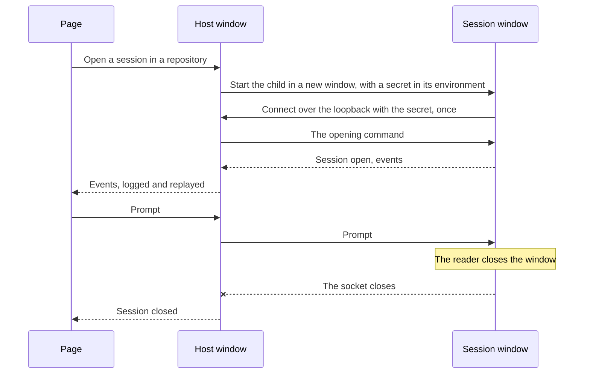

# Session Windows

Every session used to run inside the [host](/docs/infra/claude-interface/agent-console/host)'s own process. The only way to stop one outside the page was to stop the host and every session with it, and nothing on the desktop said which sessions were running. Now each session on this computer runs in a window of its own, so closing that window stops exactly that session, much as closing a browser window closes one page. The page still manages all of them. Claude Code's desktop app works the same way: sessions side by side in one app, each stopped on its own ([Claude Code desktop](https://code.claude.com/docs/en/desktop)).

## How it works

- **A session runs in a child process, in its own window.** On Windows, a host listening on the loopback opens each session by starting `agent-console-host.exe session` through cmd's `start` (`launchSessionWindow`). That gives the session its own console, shown in Terminal on Windows 11. The window runs the unchanged [Claude Agent SDK driver](/docs/infra/claude-interface/agent-console/claude-agent-sdk-driver) for that one session (`runSessionChild`). The host keeps the pairing, the token gate, the event log and the replay to pages, behind the window driver (`createWindowDriver`), which implements the same `Driver` interface, so the page's contract did not change.
- **The window connects back under a secret it holds once.** The host listens for windows on a loopback port of its own, separate from the pages' listener, so the window gate is never reachable from the network, whatever address the pages' listener is on. Each window is admitted by a fresh secret that works once and expires after thirty seconds. The secret reaches the window through its environment, never its command line. The window takes the secret out of its own environment before the session starts, because the session hands that environment to Claude Code and every tool it runs, and a command a repository steers could otherwise read it and speak to the host as that session. The host's own paths reach cmd the same way, so no command line is built from a path.
- **The page's commands pass through the host.** The host forwards each command to the window holding the session as the page's own `Command`, and the window runs it with the same `handleCommand` the host uses. The window sends its driver's callbacks back up (`ChildMessage`): events, a session opening, a change to the session list, and each command's result or error. A page never talks to a window directly, so pairing stays one credential per computer. The session list is still read on the host, from the transcripts on disk, with each open session's state taken from the events that pass through.
- **The window logs the conversation.** Each prompt, reply, tool call, permission request and error is printed as it happens (`formatSessionLogLine`), and a subagent's own conversation is left to the page. The window is a log and a stop control. Typing into the session stays in the page, so there is one composer rather than two that could race.
- **The socket is the session's life, so either end stops it and both show it.** Closing a session in the page closes the window's socket, and the window closes its session and exits. Closing the window, or Ctrl+C in it, ends the session's Claude Code process. The host sees the socket go, marks the session closed, and every page shows it closed at once. A session whose Claude Code process ends on its own ends its window the same way. Resuming a session, or resuming it at an earlier message, opens a new window.
- **The host's window stays the computer's log** of each session opened and closed, and in which folder. Closing the host's window tells every page the host is stopping, and every session window closes with it.

## What is deliberately not in it

- **No typing in a session window.** Two composers for one session would race each other; the window is for watching and stopping.
- **No window per session on a remote connection, or off Windows.** A host listening beyond the loopback is a [remote connection](/docs/infra/claude-interface/agent-console/remote-connections), whose sessions run where nobody sees a desktop, so they stay inside the host. Other platforms keep sessions inside the host until they have an installer ([signed host installers](/docs/infra/deferred/signed-host-installers)).
- **No session title kept on the host.** The window's own driver reads the title. The host lists every session by the title on disk, which the window's change of the session list prompts it to read again.

## Key files

| File                                                                                        | Role                                                                                  |
| ------------------------------------------------------------------------------------------- | ------------------------------------------------------------------------------------- |
| `packages/agent-console-server/src/services/drivers/window/createWindowDriver.ts`           | The host's half: the window gate, forwarding, and a closed socket as a closed session |
| `packages/agent-console-server/src/services/drivers/window/serveSessionChild.ts`            | The window's half: commands run against its driver, callbacks and replies sent back   |
| `packages/agent-console-server/src/services/drivers/window/runSessionChild.ts`              | The `session` subcommand: the secret taken out of the environment, then serving       |
| `packages/agent-console-server/src/services/drivers/window/launchSessionWindow.ts`          | Starts a window through cmd's `start`, with the secret in its environment             |
| `packages/agent-console-server/src/services/drivers/window/formatSessionLogLine.ts`         | The line a window prints for each event                                               |
| `packages/agent-console-server/src/models/window/ChildMessage.ts`                           | What a window tells the host                                                          |
| `packages/agent-console-server/src/services/drivers/claudeAgentSdk/listSessionSummaries.ts` | The session list both drivers read, each open session shown as it is now              |
| `packages/agent-console-server/src/cli.ts`                                                  | Runs `session`, and chooses the window driver on Windows for a loopback host          |

## Sources

- [Claude Code desktop — work in parallel with sessions](https://code.claude.com/docs/en/desktop) — sessions side by side in one app, each stopped on its own.
- [Windows Terminal — default terminal application](https://learn.microsoft.com/en-us/windows/terminal/install#set-your-default-terminal-application) — a new console window opening in Terminal on Windows 11.
